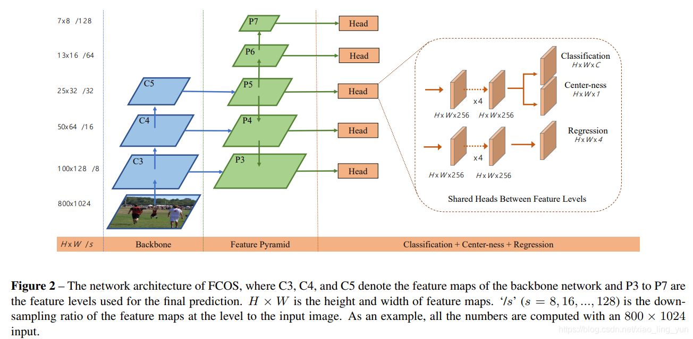
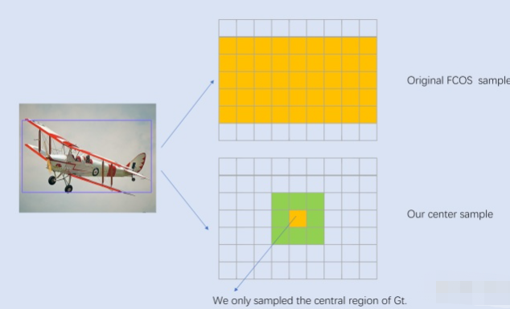
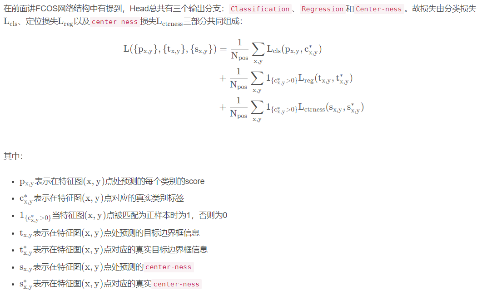

### FCOS

FCOS是一个基于FCN（全卷积网络用于目标检测）、一阶段（one-stage）， anchor-free, proposal free， 参考语义分割思想实现的**逐像素目标检测**的模型

**anchor-based方法的缺点**

在前些时候的目标检测大多都是anchor-based， （SSD, YOLOV2, YOLOV3, Faster-RCNN, Mask-RCNN）, 而且准确率最高的大多都是这类anchor-base的模型，但是也有不少缺陷：

* anchor-based模型的检测性能一定程度上依赖于anchor的设计，anchor的基础尺寸，长宽比，以及每一个特征点对应的anchor数目等。比如FasterRCNN提出的中的三种比例，共9种anchor
* 设定好anchor了只能说是匹配大部分目标，对于那些形变较大的目标检测起来还是比较困难，尤其是小目标，同时这也一定程度上限制了模型的泛化能力
* 为了取得较好的召回率，那就需要为每个特征点安排更密集的anchor，假设我们为了性能同时考虑形如FPN这样的多尺度结构，在前向推演以及NMS等操作时，显存以及CPU消耗很大。
* 在这些放置的更密集的anchor中，大多数anchor属于负样本，这样也造成了正负样本之间的不均衡。

**基于anchor-based的模型准确率来说已经很高，但是FPS会低一些，同时密集anchor， 在前向推演以及NMS等操作耗时不长，必然不能满足需求**，anchor-free也取得了不错的成效。

**FCOS模型结构**

整体上还是很传统的Backbone + FPN + head(包括分类分支、center-ness分支，回归分支)

**正负样本筛选**

**每个feature map上的特征点都是一个样本，但是在回归之前要映射回原图进行正负样本的判断，映射回原图后的点如果在某一个GT Boundingbox内，则对应的特征点是正样本，类别就是Bounding box内目标的类别；否则，负样本。**

对于特征图$F_i \in R^{HXWXC}$，其相对于输入图片的stride定义为s, 另外记GT为$B_i$，这里$B_i = \{{x^{(i)}_{0}, y^{(i)}_{0}}, x^{(i)}_{1}, y^{(i)}_{1}, c^{(i)}\}$, 其中${x^{(i)}_{0}, y^{(i)}_{0}}$和$x^{(i)}_{1}, y^{(i)}_{1}$分别为GT的左上角和右下角顶点坐标，而C为GT的类别。对于特征图上的每个位置（x, y）, 如果其落在任何GT的中心区域，就认为这个位置为正样本，并负责预测这个GT，在最早的版本中落在GT之内就算正样本，不过采用中心区域策略效果更好

上图所示，一个中心为$c_x, c_y$的GT， 其中心区域定义为GT框的一个子框$(c_x - rs, c_y - rs, c_x+rs. c_y + rs)$,这里s是特征图的stride， 而r是一个超参数，论文中选用的1.5， 一个要注意的点是在实现中要保证中心区域不超过GT，尽管采用中心区域抽样方法，可以减少前面说的冲突问题，但是无法保证，如果一个位置落在了多个GT的中心区域，此时就是模糊样本

将feature map上每一个特征点作为样本，当对应到原图上落在多个GT Boundingbox内，这样的特征点为“模糊样本”， 本文是这样抉择的：

1）引入FPN结构实现多级预测

2）在多级预测筛选后如果某一特征点还是匹配多个GT Bounding box， 这种情况简单的选择面积更小的GT Boundingbox作为该特征点的回归目标

**FCOS输出**

W, H, C

W, H, 4

**基于anchor方法的输出**

W, H, 2K

W, H, 4K

**一下子节约了9倍的参数量**

**对于Regression分支**

网络输出的每个正样本都有4d的向量$(l^*, t^*, r^*, b^*)$, 也就是这个点到左、上、右、下距离， 具体公式如下：
$$
l^* = x - x^{(i)}_0, t = y - y^{(i)}_0\\
r^* = x^{(i)}_1 - x, b^*= y^{(i)}_1 - y
$$
假设对于预测特征图上某个点映射回原图的坐标是$(c_x, c_y)$，特征图相对原图的步距为s, 那么网络预测该点对应的目标边界框坐标为：
$$
x_{min} = c_x - l s, y_{min} = c_y - t s\\
x_{max} = c_x + r s, y_{max} = c_y + bs
$$
**对于center-ness分支**

在预测特征图的每个位置都会预测1个参数，`center-ness`反映的是该点（特征图上某一点）距离目标中心点的远近程度，它的值域在0-1之间，距离目标中心越近， `center-ness`越接近于1， 下面是`center-ness`真实标签的计算公式（计算损失时只考虑正样本，即预测点在目标内的情况）
$$
centerness^* = \sqrt{\frac{min(l^*, r*)}{max(l^*, r^*)}\frac{min(t^*, b^*)}{max(t^*. b^*)}}
$$
在网络后处理部分筛选高质量bbox时，会将预测的目标class score与center-ness相乘再开根，然后根据得到的结果对bbox进行排序，只保留分数较高的bbox，这样做的目的是筛掉那些目标class score低且预测点距离目标中心较远的bbox，最终保留下来的就是高质量的bbox。

### Assigning objects to FPN

之前的FPN采用如下计算公式进行分配的，
$$
k = [k_0 + log_2(\sqrt{wh}/224)]
$$
但是在FCOS中，作者发现直接套用FPN公式并不好，作者猜测可能是因为按照FPN中的分配准则，不能确保目标在对应感受野范围内。

最终采用的是$max(l^*, t^*, r^*, b^*)$策略，其中$l^*, t^*, r^*, b^*$分别代表某点（特征图映射在原图上）相对GTbox左边界，上边界，右边界以及下边界的距离，对于不同的预测特征层只要满足以下公式即可，比如说对于P4特征图只$max(l^*, t^*, r^*, b^*)$在（64， 128）之间即为正样本：

$m_{i-1} < max(l^*, t^*, r^*, b^*) < m_i$

