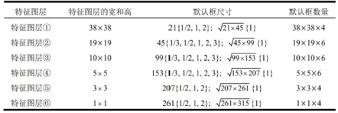
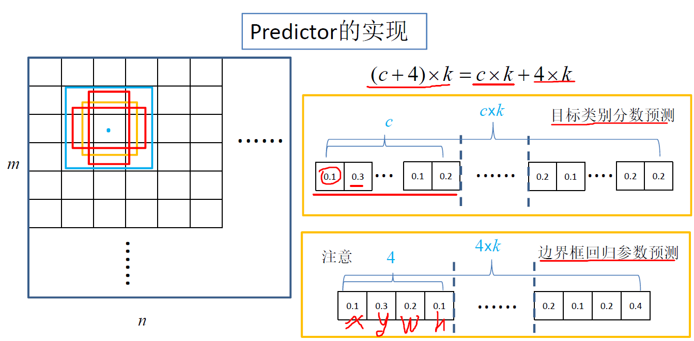
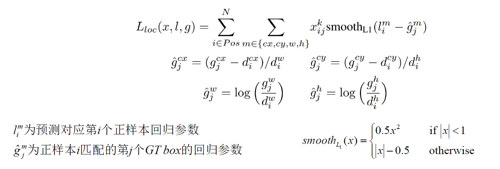

### SSD

SSD算法，（Single Shot MultiBox Detector）， single shot指明了SSD算法属于one-stage方法，MultiBox指明了SSD是多框预测。

主要贡献：

* 一是SSD提取了不同尺度的特征图来做检测，大尺度特征图（较靠前的特征图）可以用来检测小物体，而小尺度特征图（较靠后的特征图）用来检测大物体
* 二是SSD采用了不同尺度和长宽比的先验框（Default boxes）也就是Anchor。

采用了6个特征图作为预测特征层：

`conv4_3`, `conv7(FC7)`, `conv8_2`, `conv9_2`. `conv10_2`, `conv11_2`

其大小分别是`(38, 38)`, `(19, 19)`, `(10, 10)`, `(5, 5)`, `(3, 3)`, `(1, 1)`

但是不同特征图设置的先验框数目不同（同一特征图上每个单元设置的先验框是相同的，这里的数目指的是一个单元的先验框数目）。下面会介绍到

先验框的设置，包括**尺度和长宽比**两个方面，

对于先验框的**尺度**，其遵守一个线性递增的规则，随着特征图大小降低，先眼眶尺度线性增加：

$s_k = s_{min} +\frac{s_{max}-s_{min}}{m-1}(k-1), k\in[1, m]$

其中m是特征图的个数，因为`conv4_3`是单独设置的，因此m=5， $s_k$表示先验框大小相对于图片的比例， 而$s_{min}$和$s_{max}$表示比例的最小值与最大值，paper里取的是0.2和0.9。对于第一个特征图， 其先验框的尺度比例一般设置为$s_{min}/ 2=0.1$，那么尺度为$300 \times 0.1 = 30$, 对于其他5个按照上述公式进行计算，得到各个特征图$s_k$为0.2， 0.37， 0.54， 0.71， 0.88, 将这些特征图尺度乘以图片大小，可以得到各个特征图的尺度为60， 111， 162， 213， 264。综上， 可以得到各个特征图的先验框尺度30， 60， 111， 162， 213， 264.

对于先验框的**长宽比**， 一般选取$\alpha_r\in \{1, 2, 3, \frac{1}{2},\frac{1}{3}\}$, 对于特定的长宽比，按如下公式计算先验框的宽度与高度，按照如下公式计算先验框的宽度与高度（后面的$s_k$均指的是先验框的实际尺度，而不是尺度比例）：

$w^{\alpha}_k = s_k \sqrt{\alpha_r}, h^{\alpha}_k = s_k \sqrt{\alpha_r}$

默认情况下，每个特征图会有一个$\alpha_r=1$且尺度为$s_k$的先验框，除此之外，还会设置一个尺度为$s_k = \sqrt{s_ks_{k+1}}$且$\alpha_r=1$的先验框， 这样每个特征图都设置了两个长宽比为1但大小不同的正方形先验框。注意最后一个特征图需要参考一个虚拟$s_{m+1}= 300 \times 105/100 = 315$来计算$s^{'}_m$。因此， 每个特征图一共有6个先验框{1, 2, 3, 1/2, 1/3,  1'}, 但是在实现的时候，`conv4_3`， `conv10_2`， `conv11_2`层仅适用4个先验框，他们不使用长宽比为3, 1/3的先验框。

一共产生的anchor数为：

38x38x4 + 19x19x6 + 10x10x6 + 5x5x6 + 3x3x4 + 1x1x4 = 8732

特征图上的每个点预测**（c+4）x k**, 注意c中包含背景， 也就是类别+1

**正负样本筛选**（与faster-RCNN类似）

首先，对于图片中每个ground truth，找到与其IOU最大的先验框，该先验框与其匹配，这样，可以保证每个ground truth一定与某个先验框匹配。

其次，对于剩余的未匹配先验框，若某个ground truth的 IOU 大于某个阈值（一般是0.5），那么该先验框也与这个ground truth进行匹配。

与fasterRCNN不同的是：

为了保证正负样本尽量平衡，SSD采用`hard negative mining`， 就是对负样本进行抽样，抽样时按照置信度误差（预测背景的置信度越小，误差越大）进行降序排列，选取误差较大的前top-k作为训练的负样本，以保证正负样本比例接近1:3

**损失函数**

$L(x, c, l, g) = \frac{1}{N}(L_{conf}(x, c) + \alpha L_{loc}(x, l, g))$

其中N为匹配到的正样本个数， $\alpha$为1

对于置信度损失（分类损失）， 采用的是softmax loss

这里$x^p_{ij} \in {1, 0}$为一个指示参数，当$x^p_{ij}=1$时表示第i个先验框与第j个ground truth匹配，并且ground truth的类别为p， c为类别置信度预测值。

定位损失：

