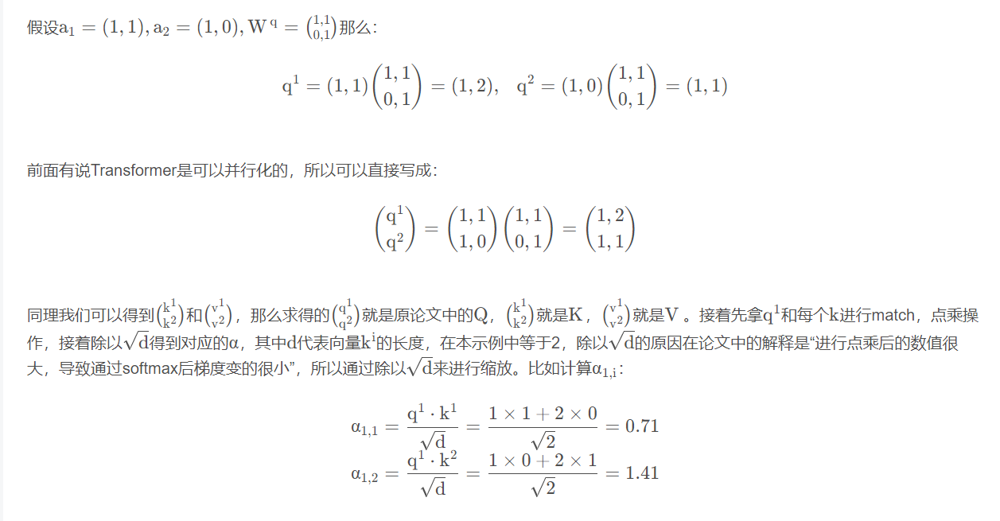

### transformer

下面进行具体理解：

假设输入的序列的长度为`2`， 输入就两个节点$x_1$, $x_2$， 然后通过`Input Embeeding`进行映射（**将高维度数据映射到低维度上**）， 如图所示的将输入节点$x_1$, $x_2$通过`f(x)`映射到$a_1$, $a_2$。紧接着分别将$a_1$, $a_2$分别通过三个变换矩阵$W_q$$W_k$$W_v$（这三个参数是可训练的， 是共享的）, 得到对应的$q^i$$k^i$$v^i$（这里直接通过全连接层进行实现的）

其中， 

* `q`代表`query`, 后续会去和每一个`k`进行匹配
* `k`代表`key`， 后续会被每个`q`匹配
* `v`代表从`a`中提取得到的信息
* 后续`q`和`k`匹配的过程可以理解成计算两者的相关性，相关性越大对应v的权重也就越大。

上面已经计算得到$\alpha$， 即针对每个`v`的权重， 接着进行加权得到最终结果：

以上就是`self-Attention`的内容， 总结下来就是论文中的一个公式：
$$
Attention(Q, K, V) = softmax(\frac{QK^T}{\sqrt{d_k}})V
$$
**Multi-Head Attention**

多头注意力机制能够联合来自不同`head`部分学习到的信息。

首先还是和self-Attention模块一样将$a_i$分别通过$W^q, W^k, W^v$得到对应的$q^i, k^i, v^i$, 然后再根据使用的`head`的数目`h`进一步把得到的$q^i, k^i, v^i$均分成h份， 比如下图中假设`h=2`， 然后$q^1$拆分成$q^{1,1}, q^{1, 2}$

那么$q^{1, 1}$就属于`head1`, $q^{1, 2}$就属于`head2`

通过上述方法就能得到每个$head_i$对应的$Q_i, K_i, V_i$参数， 接下来针对每个`head`使用和`self-Attention`中相同的方法即可得到对应的结果。
$$
Attention(Q_i, K_i, V_i) = softmax(\frac{Q_iK^T}{\sqrt{d_k}})V_i
$$

接着将每个`head`得到的结果进行`concat`拼接， 比如下图中$b_{1, 1}$($head_1$得到的$b_1$)和$b_{1, 2}$（$head_2$得到的$b_1$）拼接在一起，$b_{2, 1}$($head_2$得到的$b_2$)和$b_{2, 2}$（$head_2$得到的$b_2$）拼接在一起，

接着将拼接后的结果通过$W^O$（可学习的参数）进行融合，如下图所示， 融合后得到最终的结果$b_1, b_2$

到这， `Multi-Head Attention`的内容就讲完了， 总结下来就是论文中的两个公式
$$
MuiltiHead(Q, K, V) = Concat(head_1,..., head_h)W^O\\
where~head_i = Attention(QW^Q_i, KW^K_i, VW^V_i)
$$
