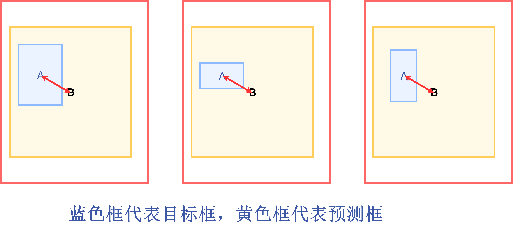
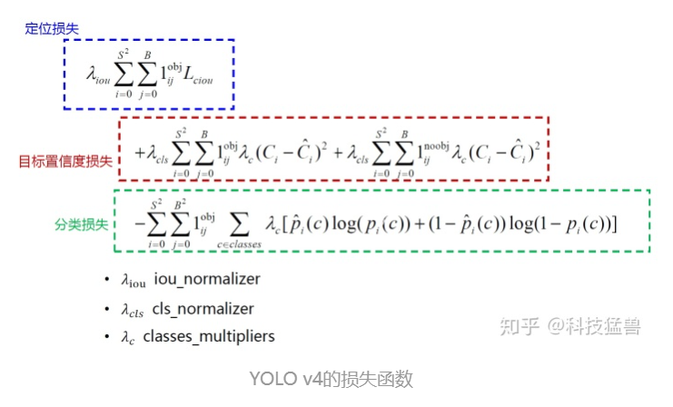
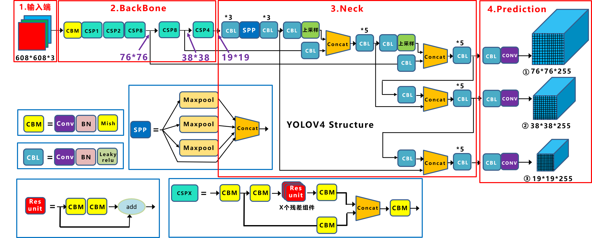
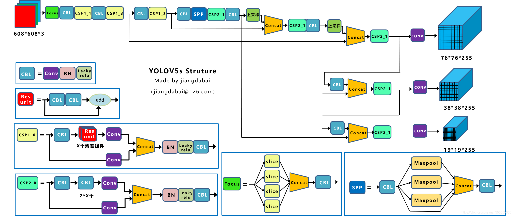

### YOLO系列

#### YOLOv0

不管用什么形式去表达bounding box, 你模型输出的结果都是vector， 和分类模型输出的vector本质上有什么区别吗？

* 没有，都是向量而已，只是分类模型输出的是one-hot向量，检测模型输出是我们标注的结果。

所以，分类模型可以用来做检测，可以把检测任务当作是遍历性的分类任务。

我们的目标是一个个框，那就用这个框去遍历所有的位置，所有的大小

这种方法其实就是RCNN全家桶的初衷，专业术语叫**滑动窗口分类方法**

这种方法的精确和什么因素有关？

遍历的彻不彻底。遍历得越精确，检测器的精度就越高，所以这也就带来一个问题就是， 检测的耗时非常大

本质上还是训练一个二分类器， 这个二分类器的输入是一个框的内容，输出是前景/背景

传统RCNN系列检测方法的主要思路：

* 耗时
* 操作复杂，需要手动生成大量的样本


yolo, 分类器输出一个One-hot vector， 那把它换成(x, y, w, h, c)， c表示的是置信度，把问题转化成一个回归问题，直接回归出bounding box的位置就好了

**本质上都是矩阵映射矩阵，只是代表的意义不一样而已**


#### YOLOv1

用一个(c, x, y, w, h)去负责image某个区域的目标

比如说图片设置为16个区域，每个区域用1个(c, x, y, w, h)去负责

**为什么这样子更优？**

因为conv操作是位置强相关的，就是原来的目标在哪里，conv之后的feature map上还在哪里，所以图片划分为16个区域上，所以我们的结果的维度就是（5， 4， 4）

**置信度的真值怎么设置呢？**

目标的中心在哪个grid就将c=1

**某个grid中有2个目标怎么办？**

这种一个区域有多个目标的情况我们目前没法解决，只能在一个区域检测出一个目标

**模型现在能力就这么大，只能在一个区域中检测出一个目标，如何改进？**

划分更加密集的grid，使得每个区域更密集，就可以缓解这个问题，但是无法从根本上解决

**怎么从16个结果中筛选出7个我们要的呢？**

法1： 聚类， 聚成7类，选择confidence最大的框， 但是问题是如果2个目标本身比较近聚成 1类怎么办， 如果不知道总的类别呢，怎么聚

法2： NMS， 2个框重合度很高，大概率就是一个目标，那就只取一个框

```
1 根据置信度选出第一个框
2 计算第一个框与其他框的重合度， 把与第一个框重合的其他框去掉
3 剩下的框中拿置信度最高的，循环
```

**多类的目标怎么办？**

比如有两个类，在（c, x, y, w, h）后加（p1, p2）

**小目标怎么办？**

对于每个区域，我们用2个五元组，一个负责回归大目标，一个负责小目标，同样添加one-hot vector

至此， YOLOV1就是这样，


yolov1使用的是7x7的区域， 每个grid预测两个目标，加20个类别

损失函数：


前2行是计算前景的位置损失

第3行是前景的confidence损失

第4行是背景的confidence损失

第5行是计算分类损失

i代表的是第i个grid, B就是每个grid预测几个， 这里是预测2个，所以B=1

**正负样本筛选**

正样本：

当一个真实目标的中心点落在某个cell内，该cell就负责检测该物体，具体做法是将与该真实物体有最大IOU的边框设为正样本， 该边框的置信度真值为1

负样本：

除了上述赋予的正样本，其他都为负样本，负样本没有类别和边框回归损失，只有置信度损失，其真值为0

**样本不均衡的问题解决了吗？**

没有计算背景的位置回归损失，只计算了前景的位置回归损失，这个问题v1依然存在

**yolov1的缺点**

* 每个网格只对应两个bounding box， 当物体的长宽比不常见，效果较差
* 原始图片只划分为7x7的网格，当两个物体靠的很近时， 效果比较差
* 最终每个网格只对应一个类别，容易出现漏检
* 对于图片中比较小的物体，效果比较差，这其实是所有目标检测算法的通病


#### YOLOv2

检测头head

我们认为， **检测模型=特征提取器+检测头**

在yolov1的模型中检测头就是最后2个全连接层，它们是参数量最大的2个层，也是最值得改进的2个层，后面的YOLO模型都对这里进行改进

**检测头的改进**

yolov1虽然快，但是预测的框不准确，很多目标找不到：

* 预测的框不准确：准确度不足
* 很多目标找不到： recall 不足

**预测的不准确，当时RCNN怎么做的？**

同时代 RCNN， 人家检测的是偏移量

 

之前YOLOV1直接预测x, y, w, h， 范围比较大， 现在我们想预测一个稍微小一点的值，来增加准确度

上图就是YOLOv2给出的改进

$b_x, b_y, b_w, b_h$：模型最终得到的检测结果

$t_x, t_y, t_w, t_h$：模型预测的值

$c_x, c_y$：grid的左上角坐标

$p_w, p_h$: Anchor的宽和高，这里的anchor是人为定好的一个框，宽和高是固定的

**通过这样的定义我们从直接预测位置改为预测一个偏移量，基于Anchor框的宽和高 和 grid的先验位置的偏移量**，得到最终的目标的位置。

**为什么YOLOv2改预测偏移量而不是去预测（x, y, w, h)?**

同时代的RCNN人家预测的是偏移量，另一个重要的原因是：直接预测位置会导致神经网络在一开始训练时不稳定，使用偏移量会使得训练过程更加稳定，性能指标提升了5%左右

位置上不使用anchor框，宽高上使用anchor框

**针对很多目标找不到**

yolov2使用13x13区域代替7x7区域，每个区域有5个anchor， 且每个anchor对应着1个类别， 输出的尺寸就应该为：[N, 13, 13, 125]  5x(5 + 20)

**为什么要用anchor?**

一开始YOLOv1的初始训练过程很不稳定，在YOLOv2中，作者观察了很多图片的所有gt, GT都是瘦高的长方形，且宽高比具有相似性，那能不能根据这一点，从数据集中预先准备几个几率较大的bounding box， 再以他们为基准进行预测呢？这就是anchor的初衷

**每个区域的5个anchor是如何得到的？**

对于任意的一个数据集，先对训练集的gt进行聚类

损失函数：


这里的W=13, H=13, A=5

每个$\lamda$都是一个权重值，c表示类别，r表示（x, y, w, h）

第1， 4行是confidence_loss， 注意这里的真值变成了0和IoU(GT, anchor)

第2行：t是迭代次数，即前12800步我们计算这个损失，后面不计算。前12800步我们会优化预测的(x, y, w, h)与anchor的(x, y, w, h)的距离+预测的(x, y, w, h)与GT的（x, y, w, h）的距离，12800步之后就只优化预测的(x, y, w, h)与GT的(x, y, w, h)的距离，因为这时的预测结果已经较为准确了，anchor已经满足我们了，而在一开始预测不准的时候，用上anchor可以加速训练


#### YOLOv3

**检测头的改进**‘

之前i说小目标检测仍然是YOLOV2的痛， YOLOv3是如何改进的呢， 我们知道， YOLOv2的检测头已经由YOLOv1的7x7变为13x13, 我们看yoloV3的检测头分叉了，分为3部分

* 13\*13\*3\*(4+1+80)

* 26\*26*3\*(4+ 1+ 80)
* 52*52\*3\*(4 + 1+ 80)

预测的框更多更全面了，并且分级了

我们发现3个分支分别为32倍下采样，16倍下采样、8倍下采样， 分别预测大、中、小目标 。

损失函数：


第一行是定位损失，s 代表是13， 26， 52， B=5

第二行是置信度损失，和v2一样

第三行是类别损失，和YOLOv2的区别是改成了交叉熵损失， YOLOv3使用多标签分类，用多个独立的Logistic分类器代替softmax函数，原因在于，Softmax函数输出的多个类别预测之间会相互抑制，只能预测出一个类别，而Logistic分类器相互独立，可以实现多类别的预测。 实验证明，Softmax可以被多个独立的Logistic分类器取代，并且准确率不会下降

**Neck层**

YOLOv3中的neck层采用FPN的思想，会输出了3个不同的尺度特征


**正负样本的确定**

正样本： 与GT的IOU最大的框

负样本： 与GT的IOU<0.5的框

对于重叠大于等于0.5的其他先验框， 忽略，不算损失

每个GT目标仅与一个先验边界框相关联，如果没有分配先验边界框，则不会导致分类和定位损失，只会有目标性的置信度损失

使用tx和ty（而不是bx和by）来计算损失

#### YOLOv4

**检测头的改进**

* 之前的YOLOv3是1个anchor负责一个GT， YOLOv4中用多个anchor去负责一个GT, 对于GT来说，只要$IoU(anchor_i, GT_j) > threshold$， 就让anchor负责预测GT相当于改进了正样本筛选策略，总的anchor框的数量没有改变，但是选择的正样本的比例增加了，就缓解了正负样本不平衡问题

* Eliminate_grid_sensitivity， 将$b_x, b_y$的计算公式改为：

  $b_x = 1.1\sigma(t_x)+c_x$

  $b_y = 1.1 \sigma(t_y) + c_y$

这样改进后效果会再次提升

**neck的改进**

采用FPN+PAN的结构， 这样结合的操作，FPN层自顶向下传达强语义特征，而特征金字塔则自底向上传达强定位特征，两两联手， 从不同的主干层对不同的检测层进行参数聚合。

**损失函数的改进**

v1, v2, v3的位置回归损失都用的MSEloss，从V4开始用IoU loss

**MSE loss  ->  IoU loss -> GIoU loss  ->  DIoU loss ->CIoU loss**

IOU Loss主要考虑检测框和目标框的重叠面积，公式如下：

$$
IOU Loss = 1 - IOU = 1 - \frac{A \cap B}{A \cup B}
$$
IOU Loss存在两个问题：

* 问题一：当预测框和目标框不相交时，也就是当IOU=0时，无法反映两个框距离的远近，此时损失函数不可导。所以IOU Loss无法优化两个框不相交的情况
* 问题二：当两个预测框和同一个目标框相重叠，且两者IOU相同，这时IOU　Loss对两个预测框的惩罚相同，无法区分两个预测框与GT目标框的相交情况

**GIoU loss**


定义$A$为预测框，$B$为目标框，$C$为目标框和预测框的最小外接矩形，公式如下：
$$
差集 = C - A \cup B
$$

$$
GIOU Loss = 1-GIOU = 1-(IOU - \frac{|差集|}{|C|})
$$

可以看到，相比于IOU Loss，GIOU Loss衡量了目标框和预测框的相交程度，缓解了IOU Loss的问题。

但是当预测框在目标框内部，且预测框大小一致时，这时候预测框和目标框的差集相等，这是GIOU Loss会退化成IOU Loss，无法区分各个预测框的位置关系。

**DIoU loss**

好的目标框回归函数应该考虑三个重要几何因素：**重叠面积**、**中心点距离**、**长宽比**

针对Iou loss 和 GIoU loss存在的问题，DIoU loss 考虑重叠面积，中心点距离，公式如下：

设：$C$为预测框和目标框的最小外接矩形，$Distance \_ C$表示最小外接矩形的对角线距离，$Distance \_ 2$表示预测框的中心点到目标框中心点的欧式距离
$$
DIOU \ Loss =  1 - DIOU = 1-(IOU - \frac{Distance \_ 2}{Distance \_ C})
$$
由上述公式可以看出，当遇到GIOU Loss 无法解决的问题时，DIOU即考虑了重叠面积，也考虑了目标框和预测框的中心点的距离，就可以衡量两者之间的位置关系。所以当目标框包裹预测框的时候，DIOU可以衡量两者之间的距离。

但是DIOU Loss没有考虑长宽比，当预测框在目标框内部时，且多个预测框的中心点的位置都一样时，这时候DIOU Loss无法区分这几个预测框的位置。



**CIoU loss**

所以提出了CIOU Loss，其在DIOU Loss的基础上增加了一个影响因子，将预测框和目标框的长宽比都考虑进去，公式如下：
$$
CIOU \ Loss = 1 - CIOU = 1 - (IOU - \frac{Distance \_ 2^2}{Distance \_C ^2} - \frac{v^2}{(1-IOU)+v}) 
$$
其中，$v$是一个衡量长宽比一致性的参数，我们可以定义为：
$$
v = \frac{4}{Π^2}(arctan \frac{w^{gt}}{h^{gt}} - arctan \frac{w^p}{h^p})^2
$$
$gt$代表目标框，$p$代表预测框。

至此，CIOU Loss包含了一个好的预测框回归函数的三个重要的几何因素：重叠面积、中心点距离、长宽比。

**损失函数**



#### YOLOv5

**检测头的改进**

head部分没有任何改动， 和YOLOv3和YOLOv4完全相同，也是三个输出头， stride分别是8， 16， 32， 大输出特征图检测小物体，小输出特征检测大物体。

加上了自适应anchor的功能


#### backbone的改进

我们发现yolov1只是把最后的特征分成了7x7个grid， 到了YOLOv2就变成了13x13个grid， 再到YOLOv3, v4, v5就变成了多尺度的（stride = 8, 16, 32）, 更加复杂了，那为什么一代比一代检测头更加复杂呢？

因为他们的提取特征网络更加强大了，能够支撑起检测头做更加复杂的操作。


YOLOv1输入图像的尺寸为$448 \times 448$，经过24个卷积层，2个全连接的层（FC），最后在reshape操作，输出的特征图大小为$7 \times 7 \times 30$。(**GoogleNet**)

* YOLOv1主要是建立一个CNN网络生成预测 $7 \times 7 \times 1024$ 的张量，
* 然后使用两个全连接层执行线性回归，以进行$7 \times 7 \times 2$ 边界框预测。将具有高置信度得分（大于0.25）的结果作为最终预测。
* 在$3 \times 3$的卷积后通常会接一个通道数更低$1 \times 1$的卷积，这种方式既降低了计算量，同时也提升了模型的非线性能力。
* 除了最后一层使用了线性激活函数外，其余层的激活函数为 Leaky ReLU ;
* 在训练中使用了 Dropout 与数据增强的方法来防止过拟合。
* 对于最后一个卷积层，它输出一个形状为 (7, 7, 1024) 的张量。 然后张量展开。使用2个全连接的层作为一种线性回归的形式，它输出 个参数，然后重新塑形为 (7, 7, 30) 。

**YOLOv2**         (DarkNet-19)

YOLOv2采用了一个新的基础模型（特征提取器），称为Darknet-19，包括19个卷积层和5个max pooling层。


* Darknet-19 与 VGG16 模型设计原则是一致的，主要采用 $3×3$ 卷积，采用 $2×2$ 的最大池化层之后，特征图维度降低2倍，而同时将特征图的通道增加两倍。用连续 $3×3$ 卷积替代了v1版本中的 $7×7$ 卷积，这样既减少了计算量，又增加了网络深度。此外，DarkNet去掉了全连接层与Dropout层。
* Darknet-19 ，包括19个卷积层 和 5个max pooling层，采用 global avg pooling+Softmax 做预测，与NIN(Network in Network)类似，并且在$3×3$ 卷积之间使用 $1×1$  卷积来压缩特征图通道以降低模型计算量和参数。
* DarkNet的实际输入为 $416 \times 416$ ，没有全连接层（FC层），5次降采样到 $13 \times 13$
* DarkNet使用了BN层，这一点带来了2%以上的性能提升。 BN层有助于解决反向传播中的梯度消失与爆炸问题，可以加速模型的收敛，同时起到一定的正则化作用，降低模型过拟合。BN层的具体位置是在每一个卷积之后，激活函数LeakyReLU之前。
* 在ImageNet分类数据集上，Darknet-19的top-1准确度为72.9%，top-5准确度为91.2%，但是模型参数较小。使用Darknet-19之后，YOLOv2的mAP值没有显著提升，但是计算量却可以减少约33%
* Passthrough层：DarkNet还进行了深浅层特征的融合，具体方法是将浅层 $26 \times 26 \times 512$的特征变换为$13 \times 13 \times 2048$，这样就可以直接与深层 $13 \times 13 \times 1024$ 的特征进行通道拼接。这种特征融合有利于小物体的检测，也为模型带来了1%的性能提升。

**YOLOv3**


采用DarkNet53, 同样是下采样32倍，但是DarkNet19是通过最大池化来进行，一共有5次。而darknet53是通过尺寸2，步长为2的卷积来进行的， darknet53加入了残差结构


**YOLOv4**



YOLOv4整个网络架构组成

* Backbone: CSPDarknet53
* Neck: SPP, PAN
* Head: YOLOv3

CSPDarknet53是在Yolov3主干网络Darknet53的基础上，借鉴2019年CSPNet的经验，产生的Backbone结构，其中包含了5个CSP模块。作者在实验中得到结论，CSPResNeX50分类精度比CSPDarknet，但是检测性能却不如后者。

每个CSP模块第一个卷积核的大小都是 $3 \times 3$，stride=2，因此可以起到下采样的作用。因为Backbone有5个CSP模块，输入图像是$608 \times 608$，所以特征图变化的规律是：$608->304->152->76->38->19$。

YOLOv4 和 YOLOv5 都使用 CSPDarknet作为BackBone，从输入图像中提取丰富的特征信息。CSPNet叫做Cross Stage Partial Network，跨阶段局部网络。其解决了其他大型卷积网络结构中的重复梯度问题，减少模型参数和FLOPS。这对 YOLO 有重要的意义，即保证了推理速度和准确率，又减小了模型尺寸。

CSPNet的作者认为推理计算过高的问题是由于网络优化中的梯度信息重复导致的。CSPNet基于Densnet的思想，复制基础层的特征映射图，通过dense block 传递到下一个阶段进行合并，从而将基础层的特征映射图分离出来。这样可以实现更丰富的梯度组合，同时减少计算量。


**YOLOv5**



YOLOv5各部分改进

* 输入端：Mosaic数据增强、自适应锚框计算

* Backbone：Focus结构，CSP结构

* Neck：FPN+PAN结构

  

**Mosaic数据增强**

Mosaic是一种新的混合4幅训练图像的数据增强方法，使四个不同的上下文信息被混合，**丰富了图像的上下文信息**，这使得网络能够检测正常图像之外的对象，增强模型的鲁棒性。此外，批处理规范化BN层从每一层上的4个不同图像计算激活统计信息。这大大减少了对large mini-batch-size的需求。Mosaic，就是把四张图片拼接为一张图片，这等于变相的增大了一次训练的图片数量，可以让最小批数量进一步降低，**让在单GPU上训练更为轻松**。

在YOLOv4中，通过引入CutMix和Mosaic数据增强、类标签平滑和Mish激活等功能，分类精度得到了提高。因此，本文用于分类训练的BoF骨干（免费包）包括以下内容：CutMix和Mosaic数据增强和类标签平滑。此外，本文使用Mish激活作为补充选项，