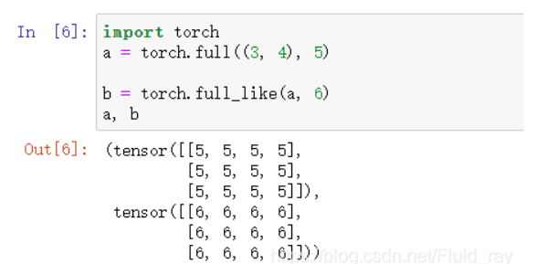
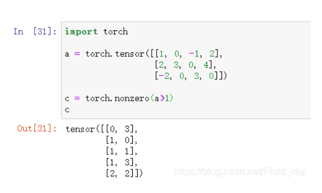
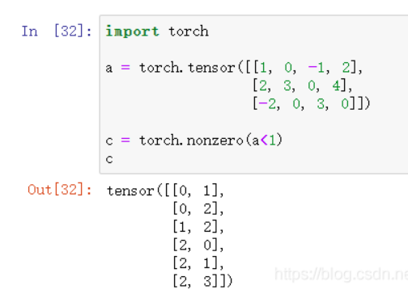

### torch

* 1、**torch.is_tensor(obj)​ **

如果obj是一个pytorch张量，则返回True

与isinstance(obj, Tensor)等价， 同时isinstance(obj, type)这个方法可以检查任何类型， 如果检查出obj是type类型返回true

* 2、**torch.is_storage(obj)**

判断obj是不是storage类型， 如果是的话就返回True， 否则返回False

什么是storage？

​			storage类型是Pytorch中的一个类型，它与tensor是对应的， tensor分为头信息区（Tensor）和存储区(Storage)

​			信息区（Tensor）主要存储tensor的形状(size)， 步长（stride）， 数据类型(type)等信息，其真正的数据保存为连续数组，存储在存储区(Storage)中

* 3、**torch.is_complex(input)**

判断是不是复数， 例如torch.complex64或者torch.complex128, 是的话返回true， 否则返回false

创建复数 torch.complex(real, imag, *, out=none)

* 4、**torch.is_floating_point(input)**

判断给定input 中data的值是不是浮点类型（支持torch.float16, torch.flaot32与torch.float64）

```python
torch([1., 2.])   #dtype: torch.float32
torch([1, 2])     #dtype: torch.int64
```

* 5、**torch.is_nonzero(input)**

此方法的用途是测试一个单元素的tensor在进行类型转化后是不是为0， 就是测试input是不是不是为torch.tensor([0.])或者torch.tensor([0])或者torch.tensor([False])三个其中的一个

**同时，tensor的长度必须为1**

* 6、**torch.set_dedault_dtype()**

设置pytorch中浮点数的默认类型，pytorch中有很多浮点数类型，例如torch.float16, torch.float32, torch.float64,这些初始化一个浮点数tensor的时候可以指定，如果我们不指定，那么pytorch就会默认给其一个类型，此方法就是指定pytorch默认给定浮点类型的浮点数哪个类型

值得注意的是，这个改变不是永久的，它只作用于当前环境，外面呢如果更换另一个Pytorch文件然后运行的话，浮点类型的默认值还是torch.float32

* 7、**torch.get_default_dtype()**

获取默认浮点数类型

* 8、**torch.set_default_tensor_type()**

设置pytorch中默认的浮点类型，一般使用torch进行运算时候使用的都是浮点数来进行计算，所以设置默认浮点数有时候也很重要

该方法与6中torch.set_default_type()类似，但是这个方法更强大一些

Tensor有不同的数据类型，每种类型分别有对应的CPU和GPU版本，默认的tensor是FlaotTensor,可通过torch.set_default_type()修改默认tensor类型（如果默认为GPU tensor, 则所有操作都将在GPU上进行

| 数据类型          | cpu tensor         | gpu tensor              |
| ----------------- | ------------------ | ----------------------- |
| 32 bit 浮点       | torch.FloatTensor  | torch.cuda.FloatTensor  |
| 64 bit 浮点       | torch.DoubleTensor | torch.cuda.DoubleTensor |
| 16 bit 单精度整型 | 无                 | torch.cuda.HalfTensor   |

我们可以通过torch.set_default_type()将我们默认的浮点类型设置为cuda类型，这样我们就不需要将我们的数据迁移到cuda上了，直接使用GPU进行加速，但是此方法肯定有一些不好的结果，可能有的时候还需自己将tensor迁回cpu， 所以使用device迁到cuda上还是使用这种默认的方法就因人而异了

* 9、**torch.numel(input)**

计算并返回input中的元素个数, 扩展： tensor自带的size

```python
a = torch.rand(3, 5)
torch.numel(a)  # 15
a.size()        #torch.size([3, 5])
```

* 10、**torch.set_printoptions()**

修改torch中的打印选项，例如：显示浮点数后小数点几位， 修改默认折叠的大小，科学计数等

* 11、**torch.tensor(data, dtype, device)  tensor的创建**

此方法用于创建pytorch中的tensor创建，此方法使用data构建并返回一个tensor，使用方法如下

```python
a = torch.tensor([2, 3, 5])
```

创建浮点型tensor

```python
a = torch.tensor([2., 3., 5.])
```

data:可以是list, tuple, numpy ndarryay, scalar等类型

dtype:默认浮点数的是torch.float32, torch.int64

device: 用于指定创建的tensor存在的位置， 即在cpu还是gpu上，默认为cpu

requires_grad: 用于指定创建的tensor需不需要梯度信息

pin_memory: 如果为True, 那么创建的tensor将会被分配到固定的内存位置， 仅仅在tensor在cpu的时候有用

torch.tensor()会复制数据（不会使用原始的数据区，而是在一个新的内存复制原来的数据并生成新的tensor），如果现在我们有一个tensor data, 并且不想进行复制， 那么我们使用torch.Tensor.detach(),使用此方法得到的tensor是和原来的tensor享用同样的storage, 并没有进行值的复制， 或者使用torch.Tensor.requires_grad_()此方法也是返回一个tensor, 和原来的tensor是共用相同的storage， 通过此方法可以更改已有的tesor是否需要梯度信息

<font color=red>当data是一个tensor时， 那么我们使用此方法创建出来的tesnor（torch.tensor(data)）与 data.copy().detach()的效果是一样的，并且torch.tensor(x, requires_grad=True)与x.clone().detach().requires_grad_(True)是一致的</font>

* 12、 **torch.as_tensor(data)**

将数据转化为tensor, data可以为list, tuple, numpy ndarray, scalar等

注意： 如果data已经是一个tensor数据并且与返回的tensor具有相同的类型和相同的设备，那么不发生复制，返回的tensor就是data, 否则就会复制并且返回一个新的tensor

* 13、**torch.from_numpy(ndarray)**

此方法是将一个numpy.ndarry()转化为tensor

注意，返回的tensor和原来的ndarray共享内存，更改tensor也会更改ndarray， 并且返回的tensor不能调整大小

* 14、**torch.zeros_like(input)**

返回一个与input形状相等的，并且用标量值填充0填充的全0tensor

* 15、**torch.ones(), torch.ones_like(input)**

创建全1的tensor, 与16和17创建全0的tensor类似

* 16、 **torch.arange(), torch.range(), torch.linespace(), torch.logspace() 根据步长创建一维tensor**

`torch.arange()`为**左闭右开，即[start, end)**，如下所示。

```python
>>> torch.arange(5)
tensor([ 0,  1,  2,  3,  4])
>>> torch.arange(1, 4)
tensor([ 1,  2,  3])
>>> torch.arange(1, 2.5, 0.5)
tensor([ 1.0000,  1.5000,  2.0000]
```

`torch.range()`为**左闭右闭，即[start, end]**，如下所示

```python
>>> torch.range(1, 4)
tensor([ 1.,  2.,  3.,  4.])
>>> torch.range(1, 4, 0.5)
tensor([ 1.0000,  1.5000,  2.0000,  2.5000,  3.0000,  3.5000,  4.0000])
```

`torch.linspace()`，这个方法也是**左闭右闭**的，但是这个steps的意思是将start到end分为多少份

```python
>>> torch.linspace(3, 10, steps=5)
tensor([  3.0000,   4.7500,   6.5000,   8.2500,  10.0000])
>>> torch.linspace(-10, 10, steps=5)
tensor([-10.,  -5.,   0.,   5.,  10.])
>>> torch.linspace(start=-10, end=10, steps=5)
tensor([-10.,  -5.,   0.,   5.,  10.])
>>> torch.linspace(start=-10, end=10, steps=1)
tensor([-10.])
```

`torch.logspace()`, 与`torch.linspace()`类似，不过，是指数形式的tensor

* 20、 **torch.eye()创建对角矩阵**

torch.eye(n,m)

创建一个二维矩阵mxn， 对角全是1， 其他全是0

* 21、**torch.empty(), torch.empty_like(), torch.empty_strided() 创建未初始化数据的tensor**

`torch.empty()`是创建一个使用未初始化值填满的tensor

`torch.empty_like()`是创建一个与input形状一样的使用未初始化值填满的tensor， 相当于torch.empty(input.size())

* 22、**torch.full, torch.full_like()**

创建全value的矩阵



* 23、**torch.complex**

```python
torch.complex(real, imag, *)
```

此方法为创建复数Tensor的方法，其中real为实部， imag为虚部，real和imag必须位数相同

* 24、**torch.cat()**

在给定的维度上对tensor进行拼接， 可以看作是`torch.split()`和`torch.chunk()`的逆向操作

```python
torch.cat((tensors1, tensors2), dim=0, *)
```

对于进行拼接的两个张量，它们在除了拼接的维度上，其余维度上的形状应该相等。例如tensor=(a, b), dim=0那么a, b除了dim=0的维度，其余维度上的形状大小应该相等，不然会报错，因为无法进行拼接。

* 25、 **torch.chunk()**

```python
torch.chunk(input, chunks, dim=0)
```

此方法是将给定的input分为指定数量的块，并返回划分以后每个块的视图

input: 将要被划分的tensor

chunks: 将要被划分的块的数量，注意是数量，此参数为整型

dim:将要划分tensor的指定的维度， 默认为0

* 26、**torch.stack(), torch.hstack(), torch.vstack(), torch.dstack()**

`torch.hstack()`按水平方向拼接

`torch.dstack()`:沿着深度方向（第三个维度）进行拼接，

`torch.vstack()`按垂直方向进行拼接

```python
>>> a = torch.tensor([1, 2, 3])
>>> b = torch.tensor([4, 5, 6])
>>> torch.vstack((a,b))
tensor([[1, 2, 3],
        [4, 5, 6]])
>>> a = torch.tensor([[1],[2],[3]])
>>> b = torch.tensor([[4],[5],[6]])
>>> torch.vstack((a,b))
tensor([[1],
        [2],
        [3],
        [4],
        [5],
        [6]])
```

* 27、**torch.nonzero(input)**





* 28、 **torch.reshape()**

更改tensor为指定形状

```python
a = torch.arange(4)
b = torch.reshape(a, (2, 2))
```

直接输入input和形状输出就可以了，但是一定要计算好维度

* 29、**torch.split(tensor, split_size_or_sections, dim)**

与`torch.chunk()`类似，都是将tensor切割的方法，split的功能更多一些

split_size_or_sections: 当此参数为整数时， 意思是将tensor按照每块大小为split_size_or_sections来切割，当此参数为列表时，将此tensor切成和列表中元素大小一样的大小的块

* 30、**torch.squeeze(input, dim)**

此方法的作用是移除tensor中维度大小为1的维度，返回的Tensor和原Tensor共享内存

dim: 要移除的维度， 默认为None

* 31、 **torch.t()**

将二维tensor转置，对二维矩阵进行操作，返回它的转置矩阵  **输入只能是小于等于二维的tensor， 否则报错**

* 32、 **torch.take(input, index)**

返回一个新的张量，其中的元素是输入元素在给定的索引处， 将输入张量视为一维张量，结果tensor的形状与索引相同

* 33、**torch.transpose()**

```python
torch.transpose(input, dim0, dim1) → Tensor
```

返回一个tensor， 此tensor是输入tensor的转置版本，给定的维度dim0和dim1将会被交换

结果tensor和原tensor共享内存，所以改变其中一个的内容也会改变另外一个里面的内容

* 34、 **torch.unsequeeze()**

torch.unsequeeze(input, dim)

在第dim个维度上，增加一个维度

* 35、 **torch.where()**

根据t指定条件更改指定tensor中的数值

```python
torch.where(condition, x, y)
```

此方法是将x中的元素和条件相比，如果符合条件就还等于原来的元素，如果不满足条件的话，那就去y中对应的值

```python
>>> x = torch.randn(3, 2)
>>> y = torch.ones(3, 2)
>>> x
tensor([[-0.4620,  0.3139],
        [ 0.3898, -0.7197],
        [ 0.0478, -0.1657]])
>>> torch.where(x > 0, x, y)
tensor([[ 1.0000,  0.3139],
        [ 0.3898,  1.0000],
        [ 0.0478,  1.0000]])
>>> x = torch.randn(2, 2, dtype=torch.double)
>>> x
tensor([[ 1.0779,  0.0383],
        [-0.8785, -1.1089]], dtype=torch.float64)
>>> torch.where(x > 0, x, 0.)
tensor([[1.0779, 0.0383],
        [0.0000, 0.0000]], dtype=torch.float64)
```

