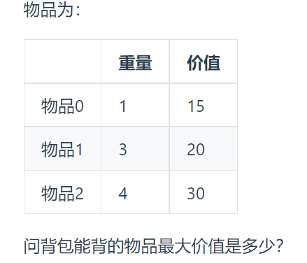
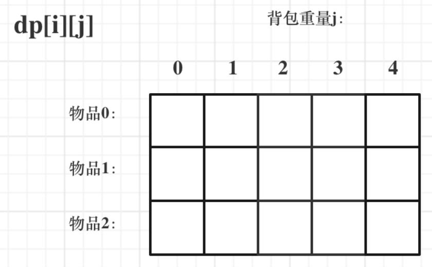

### 动态规划

`动态规划，如果某一问题有很多重叠子问题，使用动态规划是最有效的`

所以动态规划中每一个状态是由上一状态推导出来的， **这一点区别与贪心**， 贪心没有状态推导，而是从局部直接选最优的。

例如：有`N`件物品和一个最多能背重量为`W` 的背包。第i件物品的重量是`weight[i]`，得到的价值是`value[i]` 。**每件物品只能用一次**，求解将哪些物品装入背包里物品价值总和最大。

动态规划中`dp[j]`是由`dp[j-weight[i]]`推导出来的，然后取`max(dp[j], dp[j - weight[i]] + value[i])`。

但如果是贪心，每次拿物品选一个最大的或者最小的就完事了，和上一个状态没有关系。

所以贪心解决不了动态规划的问题。

**动态规划的解题步骤**

1、确定dp数组以及下标的含义

2、确定递推公式

3、dp数组如何初始化

4、确定遍历顺序

5、举例推导dp数组

#### 1、斐波那契数

[509. 斐波那契数 - 力扣（LeetCode）](https://leetcode.cn/problems/fibonacci-number/)

**斐波那契数** （通常用 `F(n)` 表示）形成的序列称为 **斐波那契数列** 。该数列由 `0` 和 `1` 开始，后面的每一项数字都是前面两项数字的和。也就是：

```
F(0) = 0，F(1) = 1
F(n) = F(n - 1) + F(n - 2)，其中 n > 1
```

给定 `n` ，请计算 `F(n)` 。

```python
class Solution:
    def fib(self, n):
        if n < 2:
            return n
        return self.fib(n-1) + self.fib(n-2)    
```

#### 2、爬楼梯

[70. 爬楼梯 - 力扣（LeetCode）](https://leetcode.cn/problems/climbing-stairs/)

假设你正在爬楼梯。需要 `n` 阶你才能到达楼顶。每次你可以爬 `1` 或 `2` 个台阶。你有多少种不同的方法可以爬到楼顶呢？

```python
class Solution:
    def climbStairs(self, n):
        dp = [0] * n
        if n < 3:
            return n
        dp[0], dp[1] = 1, 2
        for i in range(2, n):
            dp[i] = dp[i-1] + dp[i-2]
        return dp[n-1]
```

#### 3、使用最小花费爬楼梯

[746. 使用最小花费爬楼梯 - 力扣（LeetCode）](https://leetcode.cn/problems/min-cost-climbing-stairs/)

给你一个整数数组 `cost` ，其中 `cost[i]` 是从楼梯第 `i` 个台阶向上爬需要支付的费用。一旦你支付此费用，即可选择向上爬一个或者两个台阶。你可以选择从下标为 `0` 或下标为 `1` 的台阶开始爬楼梯。请你计算并返回达到楼梯顶部的最低花费。

```python
class Solution:
    def minCostClimbingStairs(self, cost):
        dp = [0] * (len(cost) + 1)
        dp[0], dp[1] = 0, 0
        for i in range(2, len(cost) + 1):
            dp[i] = min((dp[i-1] + cost[i-1]), (dp[i-2] + cost[i-2]))
        return dp[len(cost)]
```

#### 4、不同路径

[62. 不同路径 - 力扣（LeetCode）](https://leetcode.cn/problems/unique-paths/)

一个机器人位于一个 `m x n` 网格的左上角 （起始点在下图中标记为 “Start” ）。机器人每次只能向下或者向右移动一步。机器人试图达到网格的右下角（在下图中标记为 “Finish” ）。问总共有多少条不同的路径？

```python
class SOlution:
    def uniquePaths(self, m, n):
        dp = [[0] * n for _ in range(m)]
        for i in range(m):
            dp[i][0] = 1
        for j in range(n):
            dp[0][j] = 1
        for i in range(1, m):
            for j in range(1, n):
                dp[i][j] = dp[i-1][j] + dp[i][j-1]
        return dp[m-1][n-1]
```

#### 5、不同路径II

[63. 不同路径 II - 力扣（LeetCode）](https://leetcode.cn/problems/unique-paths-ii/)

一个机器人位于一个 `m x n` 网格的左上角 （起始点在下图中标记为 “Start” ）。

机器人每次只能向下或者向右移动一步。机器人试图达到网格的右下角（在下图中标记为 “Finish”）。

现在考虑网格中有障碍物。那么从左上角到右下角将会有多少条不同的路径？

网格中的障碍物和空位置分别用 `1` 和 `0` 来表示。

```python
class Solution:
    def uniquePathWithObstacles(self, obstacleGrid):
        m = len(obstacleGrid)
        n = len(obstacleGrid[0])
        dp = [[0] * n for _ in range(m)]
        for i in range(m):
            if obstacleGrid[i][0] == 1:
                break
            else:
                dp[i][0] = 1
        for j in range(n):
            if obstacleGrid[0][j] == 1:
                break
            else:
                dp[0][j] = 1
        for i in range(1, m):
            for j in range(1, n):
                if obstacleGrid[i][j] == 1:
                    dp[i][j] = 0
                else:
                    dp[i][j] = dp[i-1][j] + dp[i][j-1]
        return dp[m-1][n-1]
```

#### 6、整数拆分

[343. 整数拆分 - 力扣（LeetCode）](https://leetcode.cn/problems/integer-break/)

给定一个正整数 `n` ，将其拆分为 `k` 个 **正整数** 的和（ `k >= 2` ），并使这些整数的乘积最大化。

返回 *你可以获得的最大乘积* 。

```python
class Soution:
    def integerBreak(self, n):
        dp = [0] * (n + 1)
        dp[1] = 1
        j = 2
        while j <= n:
            for i in range(1, j):
                dp[j] = max(dp[j], max(i * (j - i), i * dp[j - i])
            j += 1
        return dp[n] 
```

#### 7、不同的二叉搜索树

[96. 不同的二叉搜索树 - 力扣（LeetCode）](https://leetcode.cn/problems/unique-binary-search-trees/)

给你一个整数 `n` ，求恰由 `n` 个节点组成且节点值从 `1` 到 `n` 互不相同的**二叉搜索树** 有多少种？返回满足题意的二叉搜索树的种数。

```python
class Solution:
    def numTrees(self, n):
        dp = [0] * (n + 1)
        if n < 3:
            return n
        dp[0] = 1
        for i in range(1, n+1):
            for j in range(i):
                dp[i] += dp[j] * dp[i-j-1]
        return dp[n]
```

#### 0-1 背包



**确定`dp`数组和下标含义**



<font color=red>**$dp[i][j]$表示从下标为[0-i]的物品里任意取，放进容量为j的背包，价值总和最大是多少**</font>

**确定递推公式**

如果该物品的重量大于背包的重量，则背包能背的物品最大价值为之前的最大价值，即$dp[i][j] = dp[i-1][j]$

但是如果该物品的重量小于等于背包的重量，就要选择**放不放**，即$dp[i][j] = max(dp[i-1][j], dp[i-1][j-weight[i]]+value[i])$

$dp[i-1][j-weight[i]]$为背包容量为$j-weight[i]$时，背包能背的物品的最大价值，再加上如果放的价值

**初始化**


当j = 0时， 背包的容量为0，此时背包什么也放不了，则背包的最大价值也为0

同时初始化`i=0`时的`dp`， 由于`i=0`时，只能选物品`0`， 则只有背包容量可以容纳物品0的重量时，背包中的最大价值就为`value[0]`

初始化程序如下：

```c++
vector<vector<int>> dp(weight.size(), vector<int>(bagweight+1, 0));
for(int j = weight[0]; j <= bagweight; j++){
    dp[0][j] = value[0];
}
```

先遍历物品，然后再遍历背包重量：

```c++
for(int i = 1; i < weight.size(); i++){
    for(int j = 1; j <= bagweight; j++){
        if(weight[i] <= j){
            dp[i][j] = max(dp[i-1][j], dp[i-1][j-weight[i]]+value[i]);
        }
        else{
            dp[i][j] = dp[i-1][j];
        }
    }
}
```


用一维数组表示`dp`， `dp[i]`为每个物品重量为i时，背包中的最大价值

分别对每个物品进行遍历，覆盖之前最大的价值

```c++
vector<int> dp(bagweight+1, 0);
for(int i = 0; i < weight.size(); i++){
    for(int j = bagweight; j >= weight[i]; j--){
        dp[j] = max(dp[j], dp[j - weight[i]] + value[i]);
    }
}
```

#### 滚动数组的形式

对于背包问题其实状态都是可以压缩的。在使用二维数组的时候，递推公式： `dp[i][j] = max(dp[i-1][j], dp[i-1][j-weight[i]] + value[i])`。

其实可以发现如果把`dp[i-1]`那一层拷贝到`dp[i]`上，表达式完全可以是： `dp[i][j] = max(dp[i][j], dp[i][j-weight[i]] + value[i] )` 

与其把`dp[i-1]`这一层拷贝到`dp[i]`上，不如只用一个一维数组了， 只用`dp[j]`（一维数组， 也可以理解是一个滚动数组。）

这就是滚动数组的由来，需要满足的条件是上一层可以重复利用，直接拷贝到当前层。

使用滚动数组， 动态规划五部曲则如下：

1、确定`dp`数组的定义

在一维`dp`数组中，`dp[j]`表示： 容量为j的背包，所被的物品价值可以最大为`dp[j]`

2、一维`dp`数组的递推公式

`dp[j]`为容量为`j`的背包所背的最大价值，那么如何推导`dp[j]`呢?


#### 8、分割等和子集

[416. 分割等和子集 - 力扣（LeetCode）](https://leetcode.cn/problems/partition-equal-subset-sum/)

给你一个 **只包含正整数** 的 **非空** 数组 `nums` 。请你判断是否可以将这个数组分割成两个子集，使得两个子集的元素和相等。

**用二维dp数组**

```python
class Solution:
    def canPartition(self, nums):
        sum_nums = sum(nums)
        if sum_nums % 2 != 0:
            return False
        big_weight = sum_nums // 2
        dp = [[0] * (big_weight + 1) for _ in range(len(nums))]
        for i in range(len(nums)):
            if i >= nums[0]:
                dp[0][i] = nums[0]
        for i in range(1, len(nums)):
            for j in range(big_weight+1):
                if nums[i] <= j:
                    dp[i][j] = max(dp[i-1][j], dp[i-1][j - nums[i]] + nums[i])
        return dp[len(nums)-1][big_weight] == big_weight
        
```

**用一维dp数组**

```python
class Solution:
    def canPartition(self, nums):
        sum_nums = sum(nums)
        if sum_nums % 2 != 0:
            return False
        big_weight = sum_nums // 2
        dp = [0] * (big_weight + 1)
        for i in range(nums[0], big_weight + 1):
            dp[i] = nums[0]
        for i in range(1, len(nums)):
            for j in range(big_weight, nums[i]-1, -1):
                dp[j] = max(dp[j], dp[j-nums[i]] + nums[i])
        return dp[big_weight] == big_weight           
```

#### 9、最后一块石头的重量

[1049. 最后一块石头的重量 II - 力扣（LeetCode）](https://leetcode.cn/problems/last-stone-weight-ii/)

有一堆石头，用整数数组 `stones` 表示。其中 `stones[i]` 表示第 `i` 块石头的重量。

每一回合，从中选出**任意两块石头**，然后将它们一起粉碎。假设石头的重量分别为 `x` 和 `y`，且 `x <= y`。那么粉碎的可能结果如下：

- 如果 `x == y`，那么两块石头都会被完全粉碎；
- 如果 `x != y`，那么重量为 `x` 的石头将会完全粉碎，而重量为 `y` 的石头新重量为 `y-x`。

最后，**最多只会剩下一块** 石头。返回此石头 **最小的可能重量** 。如果没有石头剩下，就返回 `0`。

**二维数组dp**

```python
class Solution:
    def lastStoneWeightII(self, stones):
        sum_stones = sum(stones)
        target = sum_stones // 2
        dp = [[0] * (target + 1) for _ in range(len(stones))] 
        for j in range(stones[0], target + 1):
            dp[0][j] = stones[0]
        for i in range(1, len(stones)):
            for j in range(1, target+1):
                if j >= stones[i]:
                    dp[i][j] = max(dp[i-1][j], dp[i-1][j-stones[i]] + stones[i])
                else:
                    dp[i][j] = dp[i-1][j]
        tmp = dp[len(stones)-1][target]
        return sum_stones - 2 * tmp
```

**一维数组dp**

```python
class Solution:
    def lastStoneWeightII(self, stones):
        sum_stones = sum(stones)
        target = sum_stones // 2
        dp = [0] * (target + 1)
        for i in range(len(stones)):
            for j in range(target, -1, -1):
                if j >= stones[i]:
                    dp[j] = max(dp[j-1], dp[j-stones[i]] +stones[i])
        tmp = dp[target]
        return sum_stones - 2 * tmp
```

#### 10、目标和

[494. 目标和 - 力扣（LeetCode）](https://leetcode.cn/problems/target-sum/)

给你一个整数数组 `nums` 和一个整数 `target` 。

向数组中的每个整数前添加 `'+'` 或 `'-'` ，然后串联起所有整数，可以构造一个 **表达式** ：

* 例如，`nums = [2, 1]` ，可以在 `2` 之前添加 `'+'` ，在 `1` 之前添加 `'-'`，然后串联起来得到表达式 `"+2-1"` 。

返回可以通过上述方法构造的、运算结果等于 `target` 的不同 **表达式** 的数目。
$$
sum(固定)= left(和的组合) + right(差的组合)\\
target = left - right\\
target = left - (sum - left)\\
=  2 * left - sum
$$
**一维的dp数组**

```python
class Solution:
    def findTargetSumWays(self, nums, target):
        sum_nums = sum(nums)
        if abs(target) > sum_nums:
            return 0
        temp = sum_nums + target
        if temp %2 != 0:
            return 0
        temp //= 2
        dp = [0] * (sum_nums + 1)
        dp[0] = 1
        for i in range(len(nums)):
            for j in range(temp, nums[i]-1, -1):
                dp[j] = dp[j] + dp[j-nums[i]]
        return dp[temp]   
```

#### 11、一和零

[474. 一和零 - 力扣（LeetCode）](https://leetcode.cn/problems/ones-and-zeroes/)

给你一个二进制字符串数组 `strs` 和两个整数 `m` 和 `n` 。

请你找出并返回 `strs` 的最大子集的长度，该子集中 **最多** 有 `m` 个 `0` 和 `n` 个 `1` 。

如果 `x` 的所有元素也是 `y` 的元素，集合 `x` 是集合 `y` 的 **子集** 。

```python
class Solution:
    def findMaxForm(self, strs, m, n):
        dp = [[0] * (n + 1) for _ in range(m + 1)]
        for i in range(len(strs)):
            zero_nums, one_nums = 0, 0 
            for s in list(strs[i]):
                if s == "0":
                    zero_nums += 1
                else:
                    one_nums += 1
            for l in range(m, zeros_nums-1, -1):
                for r in range(n, ones_nums-1, -1):
                    dp[l][r] = max(dp[l][r], dp[l-zeros_nums][r-ones_nums] + 1)
            return dp[m][n]
```

`dp[i][j]`：子集中最多有i个0和j个1的最大子集的长度


#### 12、零钱兑换II

[518. 零钱兑换 II - 力扣（LeetCode）](https://leetcode.cn/problems/coin-change-2/)

给你一个整数数组 `coins` 表示不同面额的硬币，另给一个整数 `amount` 表示总金额。

请你计算并返回可以凑成总金额的硬币组合数。如果任何硬币组合都无法凑出总金额，返回 `0` 。

假设每一种面额的硬币有无限个。

题目数据保证结果符合 32 位带符号整数。

```python
class Solution:
    def change(self, amount, coins):
        dp = [0] * (amount + 1)
        dp[0] = 1
        for i in range(len(coins)):
            for j in range(amount+1):
                if j >= coins[i]:
                    dp[j] = dp[j] +dp[j - coins[i]]
        return dp[amount]
```

#### 13、组合总和IV

[377. 组合总和 Ⅳ - 力扣（LeetCode）](https://leetcode.cn/problems/combination-sum-iv/)

给你一个由 **不同** 整数组成的数组 `nums` ，和一个目标整数 `target` 。请你从 `nums` 中找出并返回总和为 `target` 的元素组合的个数。

题目数据保证答案符合 32 位整数范围。

**如果求组合数就是外层for循环遍历物品， 内层for遍历背包**

**如果求排列数就是外层for遍历背包， 内层for循环遍历物品**

```python
class Solution:
    def combinationSum4(self, nums, target):
        dp = [0] * (target + 1)
        dp[0] = 1
        for i in range(target+1):
            for j in range(len(nums)):
                if i >= nums[j]:
                    dp[i] = dp[i] + dp[i - nums[j]]
        return dp[target]
```

#### 14、爬楼梯

[70. 爬楼梯 - 力扣（LeetCode）](https://leetcode.cn/problems/climbing-stairs/)

假设你正在爬楼梯。需要 `n` 阶你才能到达楼顶。

每次你可以爬 `1` 或 `2` 个台阶。你有多少种不同的方法可以爬到楼顶呢？

```python
class Solution:
    def climbStairs(self, n):
        dp = [0] * (n + 1)
        dp[0] = 1
        for i in range(n + 1):
            for j in range(1, 3):
                if i >= j:
                    dp[i] = dp[i] + dp[i - j]
        return dp[n]
```

#### 15、零钱兑换

[322. 零钱兑换 - 力扣（LeetCode）](https://leetcode.cn/problems/coin-change/)

给你一个整数数组 `coins` ，表示不同面额的硬币；以及一个整数 `amount` ，表示总金额。

计算并返回可以凑成总金额所需的 **最少的硬币个数** 。如果没有任何一种硬币组合能组成总金额，返回 `-1` 。你可以认为每种硬币的数量是无限的。

```python
class Solution:
    def coinChange(self, coins, amount):
        dp = [float("inf")] * (amount + 1)
        dp[0] = 0
        for i in range(len(coins)):
            for j in range(coins[i], amount + 1):
                dp[j] = min(dp[j], dp[j - coins[i]] + 1)
        if dp[amount] == float("inf"):
            return -1
        else:
            return dp[amount]
```

#### 16、完全平方数

[279. 完全平方数 - 力扣（LeetCode）](https://leetcode.cn/problems/perfect-squares/)

给你一个整数 `n` ，返回 *和为 `n` 的完全平方数的最少数量* 。

**完全平方数** 是一个整数，其值等于另一个整数的平方；换句话说，其值等于一个整数自乘的积。例如，`1`、`4`、`9` 和 `16` 都是完全平方数，而 `3`和 `11` 不是。

```python
class Solution:
    def numSquares(self, n):
        dp = [float("inf")] * (n + 1)
        dp[0] = 0
        for i in range(n + 1):
            j = 1
            while j * j <= i:
                dp[i] = min(dp[i], dp[i - j*j] + 1)
                j += 1
        return dp[n]   
```

#### 17、单词拆分

[139. 单词拆分 - 力扣（LeetCode）](https://leetcode.cn/problems/word-break/)

给你一个字符串 `s` 和一个字符串列表 `wordDict` 作为字典。请你判断是否可以利用字典中出现的单词拼接出 `s` 。**注意：**不要求字典中出现的单词全部都使用，并且字典中的单词可以重复使用。

<font color=red>dp[i] : 字符串长度为i的话， dp[i]为True, 表示可以拆分为一个或多个在字典中出现的单词。</font>

```python
class Solution:
    def wordBreak(self, s, wordDict):
        
```

#### 18、打家劫舍

[198. 打家劫舍 - 力扣（LeetCode）](https://leetcode.cn/problems/house-robber/)

你是一个专业的小偷，计划偷窃沿街的房屋。每间房内都藏有一定的现金，影响你偷窃的唯一制约因素就是相邻的房屋装有相互连通的防盗系统，**如果两间相邻的房屋在同一晚上被小偷闯入，系统会自动报警**。

给定一个代表每个房屋存放金额的非负整数数组，计算你 **不触动警报装置的情况下** ，一夜之内能够偷窃到的最高金额。

```python
class Solution:
    def rob(self, nums):
        if len(nums) == 1:
            return nums[0]
        dp = [0] * len(nums)
        dp[0] = nums[0]
        dp[1] = max(nums[0], nums[1])
        for i in range(2, len(nums)):
            dp[i] = max(dp[i-1], dp[i-2] + nums[i])
        return dp[len(nums)-1]
```

#### 19、打家劫舍II

[213. 打家劫舍 II - 力扣（LeetCode）](https://leetcode.cn/problems/house-robber-ii/)

你是一个专业的小偷，计划偷窃沿街的房屋，每间房内都藏有一定的现金。这个地方所有的房屋都 **围成一圈** ，这意味着第一个房屋和最后一个房屋是紧挨着的。同时，相邻的房屋装有相互连通的防盗系统，**如果两间相邻的房屋在同一晚上被小偷闯入，系统会自动报警** 。

给定一个代表每个房屋存放金额的非负整数数组，计算你 **在不触动警报装置的情况下** ，今晚能够偷窃到的最高金额。

```python
class Solution:
    def rob(self, nums):
        def robrange(nums):
            if len(nums) == 1:
                return nums[0]
            dp = [0] * len(nums)
            dp[0] = nums[0]
            dp[1] = max(nums[0], nums[1])
            for i in range(2, len(nums)):
                dp[i] = max(dp[i-1], dp[i-2] + nums[i])
            return dp[len(nums)-1]
        if len(nums) == 1:
            return nums[0]
        return max(robrange(nums[:-1]), robrange(nums[1:]))      
```

#### 20、打家劫舍III

[337. 打家劫舍 III - 力扣（LeetCode）](https://leetcode.cn/problems/house-robber-iii/)

小偷又发现了一个新的可行窃的地区。这个地区只有一个入口，我们称之为 `root` 。除了 `root` 之外，每栋房子有且只有一个“父“房子与之相连。一番侦察之后，聪明的小偷意识到“这个地方的所有房屋的排列类似于一棵二叉树”。

如果 **两个直接相连的房子在同一天晚上被打劫** ，房屋将自动报警。

给定二叉树的 `root` 。返回 ***在不触动警报的情况下** ，小偷能够盗取的最高金额* 。

```python

```

#### 21、买卖股票的最佳时机

[121. 买卖股票的最佳时机 - 力扣（LeetCode）](https://leetcode.cn/problems/best-time-to-buy-and-sell-stock/)

给定一个数组 `prices` ，它的第 `i` 个元素 `prices[i]` 表示一支给定股票第 `i` 天的价格。你只能选择 **某一天** 买入这只股票，并选择在 **未来的某一个不同的日子** 卖出该股票。设计一个算法来计算你所能获取的最大利润。

返回你可以从这笔交易中获取的最大利润。如果你不能获取任何利润，返回 `0` 。

```python
class Solution:
    def maxProfit(self, prices):
        dp = [[0] * 2 for _ in range(len(prices))]
        dp[0][0] = - prices[0]
        dp[0][1] = 0
        for i in range(1, len(prices)):
            dp[i][0] = max(dp[i-1][0], - prices[i])
            dp[i][1] = max(dp[i-1][1], dp[i-1][0] + prices[i])
        return dp[len(prices)-1][1]       
```

#### 22、买卖股票的最佳时机II

[122. 买卖股票的最佳时机 II - 力扣（LeetCode）](https://leetcode.cn/problems/best-time-to-buy-and-sell-stock-ii/)

给你一个整数数组 `prices` ，其中 `prices[i]` 表示某支股票第 `i` 天的价格。

在每一天，你可以决定是否购买和/或出售股票。你在任何时候 **最多** 只能持有 **一股** 股票。你也可以先购买，然后在 **同一天** 出售。

返回 *你能获得的 **最大** 利润* 。

 ```python
class Solution:
    def maxProfit(self, prices):
        dp = [[0] * 2 for _ in range(len(prices))]
        dp[0][0] = -prices[0]
        dp[0][1] = 0
        for i in range(1, len(pricse)):
            dp[i][0] = max(dp[i-1][0], dp[i-1][1] - prices[i])
            dp[i][1] = max(dp[i-1][1], dp[i-1][0] + prices[i])
        return dp[len(nums)-1][1]
 ```

#### 23、买卖股票的最佳时机III

[123. 买卖股票的最佳时机 III - 力扣（LeetCode）](https://leetcode.cn/problems/best-time-to-buy-and-sell-stock-iii/)

给定一个数组，它的第 `i` 个元素是一支给定的股票在第 `i` 天的价格。设计一个算法来计算你所能获取的最大利润。你最多可以完成 **两笔** 交易。**注意：**你不能同时参与多笔交易（你必须在再次购买前出售掉之前的股票）。

```python
class Solution:
    def maxProfit(self, prices):
        dp = [[0] * 5 for _ in range(len(prices)+1)]
        dp[0][0] = 0
        dp[0][1] = - prices[0]
        dp[0][3] = - prices[0]
        for i in range(1, len(prices)):
            dp[i][0] = dp[i-1][0]
            dp[i][1] = max(dp[i-1][1], dp[i-1][0] - prices[i])
            dp[i][2] = max(dp[i-1][2], dp[i-1][1] + prices[i])
            dp[i][3] = max(dp[i-1][3], dp[i-1][2] - prices[i])
            dp[i][4] = max(dp[i-1][4], dp[i-1][3] + prices[i])
        return dp[len(prices)-1][4]    
```

#### 24、买卖股票的最佳时机 IV

[188. 买卖股票的最佳时机 IV - 力扣（LeetCode）](https://leetcode.cn/problems/best-time-to-buy-and-sell-stock-iv/)

给定一个整数数组 `prices` ，它的第 `i` 个元素 `prices[i]` 是一支给定的股票在第 `i` 天的价格。

设计一个算法来计算你所能获取的最大利润。你最多可以完成 **k** 笔交易。

**注意：**你不能同时参与多笔交易（你必须在再次购买前出售掉之前的股票）。

```python
class Solution:
    def maxProfit(self, k, prices):
        if len(prices) <= 1:
            return 0
        dp = [[0] * (1 + 2 * k) for _ in range(len(prices))]
        dp[0][0] = 0
        for i in range(1, 2 * k, 2):
            dp[0][i] = -prices[0]
        for i in range(1, len(prices):
            for j in range(1, 2*k, 2):
                  dp[i][j] = max(dp[i-1][j], dp[i-1][j-1] - prices[i])
                  dp[i][j+1] = max(dp[i-1][j+1], dp[i-1][j] + prices[i])
            dp[i][0] = dp[i-1][0]
        return dp[len(prices)-1][2*k]        
```

 #### 25、最佳买卖股票时机含冷冻期

[309. 最佳买卖股票时机含冷冻期 - 力扣（LeetCode）](https://leetcode.cn/problems/best-time-to-buy-and-sell-stock-with-cooldown/)

给定一个整数数组`prices`，其中第 `prices[i]` 表示第 `*i*` 天的股票价格 。

设计一个算法计算出最大利润。在满足以下约束条件下，你可以尽可能地完成更多的交易（多次买卖一支股票）:

- 卖出股票后，你无法在第二天买入股票 (即冷冻期为 1 天)。

**注意：**你不能同时参与多笔交易（你必须在再次购买前出售掉之前的股票）。

```python
class Solution:
    def maxProfit(self, prices):
        dp = [[0] * 4 for _ in range(len(prices))]
        dp[0][0] = - prices[0]
        for i in range(1, len(prices)):
            dp[i][0] = max(dp[i-1][0], max(dp[i-1][3], dp[i-1][1])-prices[i])
            dp[i][1] = max(dp[i-1][1], dp[i-1][3])
            dp[i][2] = dp[i-1][0] + prices[i]
            dp[i][3] = dp[i-1][2]
         return max(dp[len(prices)-1][3], max(dp[len(prices)-1][2], dp[len(prices)-1][1]))  
```

#### 26、 买卖股票的最佳时机含手续费

[714. 买卖股票的最佳时机含手续费 - 力扣（LeetCode）](https://leetcode.cn/problems/best-time-to-buy-and-sell-stock-with-transaction-fee/)

给定一个整数数组 `prices`，其中 `prices[i]`表示第 `i` 天的股票价格 ；整数 `fee` 代表了交易股票的手续费用。你可以无限次地完成交易，但是你每笔交易都需要付手续费。如果你已经购买了一个股票，在卖出它之前你就不能再继续购买股票了。返回获得利润的最大值。

**注意：**这里的一笔交易指买入持有并卖出股票的整个过程，每笔交易你只需要为支付一次手续费。

```python
class Solution:
    def maxProfit(self, prices, fee):
        dp = [[0] * 2 for _ in range(len(prices))]
        dp[0][0] = - prices[0] - fee
        dp[0][1] = 0
        for i in range(1, len(prices)):
            dp[i][0] = max(dp[i-1][0], dp[i-1][1] - prices[i] - fee)
            dp[i][1] = max(dp[i-1][1], dp[i-1][0] + prices[i])
        return dp[len(prices)-1][1]
```

#### 27、最长递增子序列

[300. 最长递增子序列 - 力扣（LeetCode）](https://leetcode.cn/problems/longest-increasing-subsequence/)

给你一个整数数组 `nums` ，找到其中最长严格递增子序列的长度。

**子序列** 是由数组派生而来的序列，删除（或不删除）数组中的元素而不改变其余元素的顺序。例如，`[3,6,2,7]` 是数组 `[0,3,1,6,2,2,7]` 的子序列。

`dp[i]`: 表示`i`之前包括`i`的以`nums[i]`结尾的最长上升子序列的长度。

```python
class Solution:
    def lengthOfLIS(self, nums):
        result = 1
        dp = [1] * len(nums)
        for i in range(1, len(nums)):
            for j in range(i):
                if nums[i] > nums[j]:
                    dp[i] = max(dp[i], dp[j]+1)
            result = max(result, dp[i])
        return result 
        
```

#### 28、最长连续递增序列

[674. 最长连续递增序列 - 力扣（LeetCode）](https://leetcode.cn/problems/longest-continuous-increasing-subsequence/)

给定一个未经排序的整数数组，找到最长且 **连续递增的子序列**，并返回该序列的长度。

**连续递增的子序列** 可以由两个下标 `l` 和 `r`（`l < r`）确定，如果对于每个 `l <= i < r`，都有 `nums[i] < nums[i + 1]` ，那么子序列 `[nums[l],nums[l + 1], ..., nums[r - 1], nums[r]]` 就是连续递增子序列。

```python
class SOlution:
    def findLengthOfLCIS(self, nums):
        result = 1
        dp = [1] * len(nums)
        for i in range(1, len(nums)):
            if nums[i] > nums[i-1]:
                dp[i] = dp[i-1] + 1
            result = max(result, dp[i])
        return result
```

#### 29、最长重复子数组

[718. 最长重复子数组 - 力扣（LeetCode）](https://leetcode.cn/problems/maximum-length-of-repeated-subarray/)

给两个整数数组 `nums1` 和 `nums2` ，返回 *两个数组中 **公共的** 、长度最长的子数组的长度* 。

```python
class Solution:
    def findLength(self, nums1, nums2):
        result = 0
        dp = [[0] * (len(nums1)+1) for _ in range(len(nums1)+1)]
        for i in range(1, len(nums1)+1):
            for j in range(1, len(nums2)+1):
                if nums1[i-1] == nums2[j-1]:
                    dp[i][j] = dp[i-1][j-1] + 1
                result = max(result, dp[i][j])
        return result
```

#### 30、最长公共子序列

[1143. 最长公共子序列 - 力扣（LeetCode）](https://leetcode.cn/problems/longest-common-subsequence/)

给定两个字符串 `text1` 和 `text2`，返回这两个字符串的最长 **公共子序列**的长度。如果不存在 **公共子序列** ，返回 `0` 。

一个字符串的 **子序列** 是指这样一个新的字符串：它是由原字符串在不改变字符的相对顺序的情况下删除某些字符（也可以不删除任何字符）后组成的新字符串。

- 例如，`"ace"` 是 `"abcde"` 的子序列，但 `"aec"` 不是 `"abcde"` 的子序列。

两个字符串的 **公共子序列** 是这两个字符串所共同拥有的子序列。

<font color=red>难点：如果text1[i-1]与text2[j-1]不相同， 那就看看text1[0, i-2]与text2[0，j-1]的最长公共子序列和text1[0, i-1]与text2[0, j-2]的最长公共子序列， 取最大的。</font>

```python
class Solution:
    def longestCommonSubsequence(self, text1, text2):
        text1 = list(text1)
        text2 = list(text2)
        dp = [[0] * (len(text2)+1) for _ in range(len(text1)+1)]
        for i in range(1, len(text1)+1):
            for j in range(1, len(text2)+1):
                if text1[i-1] == text2[j-1]:
                    dp[i][j] = dp[i-1][j-1] + 1
                else:
                    dp[i][j] = max(dp[i-1][j], dp[i][j-1])
        return dp[len(text1)][len(text2)]
```

#### 31、不相交的线

[1035. 不相交的线 - 力扣（LeetCode）](https://leetcode.cn/problems/uncrossed-lines/)

在两条独立的水平线上按给定的顺序写下 `nums1` 和 `nums2` 中的整数。

现在，可以绘制一些连接两个数字 `nums1[i]` 和 `nums2[j]` 的直线，这些直线需要同时满足满足：

-  `nums1[i] == nums2[j]`
- 且绘制的直线不与任何其他连线（非水平线）相交。

请注意，连线即使在端点也不能相交：每个数字只能属于一条连线。以这种方法绘制线条，并返回可以绘制的最大连线数。

```python
class Solution:
    def maxIUncrossedLines(self, nums1, nums2):
        dp = [[0] * (len(nums1)+1) for _ in range(len(nums1)+1)]
        for i in range(1, len(nums1)+1):
            for j in range(1, len(nums2)+1):
                if nums1[i-1] == nums2[j-1]:
                    dp[i][j] = dp[i-1][j-1] + 1
                else:
                    dp[i][j] = max(dp[i-1][j] + dp[i][j-1])
        return dp[len(nums1)][len(nums2)]
```

#### 32、最大子数组和

[53. 最大子数组和 - 力扣（LeetCode）](https://leetcode.cn/problems/maximum-subarray/)

给你一个整数数组 `nums` ，请你找出一个具有最大和的连续子数组（子数组最少包含一个元素），返回其最大和。**子数组** 是数组中的一个连续部分。

```python
class SOlution:
    def maxSubArray(self, nums):
        dp = [0] *len(nums)
        dp[0] = nums[0]
        result = nums[0]
        for i in range(1, len(nums)):
            dp[i] = max(dp[i-1] + nums[i], nums[i])
            result = max(result, dp[i])
        return result
```

#### 33、判断子序列

[392. 判断子序列 - 力扣（LeetCode）](https://leetcode.cn/problems/is-subsequence/)

给定字符串 **s** 和 **t** ，判断 **s** 是否为 **t** 的子序列。字符串的一个子序列是原始字符串删除一些（也可以不删除）字符而不改变剩余字符相对位置形成的新字符串。（例如，`"ace"`是`"abcde"`的一个子序列，而`"aec"`不是）。

```python
class SOlution:
    def isSubsequence(self, s, t):
        s = list(s)
        t = list(t)
        dp = [[0] * (len(t)+1) for _ in range(len(s)+1)]
        for i in range(1, len(s)+1):
            for j in range(1, len(t)+1):
                if s[i-1] == t[j-1]:
                    dp[i][j] = dp[i][j] + 1
                else:
                    dp[i][j] = max(dp[i-1][j], dp[i][j-1])
         return dp[len(s)][len(t)] == len(s)
```

#### 34、不同的子序列

[115. 不同的子序列 - 力扣（LeetCode）](https://leetcode.cn/problems/distinct-subsequences/)

给定一个字符串 `s` 和一个字符串 `t` ，计算在 `s` 的子序列中 `t` 出现的个数。字符串的一个 **子序列** 是指，通过删除一些（也可以不删除）字符且不干扰剩余字符相对位置所组成的新字符串。（例如，`"ACE"` 是 `"ABCDE"` 的一个子序列，而 `"AEC"` 不是）

题目数据保证答案符合 32 位带符号整数范围。


`dp[i][j]`：以`i-1`结尾的字符串`s`在以`j-1`结尾的字符串`t`中出现的个数。

```python
class Solution:
    def numDistinct(self, s, t):
        s = list(s)
        t = list(t)
        dp = [[0] * (len(t)+1) for _ in range(len(s)+1)]
        for i in range(len(s)+1):
            dp[i][0] = 1
        for i in range(1, len(s)+1):
            for j in range(1, len(t)+1):
                if s[i] == t[j]:
                    dp[i][j] = dp[i-1][j-1] + dp[i-1][j]
                else:
                    dp[i][j] = dp[i-1][j]
        return dp[len(s)][len(t)] 
```

#### 35、两个字符串的删除操作

[583. 两个字符串的删除操作 - 力扣（LeetCode）](https://leetcode.cn/problems/delete-operation-for-two-strings/)

给定两个单词 `word1` 和 `word2` ，返回使得 `word1` 和 `word2` **相同**所需的**最小步数**。

**每步** 可以删除任意一个字符串中的一个字符。

 ```python
class Solution:
    def minDistance(self, word1, word2):
        word1 = list(word1)
        word2 = list(word2)
        dp = [[0] * (len(word2)+1) for _ in range(1+len(word1))]
        for i in range(len(word1)+1):
            dp[i][0] = i
        for j in range(len(word2)+1):
            dp[0][j] = j
        for i in range(1, len(word1)+1):
            for j in range(1, len(word2)+1):
                if word1[i] == word2[j]:
                    dp[i][j] = dp[i-1][j-1]
                else:
                    dp[i][j] = min(dp[i-1][j], dp[i][j-1]) + 1
        return dp[len(word1)][len(word2)]    
 ```

#### 36、编辑距离

[72. 编辑距离 - 力扣（LeetCode）](https://leetcode.cn/problems/edit-distance/)

给你两个单词 `word1` 和 `word2`， 请返回将 `word1` 转换成 `word2` 所使用的最少操作数。

你可以对一个单词进行如下三种操作：

- 插入一个字符
- 删除一个字符
- 替换一个字符

```python
class Solution:
    def minDistance(self, word1, word2):
        word1 = list(word1)
        word2 = list(word2)
        dp = [[0] * (len(word2)+1) for _ in range(len(word1)+1)]
        for i in range(len(word1)+1):
            dp[i][0] = i
        for j in range(len(word2)+1):
            dp[0][j] = j
        for i in range(1, len(word1)+1):
            for j in range(1, len(word2)+1):
                if word1[i-1] == word2[j-1]:
                    dp[i][j] = dp[i-1][j-1]
                else:
                    dp[i][j] = min(dp[i-1][j-1]+1, min(dp[i-1][j]+1, dp[i][j-1]+1))
        return dp[len(word1)][len(word2)]
```

#### 37、回文子串

[647. 回文子串 - 力扣（LeetCode）](https://leetcode.cn/problems/palindromic-substrings/)

给你一个字符串 `s` ，请你统计并返回这个字符串中 **回文子串** 的数目。

**回文字符串** 是正着读和倒过来读一样的字符串。

**子字符串** 是字符串中的由连续字符组成的一个序列。

具有不同开始位置或结束位置的子串，即使是由相同的字符组成，也会被视作不同的子串。