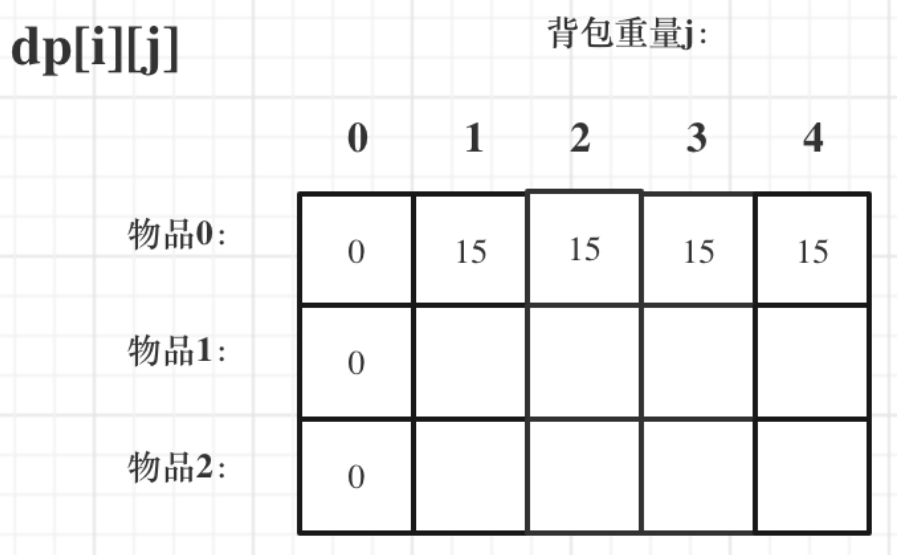

### 动态规划

`动态规划，如果某一问题有很多重叠子问题，使用动态规划是最有效的`

所以动态规划中每一个状态是由上一状态推导出来的， **这一点区别与贪心**， 贪心没有状态推导，而是从局部直接选最优的。

例如：有`N`件物品和一个最多能背重量为`W` 的背包。第i件物品的重量是`weight[i]`，得到的价值是`value[i]` 。**每件物品只能用一次**，求解将哪些物品装入背包里物品价值总和最大。

动态规划中`dp[j]`是由`dp[j-weight[i]]`推导出来的，然后取`max(dp[j], dp[j - weight[i]] + value[i])`。

但如果是贪心，每次拿物品选一个最大的或者最小的就完事了，和上一个状态没有关系。

所以贪心解决不了动态规划的问题。

**动态规划的解题步骤**

1、确定dp数组以及下标的含义

2、确定递推公式

3、dp数组如何初始化

4、确定遍历顺序

5、举例推导dp数组

#### 1、斐波那契数

[509. 斐波那契数 - 力扣（LeetCode）](https://leetcode.cn/problems/fibonacci-number/)

**斐波那契数** （通常用 `F(n)` 表示）形成的序列称为 **斐波那契数列** 。该数列由 `0` 和 `1` 开始，后面的每一项数字都是前面两项数字的和。也就是：

```
F(0) = 0，F(1) = 1
F(n) = F(n - 1) + F(n - 2)，其中 n > 1
```

给定 `n` ，请计算 `F(n)` 。

```python
class Solution:
    def fib(self, n):
        if n < 2:
            return n
        return self.fib(n-1) + self.fib(n-2)    
```

#### 2、爬楼梯

[70. 爬楼梯 - 力扣（LeetCode）](https://leetcode.cn/problems/climbing-stairs/)

假设你正在爬楼梯。需要 `n` 阶你才能到达楼顶。每次你可以爬 `1` 或 `2` 个台阶。你有多少种不同的方法可以爬到楼顶呢？

```python
class Solution:
    def climbStairs(self, n):
        dp = [0] * n
        if n < 3:
            return n
        dp[0], dp[1] = 1, 2
        for i in range(2, n):
            dp[i] = dp[i-1] + dp[i-2]
        return dp[n-1]
```

#### 3、使用最小花费爬楼梯

[746. 使用最小花费爬楼梯 - 力扣（LeetCode）](https://leetcode.cn/problems/min-cost-climbing-stairs/)

给你一个整数数组 `cost` ，其中 `cost[i]` 是从楼梯第 `i` 个台阶向上爬需要支付的费用。一旦你支付此费用，即可选择向上爬一个或者两个台阶。你可以选择从下标为 `0` 或下标为 `1` 的台阶开始爬楼梯。请你计算并返回达到楼梯顶部的最低花费。

```python
class Solution:
    def minCostClimbingStairs(self, cost):
        dp = [0] * (len(cost) + 1)
        dp[0], dp[1] = 0, 0
        for i in range(2, len(cost) + 1):
            dp[i] = min((dp[i-1] + cost[i-1]), (dp[i-2] + cost[i-2]))
        return dp[len(cost)]
```

#### 4、不同路径

[62. 不同路径 - 力扣（LeetCode）](https://leetcode.cn/problems/unique-paths/)

一个机器人位于一个 `m x n` 网格的左上角 （起始点在下图中标记为 “Start” ）。机器人每次只能向下或者向右移动一步。机器人试图达到网格的右下角（在下图中标记为 “Finish” ）。问总共有多少条不同的路径？

```python
class SOlution:
    def uniquePaths(self, m, n):
        dp = [[0] * n for _ in range(m)]
        for i in range(m):
            dp[i][0] = 1
        for j in range(n):
            dp[0][j] = 1
        for i in range(1, m):
            for j in range(1, n):
                dp[i][j] = dp[i-1][j] + dp[i][j-1]
        return dp[m-1][n-1]
```

#### 5、不同路径II

[63. 不同路径 II - 力扣（LeetCode）](https://leetcode.cn/problems/unique-paths-ii/)

一个机器人位于一个 `m x n` 网格的左上角 （起始点在下图中标记为 “Start” ）。

机器人每次只能向下或者向右移动一步。机器人试图达到网格的右下角（在下图中标记为 “Finish”）。

现在考虑网格中有障碍物。那么从左上角到右下角将会有多少条不同的路径？

网格中的障碍物和空位置分别用 `1` 和 `0` 来表示。

```python
class Solution:
    def uniquePathWithObstacles(self, obstacleGrid):
        m = len(obstacleGrid)
        n = len(obstacleGrid[0])
        dp = [[0] * n for _ in range(m)]
        for i in range(m):
            if obstacleGrid[i][0] == 1:
                break
            else:
                dp[i][0] = 1
        for j in range(n):
            if obstacleGrid[0][j] == 1:
                break
            else:
                dp[0][j] = 1
        for i in range(1, m):
            for j in range(1, n):
                if obstacleGrid[i][j] == 1:
                    dp[i][j] = 0
                else:
                    dp[i][j] = dp[i-1][j] + dp[i][j-1]
        return dp[m-1][n-1]
```

#### 6、整数拆分

[343. 整数拆分 - 力扣（LeetCode）](https://leetcode.cn/problems/integer-break/)

给定一个正整数 `n` ，将其拆分为 `k` 个 **正整数** 的和（ `k >= 2` ），并使这些整数的乘积最大化。

返回 *你可以获得的最大乘积* 。

```python
class Soution:
    def integerBreak(self, n):
        dp = [0] * (n + 1)
        dp[1] = 1
        j = 2
        while j <= n:
            for i in range(1, j):
                dp[j] = max(dp[j], max(i * (j - i), i * dp[j - i])
            j += 1
        return dp[n] 
```

#### 7、不同的二叉搜索树

[96. 不同的二叉搜索树 - 力扣（LeetCode）](https://leetcode.cn/problems/unique-binary-search-trees/)

给你一个整数 `n` ，求恰由 `n` 个节点组成且节点值从 `1` 到 `n` 互不相同的**二叉搜索树** 有多少种？返回满足题意的二叉搜索树的种数。

```python
class Solution:
    def numTrees(self, n):
        dp = [0] * (n + 1)
        if n < 3:
            return n
        dp[0] = 1
        for i in range(1, n+1):
            for j in range(i):
                dp[i] += dp[j] * dp[i-j-1]
        return dp[n]
```

#### 0-1 背包


**确定`dp`数组和下标含义**


<font color=red>**$dp[i][j]$表示从下标为[0-i]的物品里任意取，放进容量为j的背包，价值总和最大是多少**</font>

**确定递推公式**

如果该物品的重量大于背包的重量，则背包能背的物品最大价值为之前的最大价值，即$dp[i][j] = dp[i-1][j]$

但是如果该物品的重量小于等于背包的重量，就要选择**放不放**，即$dp[i][j] = max(dp[i-1][j], dp[i-1][j-weight[i]]+value[i])$

$dp[i-1][j-weight[i]]$为背包容量为$j-weight[i]$时，背包能背的物品的最大价值，再加上如果放的价值

**初始化**



当j = 0时， 背包的容量为0，此时背包什么也放不了，则背包的最大价值也为0

同时初始化`i=0`时的`dp`， 由于`i=0`时，只能选物品`0`， 则只有背包容量可以容纳物品0的重量时，背包中的最大价值就为`value[0]`

初始化程序如下：

```c++
vector<vector<int>> dp(weight.size(), vector<int>(bagweight+1, 0));
for(int j = weight[0]; j <= bagweight; j++){
    dp[0][j] = value[0];
}
```

先遍历物品，然后再遍历背包重量：

```c++
for(int i = 1; i < weight.size(); i++){
    for(int j = 1; j <= bagweight; j++){
        if(weight[i] <= j){
            dp[i][j] = max(dp[i-1][j], dp[i-1][j-weight[i]]+value[i]);
        }
        else{
            dp[i][j] = dp[i-1][j];
        }
    }
}
```


用一维数组表示`dp`， `dp[i]`为每个物品重量为i时，背包中的最大价值

分别对每个物品进行遍历，覆盖之前最大的价值

```c++
vector<int> dp(bagweight+1, 0);
for(int i = 0; i < weight.size(); i++){
    for(int j = bagweight; j >= weight[i]; j--){
        dp[j] = max(dp[j], dp[j - weight[i]] + value[i]);
    }
}
```

#### 滚动数组的形式

对于背包问题其实状态都是可以压缩的。在使用二维数组的时候，递推公式： `dp[i][j] = max(dp[i-1][j], dp[i-1][j-weight[i]] + value[i])`。

其实可以发现如果把`dp[i-1]`那一层拷贝到`dp[i]`上，表达式完全可以是： `dp[i][j] = max(dp[i][j], dp[i][j-weight[i]] + value[i] )` 

与其把`dp[i-1]`这一层拷贝到`dp[i]`上，不如只用一个一维数组了， 只用`dp[j]`（一维数组， 也可以理解是一个滚动数组。）

这就是滚动数组的由来，需要满足的条件是上一层可以重复利用，直接拷贝到当前层。

使用滚动数组， 动态规划五部曲则如下：

1、确定`dp`数组的定义

在一维`dp`数组中，`dp[j]`表示： 容量为j的背包，所被的物品价值可以最大为`dp[j]`

2、一维`dp`数组的递推公式

`dp[j]`为容量为`j`的背包所背的最大价值，那么如何推导`dp[j]`呢?


#### 8、分割等和子集

[416. 分割等和子集 - 力扣（LeetCode）](https://leetcode.cn/problems/partition-equal-subset-sum/)

给你一个 **只包含正整数** 的 **非空** 数组 `nums` 。请你判断是否可以将这个数组分割成两个子集，使得两个子集的元素和相等。

```python
class Solution:
    def canPartition(self, nums):
        
```

