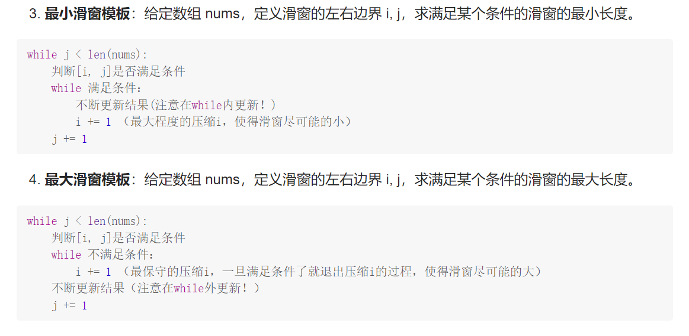
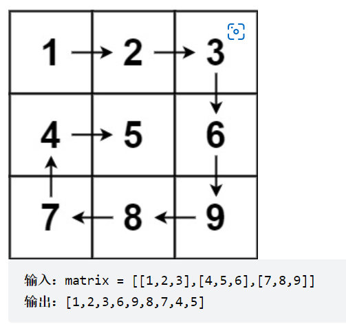

### 数组

#### 1、二分查找

[704. 二分查找 - 力扣（LeetCode）](https://leetcode.cn/problems/binary-search/)

给定一个n个元素有序的（升序）整型数组nums和一个目标值target， 写一个函数搜索nums中的target， 如果目标值存在返回下标，否则返回-1

```
nums1 = [-1, 0, 3, 5, 9, 12]  target = 9
```

```python
class Solution:
    def search(self, nums1, target):
        left, right = 0, len(nums1) -1
        while left <= right:
            mid = left + (right - left) // 2
            if nums1[mid] < target:
                left = mid + 1
            elif nums1[mid] > target:
                right  = mid - 1
            else:
                return mid
```

[35. 搜索插入位置 - 力扣（LeetCode）](https://leetcode.cn/problems/search-insert-position/)

给定一个排序数组和一个目标值，在数组中找到目标值，并返回其索引。如果目标值不存在于数组中，返回它将会被按顺序插入的位置。

请必须使用时间复杂度为 O(log n) 的算法。

```python
nums = [1, 3, 5, 6], target = 5
```

```python
class Solution:
    def searchInsert(self, nums, target):
        left, right = 0, len(nums) - 1
        while left <= right:
            mid = left + (right - left) // 2
            if nums[mid] > target:
                right = mid - 1
            elif nums[mid] < target:
                left = mid + 1
            elif nums[mid] == target:
                return mid
        return left
```

[69. x 的平方根 - 力扣（LeetCode）](https://leetcode.cn/problems/sqrtx/)

给你一个非负整数x，计算并返回x的算数平方根。由于返回类型是整数，结果只保留整数部分，小数部分将被舍去。

注意： 不允许使用任何内置指数函数和算符，例如pow(x, 0.5)或者x**0.5

```python
class Solution:
    def mySqrt(self, x):
        left, right = 0, x
        while left <= right:
            mid = left + (right - left) // 2
            if mid ** 2 < x:
                left = mid + 1
            elif mid ** 2 > x:
                right = mid - 1
            elif mid ** 2 == x:
                return mid
        return right
```

[34. 在排序数组中查找元素的第一个和最后一个位置 - 力扣（LeetCode）](https://leetcode.cn/problems/find-first-and-last-position-of-element-in-sorted-array/)

给你一个按照非递减顺序排列的整数数组nums， 和一个目标值target, 请你找出给定目标值在数组中的开始位置和结束位置。如果数组中不存在目标值target, 返回[-1, -1], 你必须设计并实现时间复杂度为0(logn)的算法解决此问题

```python
class Solution:
    def searchRange(self, nums, target):
        def findStart(nums, target):
        	left, right = 0, len(nums) - 1
            while left <= right:
                mid = left + (right - left) //2
                if nums[mid] >= target:
                    right = mid - 1
                elif nums[mid] < target:
                    left = mid + 1
            return left
        a = findStart(nums, target)
        b = findStart(nums, target + 1)
        if a == len(nums) or nums[a] != target:
            return [-1, -1]
        else:
            return [a, b-1]
```

[367. 有效的完全平方数 - 力扣（LeetCode）](https://leetcode.cn/problems/valid-perfect-square/)

给定一个正整数num， 编写一个函数，如果num是一个完全平方数，则返回True， 否则返回False,进阶：不要使用任何内置的库函数

```python
class Solution:
    def isPerfectSquare(self, num):
        left, right = 0, num
        while left <= right:
            mid = left + (right - left) // 2
            if mid ** 2 > num:
                right = mid - 1
            elif mid ** 2 < num:
                left = mid + 1
            elif mid ** 2 == num:
                return True
        return False
```

#### 2、移除元素

[27. 移除元素 - 力扣（LeetCode）](https://leetcode.cn/problems/remove-element/)

给你一个数组nums和一个值val, 你需要原地移除所有数值等于val的元素，并返回移除后数组的新长度

不要使用额外的数组空间，元素的顺序可以改变，你不需要考虑数组中超出新长度后面的元素。


```python
class Solution:
    def removeElement(self, nums, val):
        slow, fast = 0, 0
        while fast < len(nums):
            if nums[fast] != val:
                nums[slow] = nums[fast]
                slow += 1
            fast += 1
       return slow
```

[26. 删除有序数组中的重复项 - 力扣（LeetCode）](https://leetcode.cn/problems/remove-duplicates-from-sorted-array/)

给你一个 升序排列 的数组 nums ，请你 原地 删除重复出现的元素，使每个元素 只出现一次 ，返回删除后数组的新长度。元素的 相对顺序 应该保持 一致 。

由于在某些语言中不能改变数组的长度，所以必须将结果放在数组nums的第一部分。更规范地说，如果在删除重复项之后有 k 个元素，那么 nums 的前 k 个元素应该保存最终结果。

将最终结果插入 nums 的前 k 个位置后返回 k 。

不要使用额外的空间，你必须在 原地 修改输入数组 并在使用 O(1) 额外空间的条件下完成.

```python
class Solution:
    def removeDuplicates(self, nums):
        slow, fast = 1, 1
        while fast < len(nums):
            if nums[fast-1] != nums[fast]:
                nums[slow] = nums[fast]
                slow += 1
            fast += 1
        return slow
```

[283. 移动零 - 力扣（LeetCode）](https://leetcode.cn/problems/move-zeroes/)

给定一个数组 `nums`，编写一个函数将所有 `0` 移动到数组的末尾，同时保持非零元素的相对顺序。

**请注意** ，必须在不复制数组的情况下原地对数组进行操作。

```python
class Solution:
    def removeZeros(self, nums):
        slow, fast = 0, 0
        while fast < len(nums):
            if nums[fast] != 0:
                nums[slow] = nums[fast]
                slow += 1
            fast += 1
        for i in range(slow, fast):
            nums[i] = 0
        return nums
```

[844. 比较含退格的字符串 - 力扣（LeetCode）](https://leetcode.cn/problems/backspace-string-compare/)

给定 s 和 t 两个字符串，当它们分别被输入到空白的文本编辑器后，如果两者相等，返回 true 。# 代表退格字符。

注意：如果对空文本输入退格字符，文本继续为空。


```python
class Solution:
    def backspaceCompare(self, s, t):
        slow, fast = len(s)-1, len(t)-1
        records, recordf = 0, 0
        while slow >= 0 or fast >= 0:
            while slow >= 0:
                if s[slow] == "#":
                    slow -= 1
                    records += 1
                elif records > 0:
                    records -= 1
                    slow -= 1
                else:
                    break
            while fast >= 0:
                if t[fast] == "#":
                    fast -= 1
                    recordf += 1
                elif recordf > 0:
                    recordf -= 1
                    fast -= 1
                else:
                    break
            if slow >= 0 and fast >= 0:
                if s[slow] != t[fast]:
                    return False
            elif slow >= 0 or fast >= 0:
                return False
            slow -= 1
            fast -= 1
            
         return True           
```

#### 3、有序数组的平方

[977. 有序数组的平方 - 力扣（LeetCode）](https://leetcode.cn/problems/squares-of-a-sorted-array/)

给你一个按 **非递减顺序** 排序的整数数组 `nums`，返回 **每个数字的平方** 组成的新数组，要求也按 **非递减顺序** 排序。

```python
class Solution:
    def sortedSquares(self, nums):
        left, right, i = 0, len(nums) -1 , len(nums)- 1
        result = [0] * len(nums)
        while i >= 0 and  left <= right:
            if nums[left] ** 2 >= nums[right] ** 2:
                result[i] = nums[left] ** 2
                left += 1
            else:
                result[i] = nums[right] ** 2
                right -= 1
            i -= 1
         return result
```

#### 4、长度最小的子数组




[209. 长度最小的子数组 - 力扣（LeetCode）](https://leetcode.cn/problems/minimum-size-subarray-sum/)

给定一个含有 `n` 个正整数的数组和一个正整数 `target` 。

找出该数组中满足其和 `≥ target` 的长度最小的 **连续子数组** `[numsl,``numsl+1, ..., numsr-1, numsr]` ，并返回其长度**。**如果不存在符合条件的子数组，返回 `0` 。

```python
class Solution:
    def minLength(self, nums, target):
        left = 0
        result = float("inf")
        sum = 0
        for right in range(len(nums)):
            sum += nums[right]
            while sum >= target:
                length = right -left + 1
                if length < result:
                    result = length
                sum -= nums[left]
                left += 1
        if result == float("inf"):
            return 0
        else:
            return result
```

[904. 水果成篮 - 力扣（LeetCode）](https://leetcode.cn/problems/fruit-into-baskets/)

你正在探访一家农场，农场从左到右种植了一排果树。这些树用一个整数数组 `fruits` 表示，其中 `fruits[i]` 是第 `i` 棵树上的水果 **种类** 。

你想要尽可能多地收集水果。然而，农场的主人设定了一些严格的规矩，你必须按照要求采摘水果：

- 你只有 **两个** 篮子，并且每个篮子只能装 **单一类型** 的水果。每个篮子能够装的水果总量没有限制。
- 你可以选择任意一棵树开始采摘，你必须从 **每棵** 树（包括开始采摘的树）上 **恰好摘一个水果** 。采摘的水果应当符合篮子中的水果类型。每采摘一次，你将会向右移动到下一棵树，并继续采摘。
- 一旦你走到某棵树前，但水果不符合篮子的水果类型，那么就必须停止采摘。

给你一个整数数组 `fruits` ，返回你可以收集的水果的 **最大** 数目。

```python
class Solution:
    def totalFruit(self, fruits):
        left, right = 0, 0
        result = 0
        record = defaultdict(int)
        cl = 0
        while right < len(fruits):
            if not record[fruits[right]]:
                cl += 1
            record[fruits[right]] += 1
            while cl > 2:
                if record[fruits[left]] == 1:
                    cl -= 1
                record[fruits[left]] -= 1
                left += 1
            result = max(result, right - left + 1)
       return result 
```

[76. 最小覆盖子串 - 力扣（LeetCode）](https://leetcode.cn/problems/minimum-window-substring/)

给你一个字符串 `s` 、一个字符串 `t` 。返回 `s` 中涵盖 `t` 所有字符的最小子串。如果 `s` 中不存在涵盖 `t` 所有字符的子串，则返回空字符串 `""` 。

```python
class Solution:
    def minWindow(self, s, t):
        hs, ht = collections.defaultdict(int), collections.defaultdict(int)
        for char in t:
            ht[char] += 1
        left, right = 0, 0
        ch = 0
        res = ""
        while right < len(s):
            hs[s[right]] += 1
            if hs[s[right]] <= ht[s[right]]:
                ch += 1
            while left <= right and hs[s[left]] > ht[s[left]]:
                hs[s[left]] -= 1
                left += 1
            if ch == len(t):
                if not res or right -left + 1 < len(res):
                    res = s[left: right + 1]
        return res
```

#### 5、螺旋矩阵

[54. 螺旋矩阵 - 力扣（LeetCode）](https://leetcode.cn/problems/spiral-matrix/)

给你一个 `m` 行 `n` 列的矩阵 `matrix` ，请按照 **顺时针螺旋顺序** ，返回矩阵中的所有元素。



```python
class Solution:
    def spiralOrder(self, matrix):
        result = []
        up, down, left, right = 0, len(matrix)+1, 0, len(matrix[0]) -1
        while True:
            for i in range(left, right+1):
                result.append(matrix[up][i])
            up += 1
            if up > down:
                break
            for i in range(up, down + 1):
                result.append(matrix[i][right])
            right -= 1
            if right < left:
                break
            for i in range(right, left -1 , -1):
                result.append(matrix[down][i])
            down -= 1
            if down < up:
                break
            for i in range(down, up -1, -1):
                result.append(matrix[i][left])
            left += 1
            if left > right:
                break
         return result
```

[59. 螺旋矩阵 II - 力扣（LeetCode）](https://leetcode.cn/problems/spiral-matrix-ii/)

给你一个正整数 `n` ，生成一个包含 `1` 到 `n2` 所有元素，且元素按顺时针顺序螺旋排列的 `n x n` 正方形矩阵 `matrix` 。

```python
class Solution:
    def generateMatrix(self, n):
        up, down, left, right = 0, n-1, 0, n-1
        result = [[0] * n for _ in range(n)]
        ch = 0
        while True:
            for i in range(left, right+1):
                ch += 1
                result[up][i] = ch
            up += 1
            if up > down:
                break
            for i in range(up, down+1):
                ch += 1
                result[i][right] = ch
            right -= 1
            if right < left:
                break
            for i in range(right, left-1, -1):
                ch += 1
                result[down][i] = ch
            down -= 1
            if down < up:
                break
            for i in range(down, up-1, -1):
                ch += 1
                result[i][left]  = ch
            left += 1
            if left >right:
                break
        return result
```

