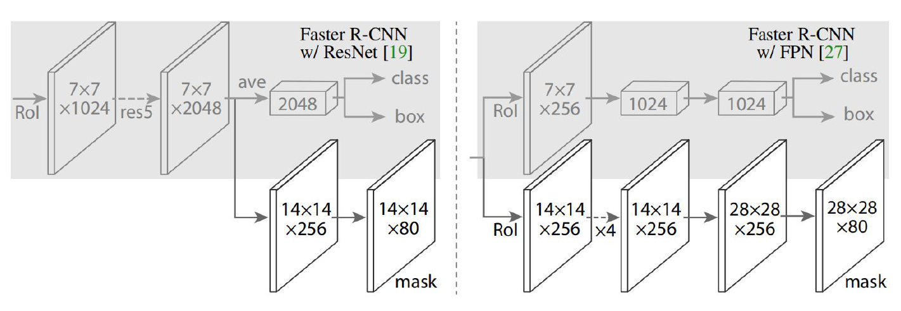
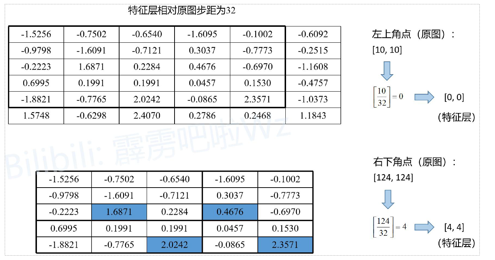
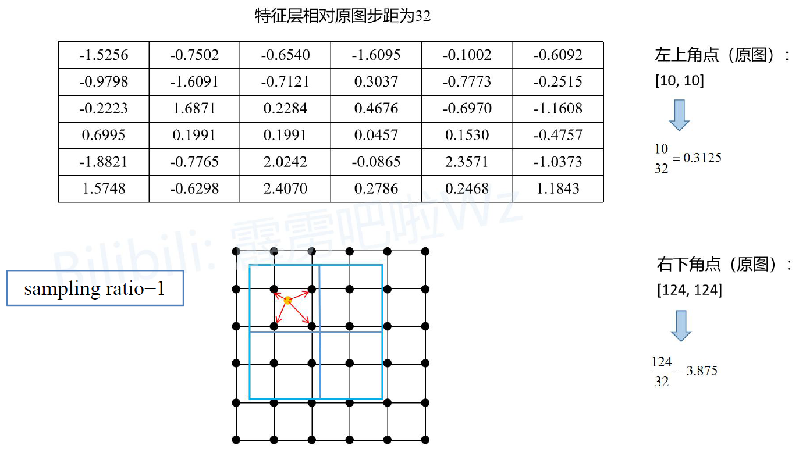
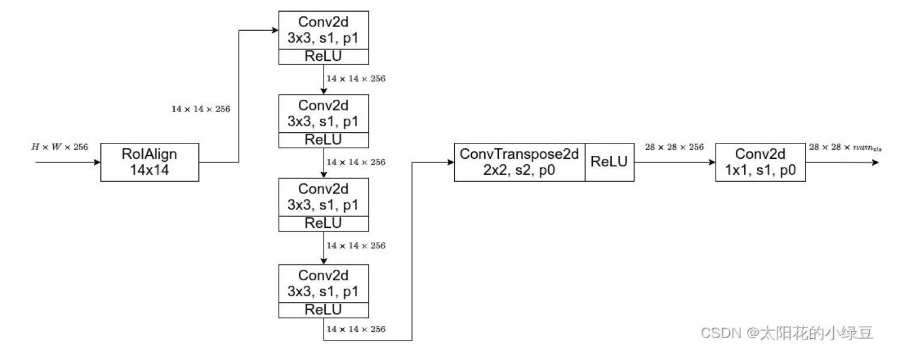

### Mask RCNN

`Mask RCNN`是在`Faster RCNN`的基础上加了一个用于预测目标分割`Mask`的分支（即可预测目标的`Bounding boxes`信息，类别信息以及分割`Mask`信息。）， 同时还能很容易地扩展到其他任务，比如再同时预测人体关键点信息。

`Mask RCNN`的结构也很简单，就是在通过`RoIAlign`（在原`FasterRCNN`中是`RoIPool`）得到的`RoI`基础上并行添加一个Mask分支（小型的**FCN**）。见下图，之前的**Faster RCNN**是在`RoI`基础上接上一个Fast RCNN的检测头，即图中**class box **分支，现在又并行了一个Mask 分支。

**注意带和不带FPN结构的Mask RCNN在Mask分支上略有不同，对于带有FPN结构的Mask RCNN它的class、box分支和mask分支并不是共用一个`RoIAlign`**，在训练过程中，对于**class, box**分支`RoIAlign`将`RPN`得到的proposals池化到`7x7`大小，而对于Mask分支`RoIAlign`将Proposals池化到`14x14`大小。

mask分支需要更加精细的特征，所以特征图大小比上面的大

**将`FasterRCNN`中的`RoIPool`替换成`RoIAlign`**

为什么替换？

在`RoIPool`中存在两次量化误差

下面的示意图就是`RoIPool`的执行过程，其中会经历两次量化，假设通过`RPN`得到一个`Proposal`, 它在原图上的左上角坐标是`(10, 10)`， 右下角的坐标是`(124, 124),` 对应要映射的特征层相对原图的步距为`32`， 通过`RoIPool`期望的输出为`2x2`大小：

* 将Proposal映射到特征层上，对于左上角坐标$\frac{10}{32}$四舍五入后等于0，对于右下角坐标$\frac{124}{32}$四舍五入后等于4， 即映射在特征层上的左上角坐标为(0, 0)， 右下角坐标为(4, 4)。对应下图特征层上从第0行到第4行，从第0列到第4列的区域（黑色矩形框）。这是第一次量化。
* 由于期望的输出为`2x2`大小，所以需要将映射在特征层上的`Proposal`划分为`2x2`大小区域，但现在映射在特征层上的`Proposal`是`5x5`大小的， 无法均分，所以强行划分后有的区域大有的区域小，如下图所示，这是第二次量化误差。
* 对于划分的每个子区域进行`maxpool`即可得到`RoIPool`的输出

为了解决这个问题， 提出了`RoIAlign`替换`RoIPool`， 以获取更加精确的空间定位信息。

下面的示意图是`RoIAlign`的执行过程。同样假设通过`RPN`得到一个Proposal，它在原图上的左上角坐标是(10, 10), 右下角坐标是(124, 124)， 对应要映射的特征层相当于原图的步距为32， 通过RoIAlign期望的输出为2x2大小：

* 将Proposal映射到特征层上，左上角坐标为(0.3125, 0.3125)（不进行四舍五入）， 右下角坐标为(3.875, 3.875)（不进行四舍五入）。为了方便了解，将特征层上的每个元素用一个点表示，就能得到图中下方的grid网格，图中蓝色的矩形框就是Proposal（没有量化误差）
* 由于期望输出为2x2大小，故将Proposal划分为2x2四个子区域（没有量化误差）， 接着根据sampling ratio在每个子区域中设置采样点，原论文中默认设置的sampling_ratio为4， 这里为了设置为了1
* 然后计算每个子区域中每个采样点的值（采用双线性插值计算）， 最后对每个区域的所有采样点取均值即为该子区域的输出。

值得注意的是，论文中提到，关于最终的采样结果对采样点位置，以及采样点的个数并不敏感。

**Mask Branch(FCN)**

FCN是对每个像素针对每个类别都会预测一个分数，然后通过softmax得到每个类别的概率（不同类别之间存在竞争关系）， 但在Mask RCNN中，作者将预测Mask和class进行了解耦，即对输入的RoI针对每个类别都单独预测一个Mask, 最终根据box, cls分支预测的classes信息来选择对应类别的Mask（不同类别之间不存在竞争关系）。作者说解耦后带来了很大的提升。

**这里还有一个需要注意的细节**。在训练网络的时候输入Mask分支的目标是由RPN提供的，即Proposals，但在预测的时候输入Mask分支的目标是由Fast R-CNN提供的（即预测的最终目标）。 并且训练时采用的Proposals全部是Fast R-CNN阶段匹配到的正样本。这里说下我个人的看法（不一定正确），在训练时Mask分支利用RPN提供的目标信息能够扩充训练样本的多样性（因为RPN提供的目标边界框并不是很准确，一个目标可以呈现出不同的情景，类似于围着目标做随机裁剪。从另一个方面来看，通过Fast R-CNN得到的输出一般都比较准确了，再通过NMS后剩下的目标就更少了）。在预测时为了获得更加准确的目标分割信息以及减少计算量（通过Fast R-CNN后的目标数会更少），此时利用的是Fast R-CNN提供的目标信息。

**损失函数**

Mask RCNN损失是在fasterRCNN上添加了一个mask损失
$$
Loss = L_{rpn} + L_{fast\_rcnn} + L_{mask}
$$
在讲Mask分支损失计算之前，我们要弄清楚logits（网络预测的输出）是什么，targets（对应的GT）是什么。前面有提到训练时输入Mask分支的目标是RPN提供的Proposals，所以网络预测的logits是针对每个Proposal对应每个类别的Mask信息（注意预测的Mask大小都是28x28）。并且这里输入的Proposals都是正样本（在Fast R-CNN阶段采样得到的），对应的GT信息（box、cls）也是知道的。

如下图所示，假设通过RPN得到了一个Proposal（图中黑色的矩形框），通过RoIAlign后得到对应的特征信息（shape为14x14xC），接着通过Mask Branch预测每个类别的Mask信息得到图中的logits（logits通过sigmoid激活函数后，所有值都被映射到0至1之间）。通过Fast R-CNN分支正负样本匹配过程我们能够知道该Proposal的GT类别为猫（cat），所以将logits中对应类别猫的预测mask（shape为28x28）提取出来。然后根据Proposal在原图对应的GT上裁剪并缩放到28x28大小，得到图中的GT mask（对应目标区域为1，背景区域为0）。最后计算logits中预测类别为猫的mask与GT mask的BCELoss（BinaryCrossEntropyLoss）即可。
