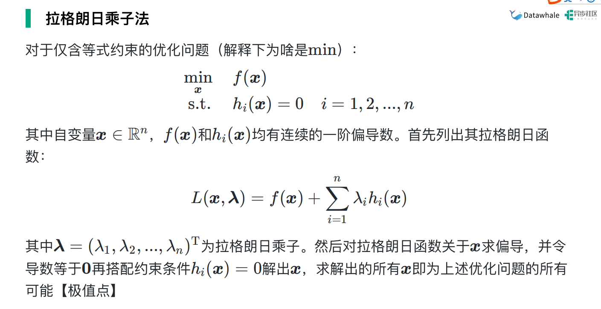

### 线性判别分析（LDA）

从几何的角度， 让全体训练样本经过投影后：

* 异类样本的中心尽可能远
* 同类样本的方差尽可能近

#### 损失函数推导

经过投影后，**异类样本的中心尽可能远**

$max||w^T\mu_0-w^T\mu_1||^2_2$

（注：上式等价于每类的均值投影点尽可能的远。相当于前面乘了常数$|w|$，不影响结果。（$max|||w|*|\mu_0|*cos\theta_0-|w|*|\mu_1|*cos\theta_1||^2_2$））

经过投影后，**同类样本的协方差尽可能小**

$min w^T\Sigma_0w$

* $w^T\Sigma_0w=w^T(\sum_{x\in X_0}(x-\mu_0)(x-\mu_0)^T)w=\sum_{x\in X_0}(w^Tx-w^T\mu_0)(x^Tw-\mu^T_0w)$

从而得出以下公式， 

$max J = \frac{w^T(\mu_0-\mu_1)(\mu_0-\mu_1)^Tw}{w^T(\Sigma_0+\Sigma_1)w}=\frac{w^TS_bw}{w^TS_ww}$

$S_b$定义为类间散度矩阵，$S_w$为类内散度矩阵

上式等价于 $min -w^TS_bw$， $s.t. w^TS_ww=1$

*解上述等式约束，可利用拉格朗日乘子法进行求解*

#### 求解w

由朗格朗日乘子法可得拉格朗日函数为：

$L(w,\lambda)=-w^TS_bw+\lambda(w^TS_ww-1)$

对w求偏导可得，

$\frac{\partial L(w,\lambda)}{\partial w}=-\frac{\partial(w^TS_bw)}{\partial w} + \lambda\frac{\partial(w^TS_ww-1)}{\partial w}=-(S_b+S_b^T)w + \lambda(S_w+S_w^T)w$

由于$S_b，S_w$是对称矩阵，所以

$\frac{\partial{L(w,\lambda)}}{\partial w} = -2S_bw + 2\lambda S_ww$

令上式等于0，即可得

$S_bw=\lambda S_ww$         $(\mu_0-\mu_1)(\mu_0-\mu_1)^Tw=\lambda S_ww$

令$(\mu_0-\mu_1)^Tw = \gamma$（前面是列向量，后面是行向量，所以点乘为实数）

$\gamma(\mu_0-\mu_1)=\lambda S_ww$

$w=\frac{\gamma}{\lambda}S^{-1}_w(\mu_0-\mu_1)= S^{-1}_w(\mu_0-\mu_1)$

