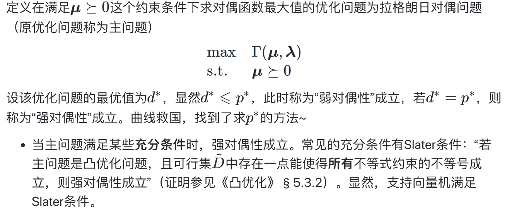

### 支持向量机 SVM

从几何角度， 对于线性可分数据集， 支持向量机就是**找距离正负样本都最远的超平面**, 相比于感知机（只是寻找可以分离正负样本的超平面）， 其解释唯一的， 且不偏不倚， 泛化性能更好。

**超平面**

n维空间的超平面($w^Tx+b=0$,其中$w,x\in R^n$):

* 超平面方程不唯一

* 法向量w和位移项b确定一个唯一超平面

* 法向量w垂直于超平面（缩放w,b时，若缩放倍数为负数会改变法向量方向）

* 法向量w指向的那一半空间为正空间，另一半为负空间

* 任意点x到超平面的距离公式为$r=\frac{|w^Tx+b|}{||w||}$

#### 几何间隔

对于给定的数据集X和超平面$w^Tx+b=0$，定义数据集X中的任意一个样本点

$(x_i,y_i),y_i\in \{-1,1\},i=1,2,...,m$关于超平面的几何间隔为：

$\gamma_i=\frac{y_i(w^Tx_i+b)}{||w||}$

正确分类时，$\gamma_i>0$，几何间隔此时也等价于点到超平面的距离

没有正确分类时，$\gamma_i<0$

对于给定的数据集X和超平面$w^Tx+b=0$,定义数据集X关于超平面的几何间隔为：

**数据集X中所有样本点的几何间隔最小值**

$\gamma = min_{i=1,2...,m} \gamma_i$

#### 支持向量机模型

模型：给定线性可分数据集X，支持向量机模型希望求得数据集X关于超平面的几何间隔$\gamma$

达到最大的那个超平面，然后套上一个sign函数实现分类功能

$$
y=sign(w^Tx+b)=\begin{cases}

1 & w^Tx + b > 0\\

-1 & w^Tx+b < 0

\end{cases}
$$

所以其本质和感知机一样，仍然是在求一个超平面，**几何间隔最大的超平面一定就是我们前面所说的距离正负样本都最远的超平面**

原因有两点：

* 当超平面没有正确划分正负样本时：几何间隔最小的为误分类点，因此$\gamma<0$
* 当超平面正确划分超平面时：$\gamma >= 0$,且越靠近中央$\gamma$越大

#### 策略与求解

给定线性可分数据集X，设X中几何间隔最小的样本为$(x_{min},y_{min})$，那么支持向量机找超平面的过程可以转化为以下带约束条件的优化问题

假设该问题的最优解为$(w^*,b^*)$，那么$(\alpha w^*,\alpha b^*)$也是最优解，且超平面也不变，因此还需要对$w,b$做一定的限制才能使得上述优化问题有可解的唯一解，不仿设分子$y_{min}(w^Tx_{min}+b)=1$，因为对于特定的$(x_{min},y_{min})$来说，能使得$y_{min}(w^Tx_{min}+b)=1$的$\alpha$有且只有一个，因此上述问题进一步转化为：

由于求$1/||w||$的最大值相当于求$\frac{1}{2}||w||^2$的最小值，所以上述目标函数等价于:

因为现在的目标函数是二次的，约束条件是线性的，所以它是一个凸二次规划问题，可以通过拉格朗日对偶性变换到对偶变量的优化问题，即通过求解与原问题等价的对偶问题得到原始问题的最优解，这就是线性可分条件下支持向量机的对偶算法，这样做的优点在于：对偶问题往往更容易求解，二是可以自然的引入核函数，进而推广到非线性分类问题。

参考以下：

拉格朗日对偶函数$\Gamma(\mu,\lambda)$为拉格朗日函数$L(x,\mu,\lambda)$的下确界。同时“弱对偶性”成立，进而参考主问题满足充分条件，得出该问题满足强对偶性成立，故满足KKT条件。

#### 软间隔

在现实任务中，线性不可分的情形才是最常见的， 因此需要允许支持向量机犯错。

最终分类模型：

$$f(x) = w^Tx + b = \sum^m_{i=1}\alpha_i y_i x^T_i x +b$$

发现分类新样本只需要跟支持向量做点积。

#### 核函数

之前的SVM推导中，**假设了输入空间是线性可分的（存在划分超平面）或者允许SVM犯错的超平面**。现实中的任务往往非线性可分（不存在划分超平面），这时候就不能在这个空间上用SVM。

**核方法** 是一类把低维空间的非线性可分问题，转化为高维空间的线性可分问题的方法。核方法不仅仅用于SVM，还可以用于其他数据为非线性可分的算法。核方法的理论基础是Cover's theorem，指的是对于非线性可分的训练集，可以大概率通过将其非线性映射到一个高维空间来转化成线性可分的训练集。

SVM中，令 `ϕ(xi) `表示将` xi` 映射后的线性向量，那么对偶问题是：

$$\begin{equation}\begin{aligned}& \max_{\alpha}& &\sum_{i=1}^m \alpha_i-\frac{1}{2}\sum_{i=1}^m\sum_{j=1}^m \alpha_i \alpha_j y_i y_j \phi(x_i)^{\intercal} \phi(x_j)\\& \text{subject to}& & \sum_{i=1}^m \alpha_i y_i = 0 \\ & & & 0 \leqslant \alpha_i \leqslant C,\; i = 1,\dots,m\end{aligned}\end{equation}\tag{1}$$

最终分类模型是：

$$f(x) = \sum_{i = 1}^m \alpha_iy_i\phi(x_i)^{\intercal} \phi(x) +b \tag{2}$$

跟之前的`SVM`相比，除了 `xi` 变成了 `ϕ(xi)` ，其他式子没有任何变化。

**核函数**： 设$\mathcal{X}$是输入空间（即$x_i \in  \mathcal{X}$,  $\mathcal{X}$是$R^n$的子集或离散集合），又设$\mathcal{H}$为特征空间($\mathcal{H}$是希尔伯特空间)， 如果存在一个从$\mathcal{X}$到$\mathcal{H}$的映射，

$$\phi(x) : \mathcal{X} \to \mathcal{H} \tag{3}$$

使得对所有 $$x,z \in \mathcal{X}$$ ，函数 $$K(x,z) $$满足条件

$$K(x,z) = \langle \phi(x),\phi(z) \rangle \tag{4}$$

则称 K 为核函数。其中 $$\phi(x)$$ 为映射函数， $$\langle \cdot,\cdot \rangle $$为内积。

即核函数输入两个向量，它返回的值跟两个向量分别作 $$\phi$$ 映射然后点积的结果相同。

**核技巧**是一种利用核函数直接计算 $\langle \phi(x),\phi(z) \rangle$ ，以避开分别计算 $\phi(x) $和 $\phi(z) $，从而加速核方法计算的技巧。

得益于SVM对偶问题的表现形式，核技巧可以应用于SVM。(1)可以改成

$$\begin{equation}\begin{aligned}& \max_{\alpha}& &\sum_{i=1}^m \alpha_i-\frac{1}{2}\sum_{i=1}^m\sum_{j=1}^m \alpha_i \alpha_j y_i y_j K(x_i,x_j)\\& \text{subject to}& & \sum_{i=1}^m \alpha_i y_i = 0 \\ & & & 0 \leqslant \alpha_i \leqslant C,\; i = 1,\dots,m\end{aligned}\end{equation}\tag{5}$$

 (2)可改写为：

$$f(x) = \sum_{i = 1}^m \alpha_iy_iK(x_i,x) +b \tag{6}$$

核函数的选择是SVM的最大变数，如果核函数选择不适，那么 ϕ 将不能将输入空间映射到线性可分的特征空间