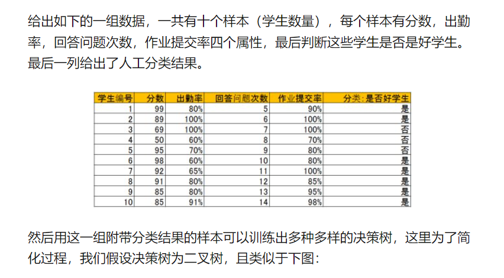
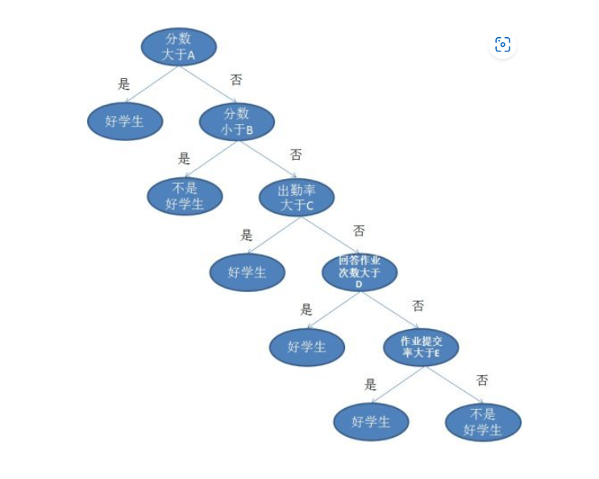
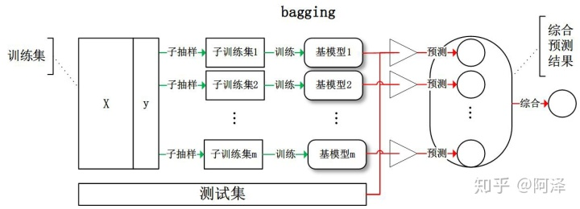
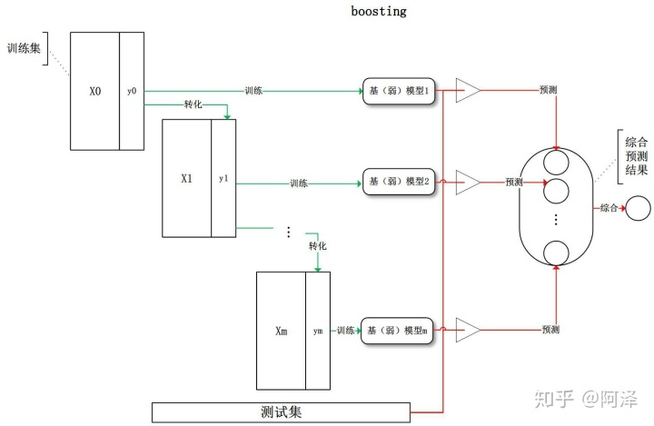
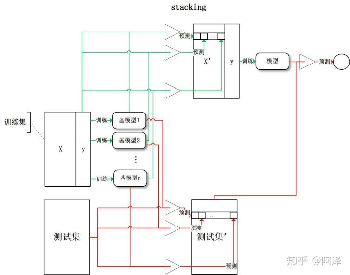
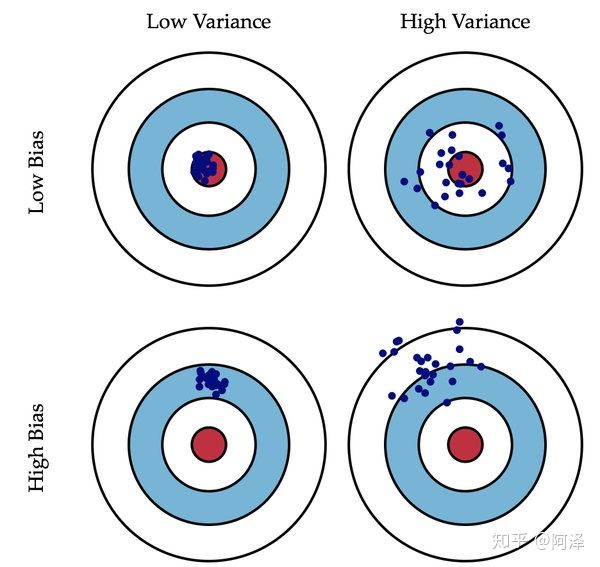

### 决策树

#### 算法原理

从逻辑角度， 决策树是一堆if else语句的组合

从几何角度， 根据某种准则划分特征空间

最终目的： 将样本越分越纯

决策树可以作为分类算法， 也可用于回归模型， 决策树是一种树形结构， 其中每个内部节点表示一个属性上的判断， 每个分支代表一个判断结果的输出，最后每个叶节点代表一种分类结果。

所以决策树的生成主要分以下两步，这两步通常通过学习已经知道分类结果的样本来实现。

* 节点的分裂：一般当一个节点所代表的属性无法给出判断时，则选择将这一节点分成2个子节点（如不是二叉树的情况会分成n个子节点）

* 阈值的确定：选择适当的阈值使得分类错误率最小 （Training Error）。

**学习决策树， 需要先理解信息论**

**信息论**

自信息：
$$
I(X) = -log_b p(x)
$$
当b=2时单位为bit, 当b=e时单位为nat(**不重要**)

信息熵（自信息的期望）：度量随机变量X的不确定性， 信息熵越大越不确定
$$
H(X) = E[I(X)] = -\sum_x p(x)log_bp(x)
$$
计算信息熵时约定： 若p(x) = 0, 则$p(x)log_b p (x) = 0$。当X的某个取值的概率为1时信息熵最小， 其值为0； 当X的各个取值的概率均等时信息熵最大（最不确定）， 其值为$log_b |X|$， 其中$|x|$表示X可能取值的个数。

将样本类别标记y视作随机变量， 各个类别在样本集合D中的占比$$p_k(k=1, 2, .., |\mathcal{Y}|)$$视作各个类别取值的概率， 则样本集合D（随机变量y）的信息熵（底取2）为
$$
H(X) = Ent(D) = -\sum^{|\mathcal{Y}|}_{k=1} p_k log_2 p_k
$$
此时的信息熵所代表的“不确定性”可以转换理解为集合内样本的“纯度”

**样本集合D中全都是一个类别时， 是最纯的**

条件熵（Y的信息熵关于概率分布X的期望）： 在已知X后Y的不确定性
$$
H(Y|X) = \sum_x p(x)H(Y|X=x)
$$
从单个属性（特征）a的角度来看， 假设其可能取值为$\{a^1, a^2, .., a^V\}$，$D^v$表示属性a的取值为$a^v \in \{a^1, a^2, .., a^V\}$的样本集合， $\frac{|D^v|}{D}$表示占比， 那么在已知属性a的取值后， 样本集合D的条件熵为
$$
\sum ^V_{v=1} \frac{|D^v|}{|D|} Ent(D^v)
$$
信息增益： 在已知`属性（特征）a`的取值后`y（样本集合）`的不确定性减少的量， 也即纯度的提升

信息增益 = 信息熵 - 条件熵
$$
Gain(D, a) = Ent(D) - \sum^V_{v=1} \frac{|D^v|}{|D|} Ent(D^v)
$$

#### **1、ID3决策树**

以信息增益为准则来选择划分属性的决策树

$$ a_* = argmax_{a \in A}~Gain(D, a)$$

`ID3`算法的核心思想就是**以信息增益来度量特征选择**， **选择信息增益最大的特征进行分裂**。算法采用自顶向下的贪婪搜索遍历可能的决策树空间。其大致步骤为：

1、初始化特征集合和数据集合

2、计算数据集合信息熵和所有特征的条件熵， 选择信息增益最大的特征作为当前决策节点；

3、更新数据集合和特征集合（删除上一步使用的特征， 并按照特征值来划分不同分支的数据集合）

4、重复2， 3两步， 若子集值包含单一特征， 则为分支叶子节点。

比如上表中的4个属性：单一地通过以下语句分类：

1. 分数小于70为【不是好学生】：分错1个

2. 出勤率大于70为【好学生】：分错3个

3. 问题回答次数大于9为【好学生】：分错2个

4. 作业提交率大于80%为【好学生】：分错2个

最后发现 分数小于70为【不是好学生】这条分错最少，也就是熵最小，所以应该选择这条为父节点进行树的生成，当然分数也可以选择大于71，大于72等等，出勤率也可以选择小于60，65等等，总之会有很多类似上述1~4的条件，最后选择分类错最少即熵最小的那个条件。而当分裂父节点时道理也一样，分裂有很多选择，针对每一个选择，与分裂前的分类错误率比较，留下那个提高最大的选择，即熵减最大的选择。

**ID3的缺点**

- `ID3 `没有剪枝策略，容易过拟合；
- 信息增益准则对可取值数目较多的特征有所偏好，类似“编号”的特征其信息增益接近于 1；
- 只能用于处理离散分布的特征；
- 没有考虑缺失值。

#### 2、C4.5

`C4.5 `算法最大的特点是克服了 `ID3 `对特征数目的偏重这一缺点，引入信息增益率来作为分类标准。

**思想**

`C4.5 `相对于 `ID3 `的缺点对应有以下改进方式：

- 引入悲观剪枝策略进行后剪枝；
- 引入信息增益率作为划分标准；
- 将连续特征离散化，假设 n 个样本的连续特征 A 有 m 个取值，`C4.5 `将其排序并取相邻两样本值的平均数共 m-1 个划分点，分别计算以该划分点作为二元分类点时的信息增益，并选择信息增益最大的点作为该连续特征的二元离散分类点；
- 对于缺失值的处理可以分为两个子问题：
- 问题一：在特征值缺失的情况下进行划分特征的选择？（即如何计算特征的信息增益率）
- 问题二：选定该划分特征，对于缺失该特征值的样本如何处理？（即到底把这个样本划分到哪个结点里）
- 针对问题一，`C4.5 `的做法是：对于具有缺失值特征，用没有缺失的样本子集所占比重来折算；
- 针对问题二，`C4.5 `的做法是：将样本同时划分到所有子节点，不过要调整样本的权重值，其实也就是以不同概率划分到不同节点中。

**举例：**

通过对`ID3`的学习，可以知道`ID3`存在一个问题，那就是越细小的分割分类错误率越小，所以ID3会越分越细，比如以第一个属性为例：设阈值小于70可将样本分为2组，但是分错了1个。如果设阈值小于70，再加上阈值等于95，那么分错率降到了0，但是这种分割显然只对训练数据有用，对于新的数据没有意义，这就是所说的过度学习（`Overfitting`）。

分割太细了，训练数据的分类可以达到0错误率，但是因为新的数据和训练数据不同，所以面对新的数据分错率反倒上升了。决策树是通过分析训练数据，得到数据的统计信息，而不是专为训练数据量身定做。

所以为了避免分割太细，`c4.5`对`ID3`进行了改进，`C4.5`中，优化项要除以分割太细的代价，这个比值叫做**信息增益率**，显然分割太细分母增加，信息增益率会降低。除此之外，其他的原理和ID3相同。

#### 3、CART

`ID3` 和 `C4.5 `虽然在对训练样本集的学习中可以尽可能多地挖掘信息，但是其生成的决策树分支、规模都比较大，CART 算法的二分法可以简化决策树的规模，提高生成决策树的效率。

`CART `包含的基本过程有分裂，剪枝和树选择。

- **分裂：**分裂过程是一个二叉递归划分过程，其输入和预测特征既可以是连续型的也可以是离散型的，`CART `没有停止准则，会一直生长下去；
- **剪枝：**采用**代价复杂度剪枝**，从最大树开始，每次选择训练数据熵对整体性能贡献最小的那个分裂节点作为下一个剪枝对象，直到只剩下根节点。`CART `会产生一系列嵌套的剪枝树，需要从中选出一颗最优的决策树；
- **树选择：**用单独的测试集评估每棵剪枝树的预测性能（也可以用交叉验证）。

`CART `在 `C4.5 `的基础上进行了很多提升。

- `C4.5 `为多叉树，运算速度慢，`CART `为二叉树，运算速度快；
- `C4.5 `只能分类，`CART `既可以分类也可以回归；
- `CART `使用 `Gini `系数作为变量的不纯度量，减少了大量的对数运算；
- `CART `采用代理测试来估计缺失值，而 `C4.5 `以不同概率划分到不同节点中；
- `CART `采用“基于代价复杂度剪枝”方法进行剪枝，而 `C4.5` 采用悲观剪枝方法。

举例：

`CART`是一个二叉树，也是回归树，同时也是分类树，`CART`的构成简单明了。

`CART`只能将一个父节点分为2个子节点。`CART`用`GINI`指数来决定如何分裂：

`GINI`指数：总体内包含的类别越杂乱，`GINI`指数就越大（跟熵的概念很相似）。

a. 比如出勤率大于70%这个条件将训练数据分成两组：大于70%里面有两类：【好学生】和【不是好学生】，而小于等于70%里也有两类：【好学生】和【不是好学生】。

b. 如果用分数小于70分来分：则小于70分只有【不是好学生】一类，而大于等于70分有【好学生】和【不是好学生】两类。

比较a和b，发现b的凌乱程度比a要小，即`GINI`指数b比a小，所以选择b的方案。以此为例，将所有条件列出来，选择`GINI`指数最小的方案，这个和熵的概念很类似。

`CART`还是一个回归树，回归解析用来决定分布是否终止。理想地说每一个叶节点里都只有一个类别时分类应该停止，但是很多数据并不容易完全划分，或者完全划分需要很多次分裂，必然造成很长的运行时间，所以`CART`可以对每个叶节点里的数据分析其均值方差，当方差小于一定值可以终止分裂，以换取计算成本的降低。

`CART`和`ID3`一样，存在偏向细小分割，即过度学习（过度拟合的问题），为了解决这一问题，对特别长的树进行剪枝处理，直接剪掉。

以上的决策树训练的时候，一般会采取`Cross-Validation`法：比如一共有10组数据：

第一次. 1到9做训练数据， 10做测试数据

第二次. 2到10做训练数据，1做测试数据

第三次. 1，3到10做训练数据，2做测试数据，以此类推

做10次，然后大平均错误率。这样称为 10 folds Cross-Validation。

比如 3 folds Cross-Validation 指的是数据分3份，2份做训练，1份做测试。

最后通过总结的方式对比下 `ID3`、`C4.5 `和 `CART `三者之间的差异。

除了之前列出来的划分标准、剪枝策略、连续值确实值处理方式等之外，我再介绍一些其他差异：

- **划分标准的差异：**`ID3 `使用信息增益偏向特征值多的特征，`C4.5 `使用信息增益率克服信息增益的缺点，偏向于特征值小的特征，`CART `使用基尼指数克服 `C4.5 `需要求 `log `的巨大计算量，偏向于特征值较多的特征。
- **使用场景的差异：**`ID3 `和 `C4.5 `都只能用于分类问题，`CART `可以用于分类和回归问题；`ID3 `和 `C4.5 `是多叉树，速度较慢，CART 是二叉树，计算速度很快；
- **样本数据的差异：**`ID3 `只能处理离散数据且缺失值敏感，`C4.5 `和 CART 可以处理连续性数据且有多种方式处理缺失值；从样本量考虑的话，小样本建议 `C4.5`、大样本建议 `CART`。`C4.5 `处理过程中需对数据集进行多次扫描排序，处理成本耗时较高，而 `CART `本身是一种大样本的统计方法，小样本处理下泛化误差较大 ；
- **样本特征的差异：**`ID3 `和 `C4.5 `层级之间只使用一次特征，`CART `可多次重复使用特征；
- **剪枝策略的差异：**`ID3 `没有剪枝策略，`C4.5 `是通过悲观剪枝策略来修正树的准确性，而 `CART `是通过代价复杂度剪枝。

**4、5、6是基于集成学习的决策树， 常见的集成学习框架有三种： Bagging, Boosting, Stacking**

**Bagging **， 每个基学习器都会对训练集进行有放回抽样得到子训练集， 比较著名的采样法为`0.632`自助法。每个基学习器基于不同子训练集进行训练， 并综合所有基学习器的预测值得到最终的预测结果。Bagging常用的综合方法是投票法， 票数最多的类别为预测类别。

**Boosting**， 训练过程为阶梯状， 基模型的训练是有顺序的，每个基模型都会在前一个基模型的基础上进行学习， 最终综合所有基模型的预测值产生最终的预测结果， 用的比较多的综合方式为加权法。

 

**stacking**， 先用全部数据训练好基模型， 然后每个基模型都对每个训练样本进行的预测， 其预测值将作为训练样本的特征值， 最终会得到新的训练样本， 

**集成学习的偏差与方差：**

偏差（bias）描述的是预测值和真实值之差； 方差（Variance）描述的是预测值作为随机变量的离散程度。

模型的偏差与方差

- **偏差：**描述样本拟合出的模型的预测结果的期望与样本真实结果的差距，要想偏差表现的好，就需要复杂化模型，增加模型的参数，但这样容易过拟合，过拟合对应上图的 High Variance，点会很分散。低偏差对应的点都打在靶心附近，所以喵的很准，但不一定很稳；
- **方差：**描述样本上训练出来的模型在测试集上的表现，要想方差表现的好，需要简化模型，减少模型的复杂度，但这样容易欠拟合，欠拟合对应上图 High Bias，点偏离中心。低方差对应就是点都打的很集中，但不一定是靶心附近，手很稳，但不一定瞄的准。

我们常说集成学习中的基模型是弱模型，通常来说弱模型是偏差高（在训练集上准确度低）方差小（防止过拟合能力强）的模型，**但并不是所有集成学习框架中的基模型都是弱模型**。**Bagging 和 Stacking 中的基模型为强模型（偏差低，方差高），而Boosting 中的基模型为弱模型（偏差高，方差低）**。

#### 4、Random Forest

随机森林， 用随机的方式建立一个森林， 随机森林由很多决策树组成， 每一棵决策树之间没有关联，建立完森林后，当有新样本进入时， 每棵决策树都会分别进行判断， 然后基于投票法给出分类结果。

随机森林是bagging的扩展变体， 它在以决策树为基学习器构建Bagging集成的基础上， 进一步在决策树的训练过程中引入随机特征选择， 因此可以概括随机森林一下四个部分：

1、随机选择样本（放回抽回）

2、随机选择特征

3、构建决策树

4、随机森林投票（平均）

随机选择样本和Bagging相同， 采用的是Bootstrap自助采样法， 随机选择特征是指在每个节点在分裂过程中都是随机选择特征的（区别与每棵树随机选择一批特征）

这种随机性导致随机森林的偏差会有稍微的增加（相比于单棵不随机树），但是由于随机森林的“平均”特性，会使得它的方差减小，而且方差的减小补偿了偏差的增大，因此总体而言是更好的模型。 

随机采样由于引入了两种采样方法保证了随机性，所以每棵树都是最大可能的进行生长就算不剪枝也不会出现过拟合。

**优点**

1. 在数据集上表现良好，相对于其他算法有较大的优势
2. 易于并行化，在大数据集上有很大的优势；
3. 能够处理高维度数据，不用做特征选择。

#### 5、Adaboost

`AdaBoost`（`Adaptive Boosting`，自适应增强），其自适应在于：**前一个基本分类器分错的样本会得到加强，加权后的全体样本再次被用来训练下一个基本分类器。同时，在每一轮中加入一个新的弱分类器，直到达到某个预定的足够小的错误率或达到预先指定的最大迭代次数。**

`Adaboost `迭代算法有三步： 

1. 初始化训练样本的权值分布，每个样本具有相同权重；
2. 训练弱分类器，如果样本分类正确，则在构造下一个训练集中，它的权值就会被降低；反之提高。用更新过的样本集去训练下一个分类器；
3. 将所有弱分类组合成强分类器，各个弱分类器的训练过程结束后，加大分类误差率小的弱分类器的权重，降低分类误差率大的弱分类器的权重。

**优点**

1. 分类精度高；
2. 可以用各种回归分类模型来构建弱学习器，非常灵活；
3. 不容易发生过拟合。

**缺点**

1. 对异常点敏感，异常点会获得较高权重。

#### 6、GBDT

`GBDT`（Gradient Boosting Decision Tree）是一种迭代的决策树算法，该算法由多棵决策树组成，从名字中我们可以看出来它是属于 Boosting 策略。GBDT 是被公认的泛化能力较强的算法。

`GBDT `由三个概念组成：`Regression Decision Tree`（即 DT）、`Gradient Boosting`（即 GB），和 `Shrinkage`（一个重要演变）

**回归树（Regression Decision Tree）**

如果认为 `GBDT `由很多分类树那就大错特错了（虽然调整后也可以分类）。对于分类树而言，其值加减无意义（如性别），而对于回归树而言，其值加减才是有意义的（如说年龄）。`GBDT `的核心在于累加所有树的结果作为最终结果，所以 `GBDT `中的树都是回归树，不是分类树，这一点相当重要。

回归树在分枝时会穷举每一个特征的每个阈值以找到最好的分割点，衡量标准是最小化均方误差。

**梯度迭代（Gradient Boosting）**

上面说到 `GBDT `的核心在于累加所有树的结果作为最终结果，`GBDT `的每一棵树都是以之前树得到的残差来更新目标值，这样每一棵树的值加起来即为 `GBDT `的预测值。

**优点**

1. 可以自动进行特征组合，拟合非线性数据；
2. 可以灵活处理各种类型的数据。

**缺点**

1. 对异常点敏感。

与 `Adaboost `的对比

**相同：**

1. 都是 `Boosting `家族成员，使用弱分类器；
2. 都使用前向分布算法；

**不同：**

1. **迭代思路不同**：`Adaboost `是通过提升错分数据点的权重来弥补模型的不足（利用错分样本），而 `GBDT `是通过算梯度来弥补模型的不足（利用残差）；
2. **损失函数不同**：`AdaBoost `采用的是指数损失，`GBDT `使用的是绝对损失或者 Huber 损失函数；

