###  概率论

 [概率论与数理统计期末总复习笔记（持续更新中）](https://blog.csdn.net/weixin_43914604/article/details/105655745)

####  一、随机事件与概率

**古典概型**

一个试验的样本点有限， 并且每个样本点出现的可能性都相等， 那这个试验就是古典概型（等可能概型）， 比如扔色子 ， 每个点数出现的可能性都是$\frac{1}{6}$。古典概型的事件A概率为：
$$
P(A) = \frac{A中包含样本点数k}{样本点总数n} = \frac{k}{n}
$$
古典概型计算公式：
$$
P(A\cup B) = P(A)+P(B)-P(AB);\\
P(A\cup B \cup C) = P(A) + P(B) + P(C) - P(AB) - P(BC) - P(AC) + P(ABC)\\
P(A-B) = P(A) - P(B)\\
P(AB) = P(B|A)P(A) = P(A|B)P(B)\\
$$
**条件概率**
$$
P(B|A) = \frac{P(AB)}{P(A)}\\
P(\overline{B}|A) = 1 - P(B|A)
$$
**全概率公式**
$$
P(A) = \sum^n_{i=1} P(AB_i) = \sum^n_{i=1}P(A|B_i)P(B_i)
$$

#### 二、随机变量及其分布

**分布律、分布函数、概率密度**

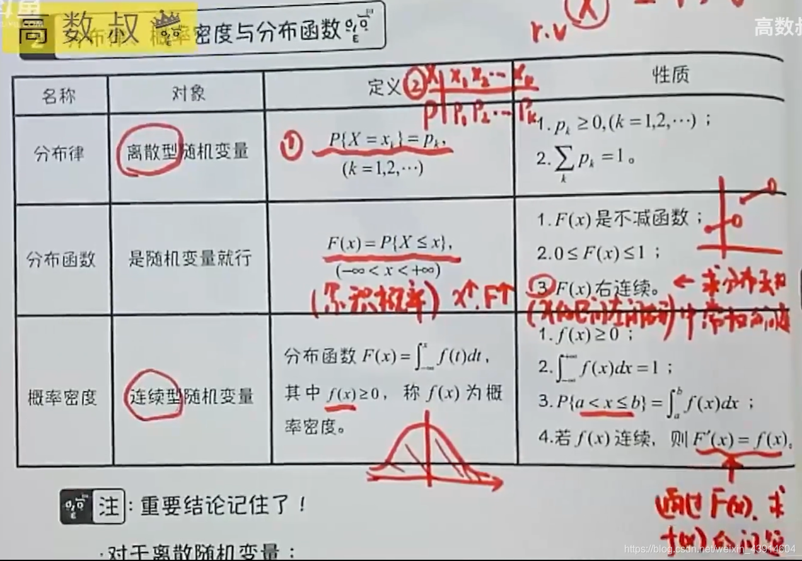

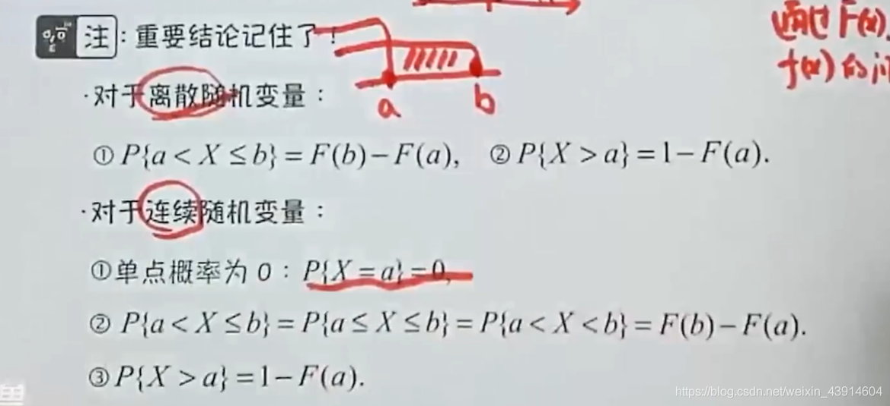

**常见的离散随机变量 - （0-1， 二项， 泊松）分布**

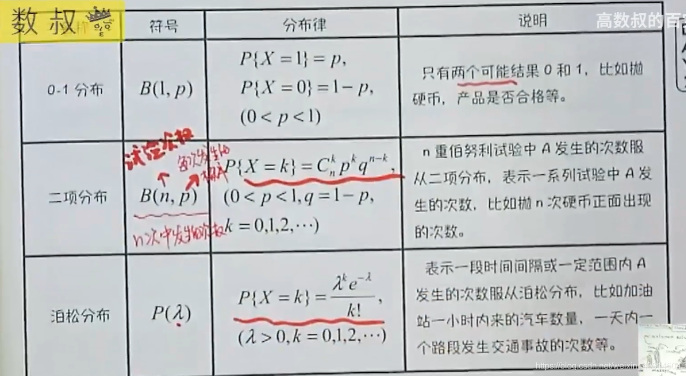

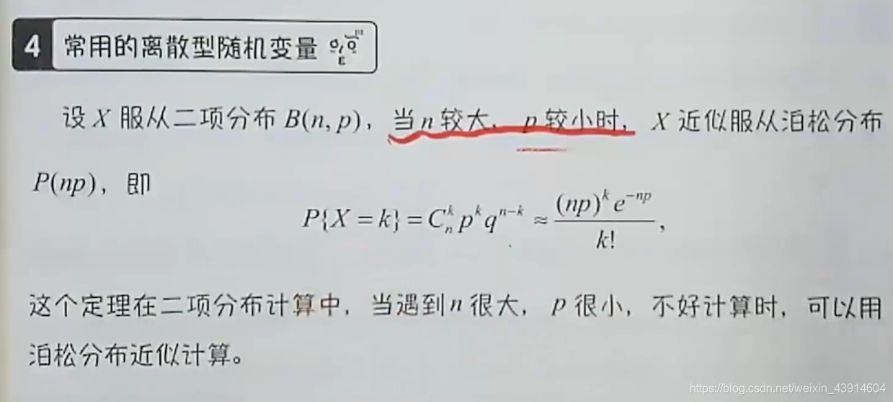

**常见的连续型随机变量分布--（均匀， 正态， 标准正态，指数）分布**

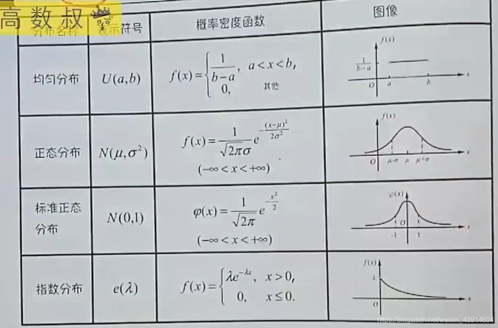

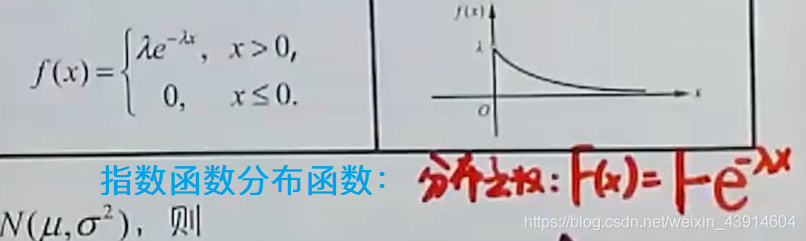

****

#### 三、二维随机变量及其分布

**多维随机变量及其分布和独立性**

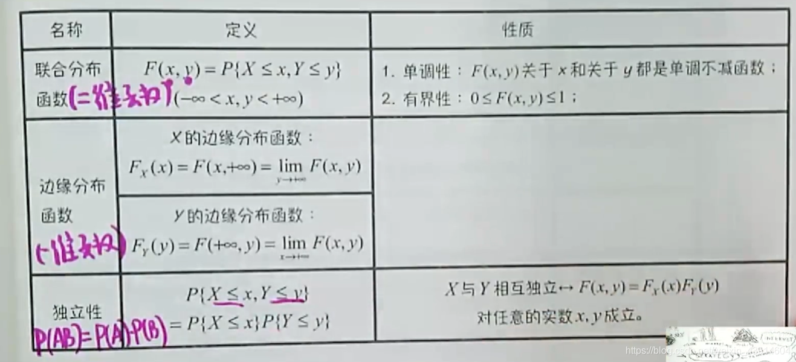

**二维离散型随机变量的分布及独立性**

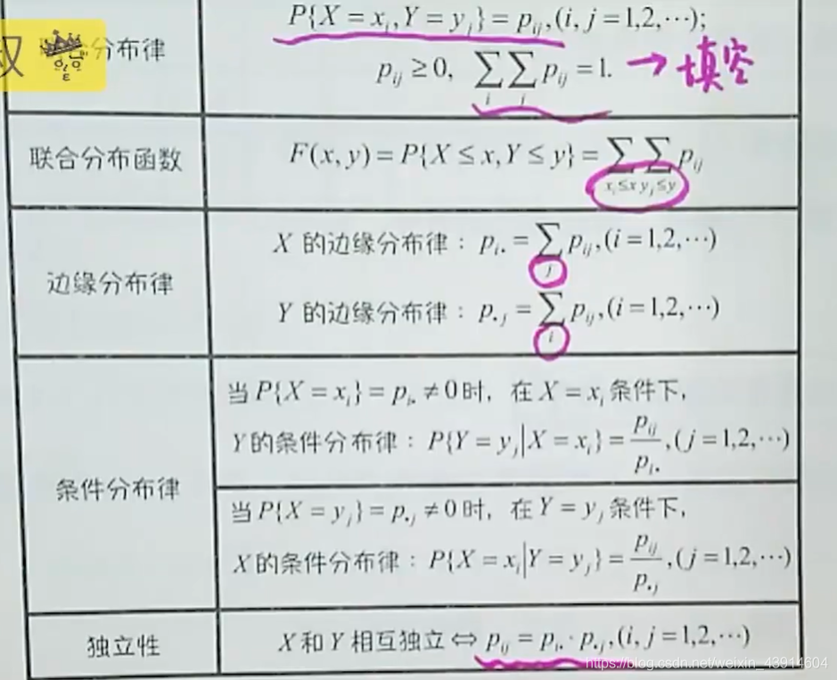

**二维连续型随机变量的分布及独立性**

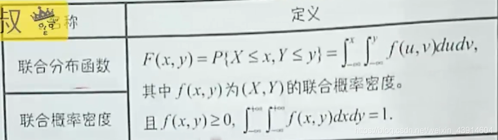

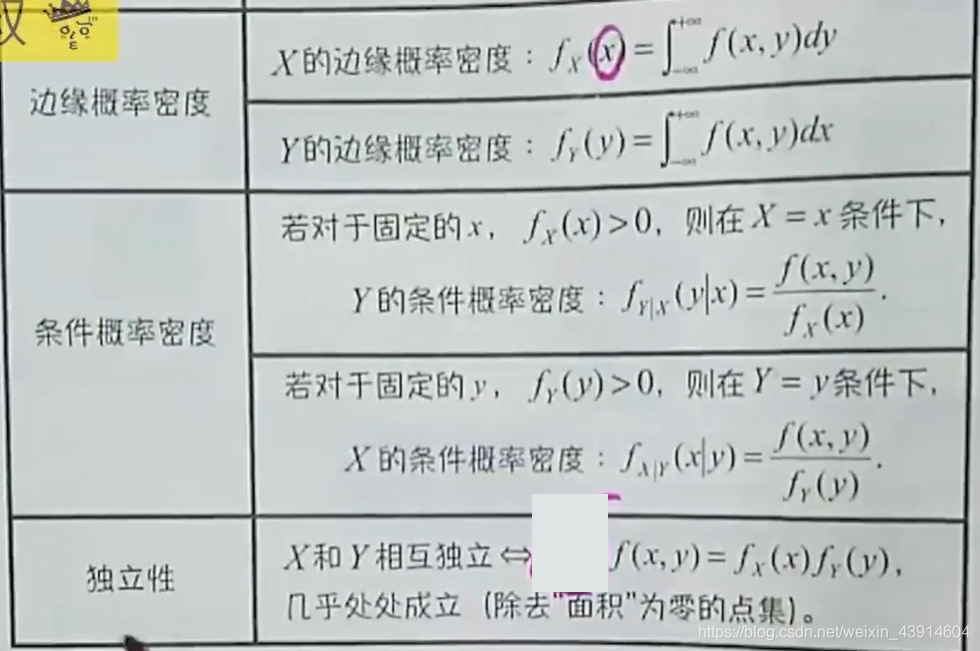

**二维标准正态分布N(0, 1)联合概率密度**

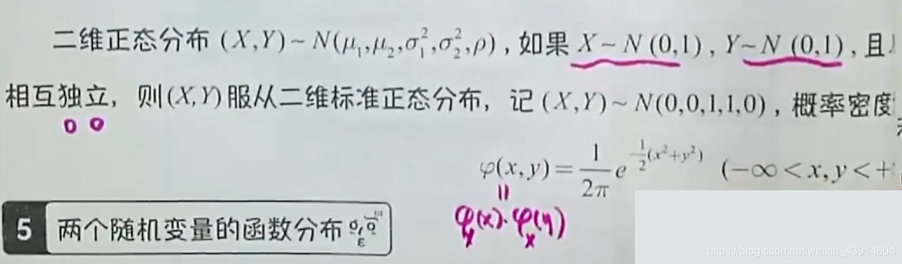

**两个随机变量的函数分布**

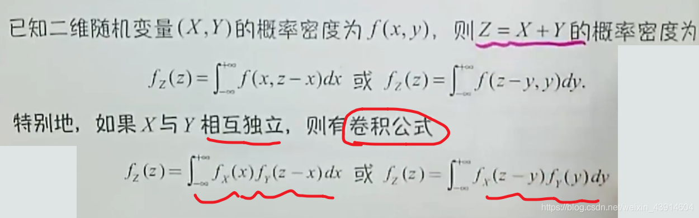

#### 四、随机变量数字特征

**数学期望**

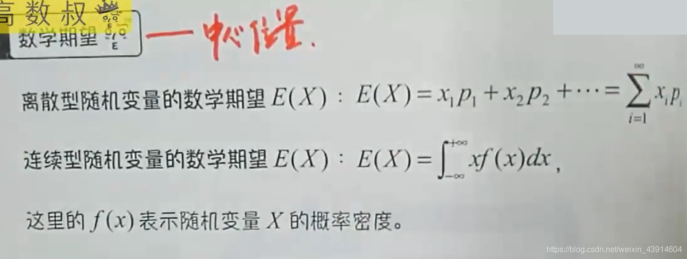

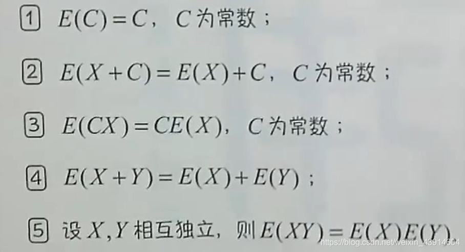

**方差与标准差**

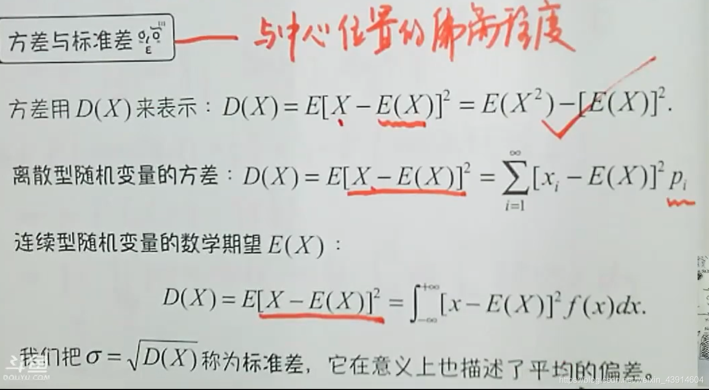

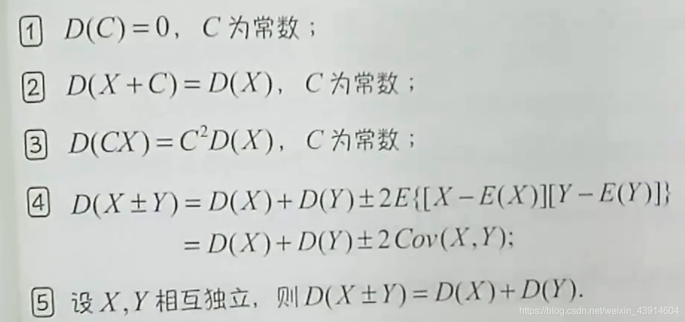

**常见分布的期望和方差**

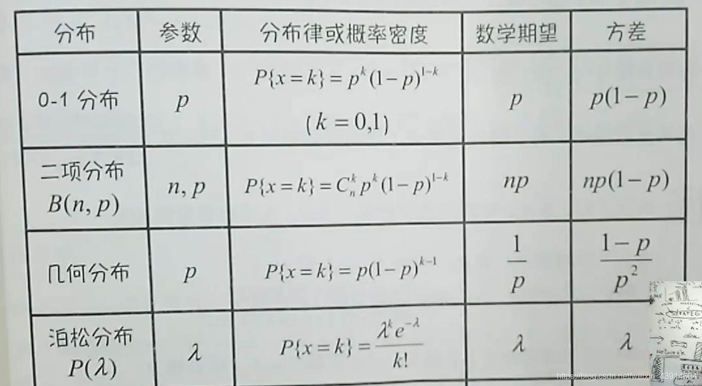

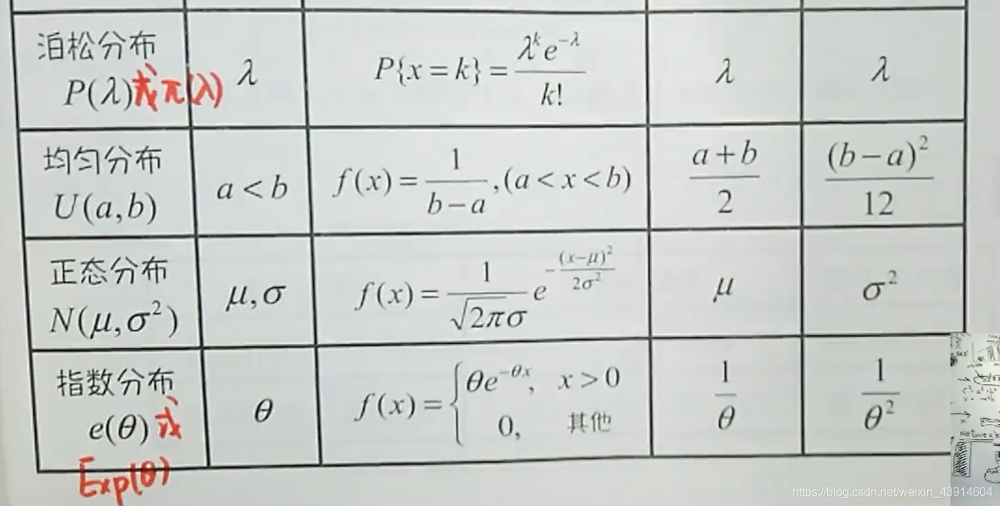

**协方差及性质**

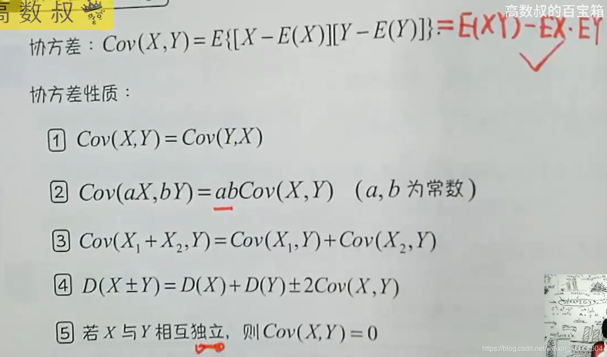

**相关系数**

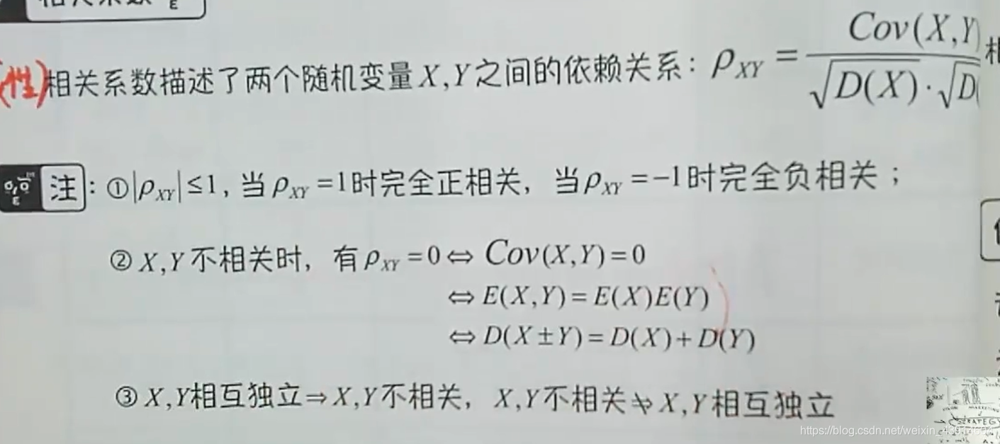

**矩--原点矩， 中心矩**

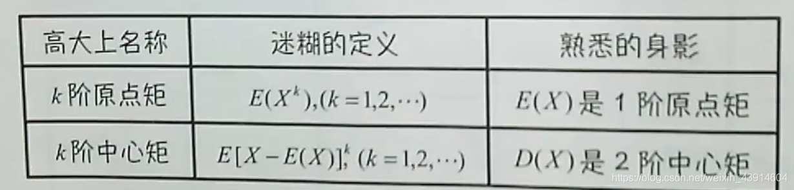