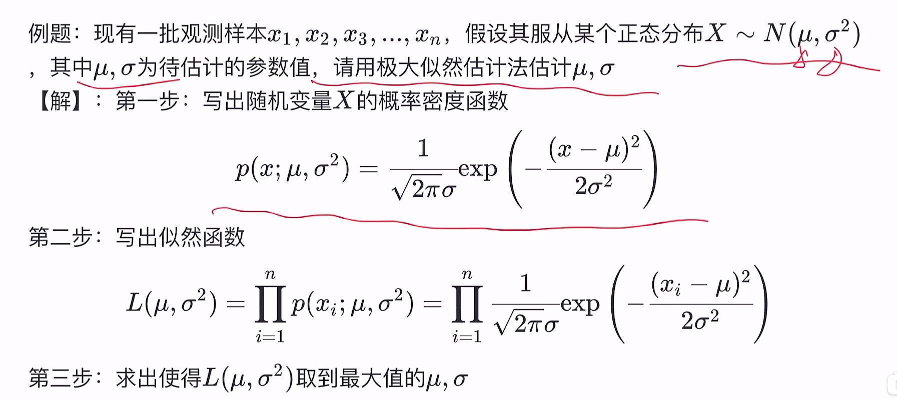
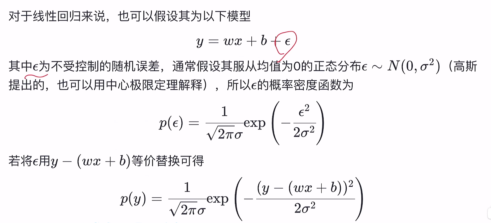

### 线性回归

我们的目标是建立一个系统，将向量$x_i$作为输入， 预测标量$y\in R$作为输出，线性回归的输出是其输入的线性函数，令$f(x_i)$表示模型预测y应该取得的值，我们定义输出为：$f(x) = wx_i + b$

其中，$w_i$是参数向量, b为偏置

#### 均方误差

如何确定$w$和$b$呢，显然，关键在于如何衡量$f(x)$与y之间的差别，我们可以通过**均方误差**来试图让均方误差最小化，即：

$(w^*,b^*) = arg min_{(w, b)}\sum^{m}_{i=1}(f(x_i)-y_i)^2$

均方误差对应了常用的欧几里得距离，基于均方误差最小化来进行模型求解的方法称为最小二乘法， 在线性回归中，最小二乘法就是试图找到一条直线，使所有样本到直线上的欧氏距离之和最小。

**求解$w$和$b$**：

分别对$w$和$b$求导，然后再对求导后的式子令其为`0`， 可得到$w$和$b$的最优的闭式解。

更一般的我们可以扩展到多元线性回归，类似的求解步骤，但是由于$X^TX$在现实任务中往往不是满秩矩阵，此时可能会解出多个$\hat{w}$, 它们都能使得均方误差最小化，选择哪一个解作为输出，将由学习算法的归纳偏好决定，常见的做法是引入**正则化项**

另一种用来估计概率分布的参数值的方法是**极大似然估计**

#### 极大似然估计

用途： 估计概率分布的参数值    

具体定义：对于离散型（连续型）随机变量X， 假设其概率质量函数为$P(x;\theta)$(连续的为概率密度函数)，其中$\theta$为待估计的参数值，现有$x_1, x_2, x_3,...,x_n$是来自X的n个独立同分布的样本，它们的联合概率为$L(\theta) = \prod^n_{i=1}P(x_i;\theta)$

其中$x_1, x_2, x_3,...,x_n$是已知量，$\theta$是未知量，因此以上概率是一个关于$\theta$的函数，称为$L(\theta)$为样本的似然函数。

**极大似然估计的直观想法是：使得观测样本出现概率最大的分布就是待求分布，也即使得似然函数$L(\theta)$取得最大值的$\theta^*$即为$\theta$的估计值。**

通过极大似然估计的方法我们同样可以得出与通过均方误差相同的结果，即：

$(w^*,b^*)=argmax_{(w,b)} ln L(w, b)=argmin_{w,b}\sum^m_{i=1}(y_i-wx_i-b)^2$

求解过程同最小二乘法相同。

**求解$w$和$b$**：

分别对$w$和$b$求导，然后再对求导后的式子令其为`0`， 可得到$w$和$b$的最优的闭式解。