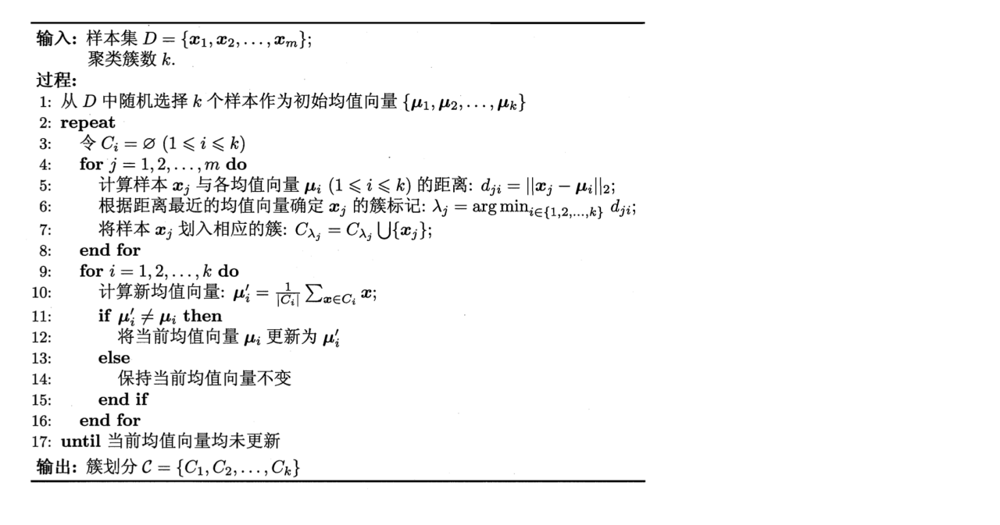

### 聚类

聚类：物以类聚，将相似的样本聚集到一起，使得同一类簇的样本尽可能接近，不同类簇的样本尽可能远离。

对“距离”的定义：
1、非负性：$dist(x_i,x_j) >=0$

2、同一性：$dist(x_i,x_j)=0$当且仅当$x_i=x_j$

3、对称性： $dist(x_i,x_j)=dist(x_j,x_i)$

4、直递性：$dist(x_i,x_j)<=dist(x_i,x_k)+dist(x_k, x_j)$

**常用的距离度量-连续/离散有序**

明可夫斯基距离：

$dist_{mk}(x_i, x_j)=(\displaystyle\sum^n_{u=1}|x_{iu}-x_{ju}|^p)^{\frac{1}{p}}$

p=2退化为欧式距离：

$dist_{ed}(x_i,x_j)=||x_i-x_j||_2=(\displaystyle\sum^n_{u=1}|x_{iu}-x_{ju}|^2)^{\frac{1}{2}}$

p=1退化为曼哈顿距离：

$dist_{man}(x_i,x_j)=||x_i-x_j||_1=\displaystyle\sum^n_{u=1}|x_{iu}-x_{ju}|$

****

**常用的距离度量-离散无序**

VDM(Value Difference Metric)度量

#### **Kmeans(原型聚类）**无监督学习

原型指的是类结构能通过一组典型的特例刻画，比如男、女类似的。

给定样本集$D=\{x_1, x_2, ..., x_m\}$，k均值算法针对聚类所得簇划分$C={c_1,c_2,c_k}$,求解最小化平方误差问题：

$E=\displaystyle\sum^k_{i=1}\sum_{x\in C_i}||x-\mu||^2_2$

其中$\mu_i=\frac{1}{|C_i|}\sum_{x \in C_i}$，x表示的是簇$C_i$的均值向量

求解该式需要考虑样本集D所有可能的划分，是一个NP-hard问题，一般来说，我们采用迭代算法求解近似划分。

