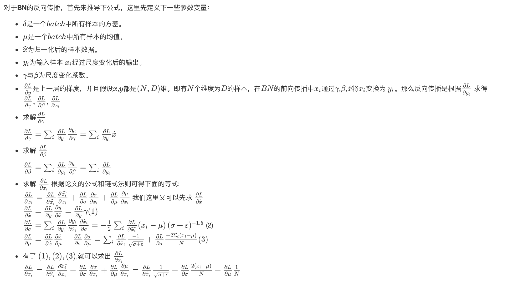

### normalization

**主要且常用**的归一化操作有**BN，LN，IN，GN**，示意图如图所示。


图中的蓝色部分，表示需要归一化的部分。其中两维$C$和$N$分别表示$channel$和$batch$  $size$，第三维表示$H$,$W$，可以理解为该维度大小是$H*W$，也就是拉长成一维，这样总体就可以用三维图形来表示。可以看出$BN$的计算和$batch$  $size$相关（蓝色区域为计算均值和方差的单元），而$LN$、$BN$和$GN$的计算和$batch$ $size$无关。同时$LN$和$IN$都可以看作是$GN$的特殊情况（$LN$是$group$=1时候的$GN$，$IN$是$group=C$时候的$GN$）。


### Batch Normalization；

​    $BN$的简单计算步骤为：

- 沿着通道计算每个batch的均值$\mu=\frac{1}{m} \sum_{i=1}^{m} x_{i}$。

- 沿着通道计算每个$batch$的方差$\delta^{2}=\frac{1}{m} \sum_{i=1}^{m}\left(x_{i}-\mu_{\mathcal{B}}\right)^{2}$。

- 对x做归一化, 


- 加入缩放和平移变量$\gamma$和$\beta$ ,归一化后的值，$y_{i} \leftarrow \gamma \widehat{x}_{i}+\beta$


$BN$适用于判别模型中，比如图片分类模型。因为$BN$注重对每个$batch$进行归一化，从而保证数据分布的一致性，而判别模型的结果正是取决于数据整体分布。但是$BN$对$batchsize$的大小比较敏感，由于每次计算均值和方差是在一个$batch$上，所以如果$batchsize$太小，则计算的均值、方差不足以代表整个数据分布。（其代码见下BN的前向与反向的代码详解！）

在训练过程之中，我们主要是通过**滑动平均**这种**Trick**的手段来控制变量更新的速度。

```python
def batchnorm_forward(x, gamma, beta, bn_param):
  """
  Input:
  - x: (N, D)维输入数据
  - gamma: (D,)维尺度变化参数 
  - beta: (D,)维尺度变化参数
  - bn_param: Dictionary with the following keys:
    - mode: 'train' 或者 'test'
    - eps: 一般取1e-8~1e-4
    - momentum: 计算均值、方差的更新参数
    - running_mean: (D,)动态变化array存储训练集的均值
    - running_var：(D,)动态变化array存储训练集的方差

  Returns a tuple of:
  - out: 输出y_i（N，D）维
  - cache: 存储反向传播所需数据
  """
  mode = bn_param['mode']
  eps = bn_param.get('eps', 1e-5)
  momentum = bn_param.get('momentum', 0.9)

  N, D = x.shape
  # 动态变量，存储训练集的均值方差
  running_mean = bn_param.get('running_mean', np.zeros(D, dtype=x.dtype))
  running_var = bn_param.get('running_var', np.zeros(D, dtype=x.dtype))

  out, cache = None, None
  # TRAIN 对每个batch操作
  if mode == 'train':
    sample_mean = np.mean(x, axis = 0)
    sample_var = np.var(x, axis = 0)
    x_hat = (x - sample_mean) / np.sqrt(sample_var + eps)
    out = gamma * x_hat + beta
    cache = (x, gamma, beta, x_hat, sample_mean, sample_var, eps)
    #滑动平均(影子变量)这种Trick的引入，目的是为了控制变量更新的速度，防止变量的突然变化对变量的整体影响，这能提高模型的鲁棒性。
    running_mean = momentum * running_mean + (1 - momentum) * sample_mean
    running_var = momentum * running_var + (1 - momentum) * sample_var
  # TEST：要用整个训练集的均值、方差
  elif mode == 'test':
    x_hat = (x - running_mean) / np.sqrt(running_var + eps)
    out = gamma * x_hat + beta
  else:
    raise ValueError('Invalid forward batchnorm mode "%s"' % mode)

  bn_param['running_mean'] = running_mean
  bn_param['running_var'] = running_var

  return out, cache
```





  下面来一个背诵版本：


因此，$BN$的反向传播代码如下：

```python
def batchnorm_backward(dout, cache):
    """
    Inputs:
    - dout: 上一层的梯度，维度(N, D)，即 dL/dy
    - cache: 所需的中间变量，来自于前向传播

    Returns a tuple of:
    - dx: (N, D)维的 dL/dx
    - dgamma: (D,)维的dL/dgamma
    - dbeta: (D,)维的dL/dbeta
    """
      x, gamma, beta, x_hat, sample_mean, sample_var, eps = cache
      N = x.shape[0]

      dgamma = np.sum(dout * x_hat, axis = 0)
      dbeta = np.sum(dout, axis = 0)

      dx_hat = dout * gamma
      dsigma = -0.5 * np.sum(dx_hat * (x - sample_mean), axis=0) * np.power(sample_var + eps, -1.5)
      dmu = -np.sum(dx_hat / np.sqrt(sample_var + eps), axis=0) - 2 * dsigma*np.sum(x-sample_mean, axis=0)/ N
      dx = dx_hat /np.sqrt(sample_var + eps) + 2.0 * dsigma * (x - sample_mean) / N + dmu / N

      return dx, dgamma, dbeta
```

那么为啥要用$BN$呢？$BN$的作用如下：

- $BN$加快网络的训练与收敛的速度

  在深度神经网络中中，如果每层的数据分布都不一样的话，将会导致网络非常难收敛和训练。如果把每层的数据都在转换在均值为零，方差为1 的状态下，这样每层数据的分布都是一样的训练会比较容易收敛。

- 控制梯度爆炸防止梯度消失

  以$sigmoid$函数为例，$sigmoid$函数使得输出在$[0,1]$之间，实际上当 输入过大或者过小，经过sigmoid函数后输出范围就会变得很小，而且反向传播时的梯度也会非常小，从而导致梯度消失，同时也会导致网络学习速率过慢；同时由于网络的前端比后端求梯度需要进行更多次的求导运算，最终会出现网络后端一直学习，而前端几乎不学习的情况。Batch Normalization (BN) 通常被添加在每一个全连接和激励函数之间，使数据在进入激活函数之前集中分布在0值附近，大部分激活函数输入在0周围时输出会有加大变化。

  同样，使用了$BN$之后，可以使得权值不会很大，不会有梯度爆炸的问题。

- 防止过拟合

  在网络的训练中，BN的使用使得一个$minibatch$中所有样本都被关联在了一起，因此网络不会从某一个训练样本中生成确定的结果，即同样一个样本的输出不再仅仅取决于样本的本身，也取决于跟这个样本同属一个$batch$的其他样本，而每次网络都是随机取$batch$，比较多样，可以在一定程度上避免了过拟合。

### Instance Normalization

IN适用于生成模型中，比如图片风格迁移。因为图片生成的结果主要依赖于某个图像实例， 所以对整个batch归一化不适合图像风格化中， 在风格迁移中使用$Instance Normalization$。不仅可以加速模型收敛， 并且可以保持每个图像实例之间的独立。

```python
def Instancenorm(x, gamma, beta):
    results = 0.
    eps = 1e-5
    x_mean = np.mean(x, axis=(2,3), keepdims = True)
    x_var = np.var(x, axis=(2, 3), keepdims = True)
    x_normalized = (x - x_mean) / np.sqrt(x_var + eps)
    results = gamma * x_normalized + beta
    return results
```


### Layer Normalization

$LN$是指对同一张图片的同一层的所有通道进行$Normalization$操作， 与上面的计算方式相似， 计算均值与方差， 在计算缩放和平移变量$\gamma$和$\beta$， $LN$主要用在NLP任务中

```python
def Layernorm(x, gamma, beta):
    results = 0.
    eps = 1e-5
    x_mean = np.mean(x, axis=(1, 2, 3), keepdims = True)
    x_var = np.var(x, axis = (1, 2, 3), keepdims = True)
    x_normalized = (x - x_mean) / np.sqrt(x_var + eps)
    result = gamma * x_normalized + beta
    return results
```

### Group Normalization

$Group Normalization$是针对$Batch Normalization$在$batch size$较小时错误率较高而提出的改进算法， 因为$BN$层的计算结果依赖于当前batch数据， 当$batch size$较小时， 该$batch $数据的均值和方差的代表性较差， 因此对最后的结果影响也较大。

其中$GN$是将通道数$C$分成$G$份， 每份$C//G$， 当$G=1$时， 每份$G$个， 所以为一整块的$C$， 即为$LN$， 当$G=C$时， 每份只有$1$个， 所以为$IN$。

$GN$是指对同一张图片的同一层的某几个通道一起进行$Normalization$操作。这几个通道称为一个$Group$。计算相应的均值以及方差， 计算缩放和平移变量$\gamma$和$\beta$

```python
def GroupNorm(x, gamma, beta, G=16):
    results = 0.
    eps = 1e-5
    x = np.reshape(x, (x.shape[0], G, x.shape[1]/16, x.shape[2], x.shape[3]))
    x_mean = np.mean(x. axis = (2, 3, 4), keepdims = True)
    x_var = np.var(x, axis = (2, 3, 4), keepdims=True)
    x_normalized = (x - x_mean) / np.sqrt(x_var + eps)
    results = gamma * x_normalized + beta
    return results
```

