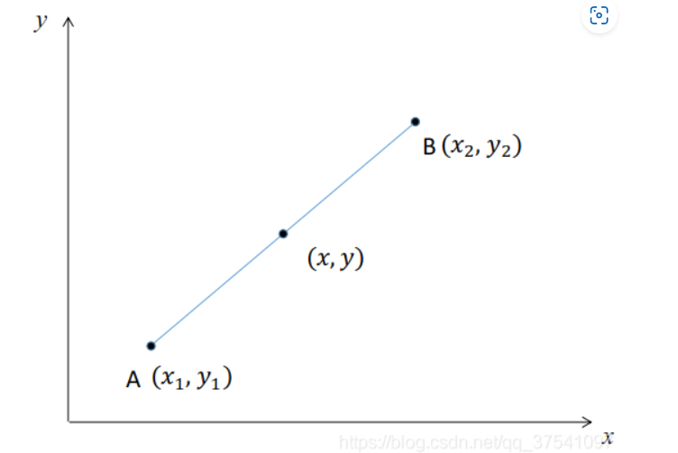
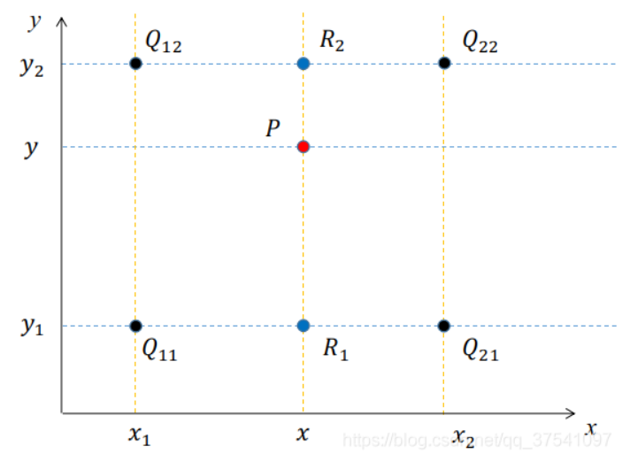
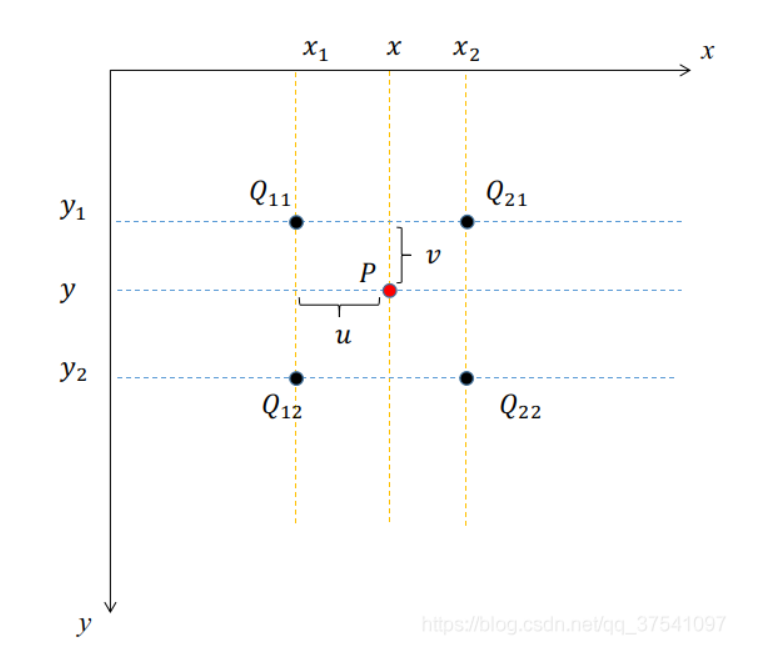
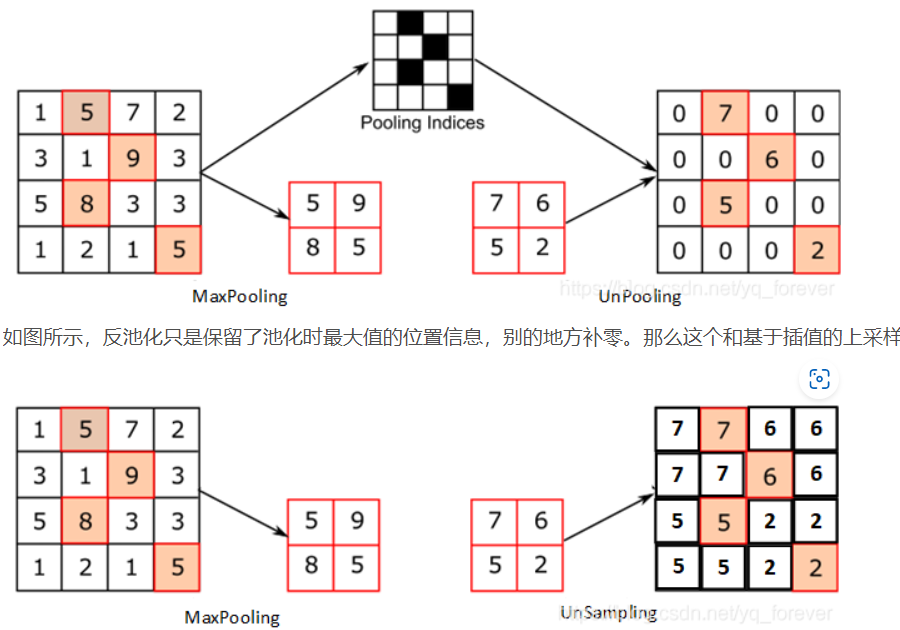

### 上采样的方式

##### 1、双线性插值

线性插值： `插值函数为一次多项式的插值方式。线性插值的几何意义为利用A点和B点的直线来近似表示原函数。线性插值可以用来近似代替原函数，也可以用来计算得到查表过程中没有的数值。`

如下图所示，假设已知$y_1 = f(x_1), y_2 = f(x_2)$， 现在要通过线性插值的方式得到区间$[x_1, x_2]$内任何一点的$f(x)$值。

通过上图很容易得到以下公式：
$$
\frac{y-y_1}{x-x_1} = \frac{y_2-y_1}{x_2-x_1}
$$
变换可以得到：
$$
y = \frac{x_2-x}{x_2-x_1}y_1 + \frac{x-x_1}{x_2-x_1}y_2
$$
双线性插值

`双线性插值， 又称双线性内插，在数学上，双线性插值是由两个变量的插值函数的线性插值扩展，其核心思想是在两个方向分别进行一次线性插值`

通过以上介绍我们知道，双线性插值就是分别在两个方向上分别进行一次简单的线性插值。如下图所示，每个点的数值是由$z= f(x, y)$即x, y两个变量决定。下图可理解为沿z轴方向的俯视图。我们已知$Q_{11}, Q_{12}, Q_{21}, Q_{22}$四个点中插入一个点p， 并算出p点的值。

根据上图我们已知$Q_{11}, Q_{12}, Q_{21}, Q_{22}$四个点的值：
$$
f(Q_{11}) = F(x_1, y_1)\\
f(Q_{12}) = F(x_1, y_2)\\
f(Q_{21}) = F(x_2, y_1)\\
F(Q_{22}) = F(x_2, y_2)
$$
在求P点之前，首先根据线性插值的方法求得$R_1$, $R_2$的值，对于$R_1$点，我们可以根据$Q_{11}, Q_{21}$两个点根据线性插值的办法得到，而$Q_{11}, Q_{21}$两个点的y值是相同的，所以两点的连线可看作只关于x一个变量的函数。

根据上述线性插值公式，可以求得$R_1$点的值：
$$
f(R_1) = \frac{x_2-x}{x_2-x_1}f(Q_{11}) + \frac{x-x_1}{x_2-x_1}f(Q_{21})
$$
同理，求得$R_2$点的值：
$$
f(R_2) = \frac{x_2-x}{x_2-x_1}f(Q_{12}) + \frac{x-x_1}{x_2-x_1}f(Q_{22})
$$
得到$R_1， R_2$的插值后，接着我们去计算P点的插值。$R_1, R_2 $两个点的x值是相同的，所以两点的连线可看做只关于y 一个变量的函数。通过线性插值公式可以得
$$
f(P) = \frac{y_2-y}{y_2-y_1}f(R_1) + \frac{y-y_1}{y_2-y_1}f(R_2)
$$
带入$f(R_1), f(R_2)$, 
$$
f(P) = \frac{x_2-x}{x_2-x_1}\frac{y_2-y}{y_2-y_1}f(Q_{11}) + \frac{x-x_1}{x_2-x_1}\frac{y_2-y}{y_2-y_1}f(Q_{21}) \\
+ 
\frac{x_2-x}{x_2-x_1}\frac{y-y_1}{y_2-y_1}f(Q_{12}) + \frac{x-x_1}{x_2-x_1}\frac{y-y_1}{y_2-y_1}f(Q_{22})
$$

******

在图像中，常见的坐标如下图所示，以图像左上角为坐标原点，水平向右为x轴正方向，竖直向下为y轴正方向。注意像素值是从（0， 0）点开始，假设我们在图像中插入一个点P, 离P点最近的相邻四个像素点是$Q_{11}, Q_{12}, Q_{21}, Q_{22}$并利用双线性插值的方法求其值。

* 由于$Q_{11}, Q_{12}, Q_{21}, Q_{22}$四个点是图像中相邻的像素，故有：

    $x_2 - x_1 = 1, y_2 - y_1 = 1$

* 带入公式进一步化简可得：
  $$
  f(P) ={(x_2-x)}{(y_2-y)}f(Q_{11}) + (x-x_1){(y_2-y)}f(Q_{21}) \\
  + 
  (x_2-x)(y-y_1)f(Q_{12}) + (x-x_1)(y-y_1)f(Q_{22})
  $$

* 令：
  $$
  x - x_1 = u, y - y_1 = v
  $$

*  带入公式可得：
  $$
  f(P) ={(1-u)}{(1-v)}f(Q_{11}) + u(1-v)f(Q_{21}) \\
  + 
  (1-u)vf(Q_{12}) + uvf(Q_{22})
  $$

* 然后令：
  $$
  x_1 = i, y_1 = j \\
  f(Q_{11}) = f(i, j)
  $$

* 那么有：
  $$
  f(Q_{11}) = f(i, j), f(Q_{12}) = f(i, j+1)\\
  f(Q_{21}) = f(i+1, j), f(Q_{22}) = f(i+1, j+1)
  $$

* 进一步带入公式得：
  $$
  f(P) = (1-u)(1-v)f(i, j) + u(1-v)f(i+1, j) + (1-u)vf(i, j+1)+ uvf(i+1, j+1)
  $$

##### 2、反卷积（转置卷积）

在语义分割或者GAN网络中比较常见，其主要作用是用来上采样

对于转置卷积需要注意的是：

* 转置卷积不是卷积的逆运算
* 转置卷积也是卷积

[(带你理解转置卷积（反卷积）_史丹利复合田的博客-CSDN博客_转置卷积和反卷积](https://blog.csdn.net/tsyccnh/article/details/87357447)

转置卷积不是卷积的逆运算（一般卷积操作是不可逆的），它只能恢复到原来的大小（shape)数值与原来不同。转置卷积的运算步骤可以归为以下几步：

* 在输入特征图元素间填充s-1行，列0（其中s表示转置卷积的步距）
* 在输入特征图四周填充k-p-1行，列0(其中k表示转置卷积的kernel_size大小，p为转置卷积的padding, 注意这里的padding和卷积操作有些不同）
* 将卷积核参数上下，左右翻转
* 做正常卷积运算（填充0， 步距1）

转置卷积操作后特征图的大小可以通过如下公式计算：
$$
H_{out} = (H_{in} - 1) \times stride[0] - 2 \times padding[0] + kernel_size[0]\\
W_{out} = (E_{in} - 1) \times stride[1] - 2 \times padding[1] + kernel_size[1]
$$
其中stride[0]表示高度方向的stride, padding[0]表示高度方向的padding， kernel_size[0]表示高度方向的kernel_size, 通过上面公式可以看出padding越大，输出的特征矩阵高宽越小。

##### 3、反池化

与池化相反，是把图片从小变大的操作，严格意义上讲， 池化过程中丢失了很多信息，是不可逆的，反池化只是一个近似恢复的操作。

##### 4、upsampling 上采样

最常见的技术为插值，即把分辨率低的图片放大到需要的大小，再用插值的方法补齐像素的值。