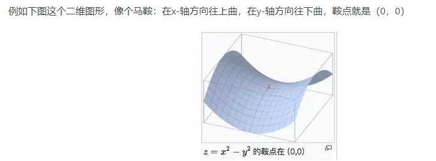
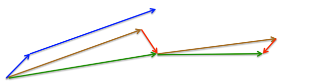

### 优化器的选取

深度学习中的优化算法采用的原理是梯度下降法，即最小化目标函数 $ J(\theta) $，最优化的求解过程，首先求解目标函数的梯度 $ \nabla J(\theta) $，然后将参数 $ \theta $ 向负梯度方向更新，$ \theta_{t}=\theta_{t-1}-\eta\nabla J(\theta) $， $ \eta $ 为学习率，表明梯度更新的步伐的大小，最优化的过程依赖的算法称为优化器，可以看出深度学习优化器的两个核心是梯度与学习率，前者决定参数更新的方向，后者决定参数的更新程度。

我们定义 $\theta$ 为待优化的参数，$ J(\theta) $ 为目标函数，初始学习率为 $ \eta $。再进行一次梯度下降过程中优化算法的执行框架如下：

1、计算目标函数关于当前参数的梯度：
$$
g_t = \nabla J(\theta_t)
$$

2、根据需要计算历史梯度的一阶和二阶动量：
$$
m_t = \phi(g_1, g_2,···,g_t)
$$

$$
V_t = \psi(g_1, g_2,···,g_t)
$$

3、计算当前时刻的下降梯度：

$$
p = \eta * m_t / \sqrt{V_t}(自适应优化器)
$$

$$
p = \eta * g_t(非自适应优化器)
$$

4、进行梯度下降更新

$$
\theta_{t+1} = \theta_t - p
$$

对于各种优化器而言，步骤 $3$ 和步骤 $4$ 都是一样的，主要差别是体现在步骤 $1$ 和步骤 $2$，下面我们就来具体讲解这些优化器的设计思路。

### 非自适应优化器

在优化过程中，**学习率全程不变，或者按照一定的 $learning$ $schedule$ 随时间变化，称之为非自适应优化器**，这类包括最常见的 $SGD$（随机梯度下降法），带 $Momentum$ 的 $SGD$、带 $Nesterov$ 的 $SGD$ 等。

#### 1、SGD

$SGD$ 的梯度下降过程，类似于一个小球从山坡上滚下，它的前进方向只于当前山坡的最大倾斜方向一致(最大负梯度方向)，每一个时刻的初速度为 0。每一次利用一个 $batch$ 样本，即 $n$ 个样本进行计算，这样它可以降低参数更新时的方差，收敛更稳定，另一方面可以充分地利用深度学习库中高度优化的矩阵操作来进行更有效的梯度计算。
$$
\theta = \theta - \eta * \nabla_{\theta} J(\theta)
$$
**优点：**

1、虽然看起来在更新过程中 $MSGD$ 的 $cost$ $function$ 波动非常大，会走很多弯路，但是对梯度的要求很低（计算梯度快），而且对于引入噪声，大量的理论和实践工作证明，只要噪声不是特别大，$MSGD$ 都能很好地收敛。

2、应用大型数据集时，训练速度很快。比如每次从百万数据样本中，取几百个数据点，算一个 $MSGD$ 梯度，更新一下模型参数。相比于标准梯度下降法的遍历全部样本，每输入一个样本更新一次参数，要快得多。

**缺点：**

1、不能保证很好的收敛性；$mini$-$batch$ 每次仅使用数据集中的一部分进行梯度下降，所以每次下降并不是严格按照朝最小方向下降，只是总体下降趋势是朝着最小方向，极度容易陷于局部最小值。

2、$lr$ 如果太小，收敛速度会很慢，如果太大，$loss$ $function$ 就会在极小值处不停地震荡甚至偏离。(有一种措施是先设定大一点的学习率，当两次迭代之间的变化低于某个阈值后，就减小 $learning$ $rate$，不过这个阈值的设定需要提前写好，但这样的话就不能够适应数据集的特点)。

3、对于非凸函数，还要避免陷于局部极小值处，或者鞍点处，因为鞍点周围的梯度都接近于 $0$，$MSGD$ 很容易被困在这里。在这里解释一下鞍点就是：一个光滑函数的鞍点邻域的曲线，曲面，或超曲面，都位于这点的切线的不同边。如下图 $2$ 所示。

#### 2、SGDM(带动量的SGD)

为了解决在上面的优化算法中容易出现的问题，$SGDM$ 应用而生，在原有的 $SGD$ 上加入了**一阶动量**，从直观理解就是加入了一个惯性，在坡度比较陡的地方，会有较大的惯性，下降的就会比较快；坡度平缓的地方，惯性较小，下降的会比较慢。

其梯度更新公式为：

$$
v_t = \gamma v_{t-1} + \eta \nabla_{\theta}J(\theta)
$$

$$
\theta = \theta - v_t
$$

$SGDM$ 通过加入 $ \gamma v_{t-1} $，将其定义为动量，$ \gamma$ 常用的值为 $0.9$。使用动量后在梯度下降过程中可以使得梯度方向不变的方向上下降速度变快，梯度方向有所改变的方向上的下降速度变慢。在这里我们举一个比较贴近的例子：在原本的梯度下降中一直朝着一个方向去下降，而当遇到山沟的时候(也就是一个拐点)，越过山沟此时就在另一边山坡，这个时候梯度方向是跟之前相反的，此时由于之前梯度大小的累加，在两个山坡间的变化就会被互相抵消掉，也就不会一直在两个山坡振荡，容易朝山沟向下走，也就是会减少震荡。

#### 3、$NAG$($Nesterov$ $accelerated$ $gradient$)

上面介绍的 $SGDM$ 的每下降一步都是由前面下降方向的一个累积和当前点的梯度方向组合而成，但当刚好下降到拐点附近时，如果这个时候继续以这样的方式更新参数，我们会有一个较大的幅度越过拐点，即：模型遇到拐点不会自动减弱更新的幅度。NAG 针对上述问题对动量方法进行了改进，其表达式如下：

$$
v_t = \gamma v_{t-1} + \eta \nabla_{\theta}J(\theta-\gamma v_{t-1})
$$

$$
\theta = \theta - v_t
$$

$NAG$ 利用当前位置处先前的梯度值先做一个参数更新，然后在更新后的位置再求梯度，将此部分梯度跟之前累积下来的梯度值矢量相加，简单的说就是先根据之前累积的梯度方向模拟下一步参数更新后的值，然后将模拟后的位置处梯度替换动量方法中的当前位置梯度。那么这种方式为什么解决了之前说的那个问题呢？因为 $NAG$ 有一个预测后一步位置梯度的步骤，所以当下降到拐点附近时，$NAG$ 预测到会跨过拐点，该项梯度就会对之前梯度有个修正，相当于阻止了其跨度太大。

如上图 所示，我们举个例子来简单示意一下 $NAG$ 的更新原理，其中蓝色线表示$SGDM$方法，蓝色短线表示当前位置梯度更新，蓝色长线表示之前累积的梯度；第一个红色线表示用 $NAG$ 算法预测下一步位置的梯度更新，第一条棕色线表示先前累积的梯度，其矢量相加结果（绿色线）就是参数更新的方向。

### 自适应优化器

在优化过程中，**学习率随着梯度自适应的变化，并尽可能去消除给定的全局学习率的影响，叫做自适应优化器**,常见的包括 $Adagrad$、$Adadelta$、$RMSprop$、$Adam$ 等。

#### 1、$Adagrad$

$Adagrad$ 其实是对学习率进行了一个约束，对于经常更新的参数，我们已经积累了大量关于它的知识，不希望被单个样本影响太大，希望学习速率慢一些；对于偶尔更新的参数，我们了解的信息太少，希望能从每个偶然出现的样本身上多学一些，即学习速率大一些。而该方法中开始使用二阶动量，意味着“自适应学习率”优化算法时代的到来。

在这里我们说明一下二阶动量 $V_t$ 的定义：它是用来度量参数历史更新频率的，二阶动量是迄今为止所有梯度值的平方和。$Adagrad$ 的表达式为：

$$
m_t = g_t
$$

$$
V_t = \sum_{i=1}^{t}{g_t}^2
$$

$$
\theta_{t+1} = \theta_t - \eta \frac{m_t}{\sqrt{V_t}}
$$

其中 $g_t$ 为 $t$ 时刻参数梯度，下面来讲解为什么 $adagrad$ 可以实现不同频率特征对其参数学习率改变。首先，我们看到二阶动量 $V_t$，它是梯度平方累加和，对于训练数据少的特征，自然对应的参数更新就缓慢，也就是说他们的梯度变化平方累加和就会比较小，所以对应于上面参数更新方程中的学习速率就会变大，因而对于某个特征数据集少，相应参数更新速度就快。为了防止上述分母为 $0$，所以往往添加一个平滑项参数 $\epsilon$，参数更新方程也就变成：

$$
\theta_{t+1} = \theta_t - \eta \frac{m_t}{\sqrt{V_t+\epsilon}}
$$

但是 $adagrad$ 同样也有问题，就是其分母随着训练数增加，也会跟着增加，这样会导致学习速率越来越小，最终无限接近于 $0$，从而无法有效更新参数。

#### 2、$Adadelta$

针对于 $Adagrad$ 的缺点，$Adadelta$ 对二阶动量 $V_t$ 进行了改进，和 $Adagrad$ 相比，就是分母换成了过去的梯度平方的衰减平均值，这个分母相当于梯度的均方根值 $RMS$($root$ $mean$ $squared$)。其表达式如下：

$$
m_t = g_t
$$

$$
V_{g,t} = \gamma V_{g,t-1} + (1-\gamma){g_t}^2
$$

$$
V_{\Delta \theta,t} = \gamma V_{\Delta \theta,t-1} + (1-\gamma){\Delta \theta_t}^2
$$

$$
RMS[g]_t = \sqrt{V_{g,t}+\epsilon}
$$

$$
RMS[\Delta \theta]_t = \sqrt{V_{\Delta \theta,t}+\epsilon}
$$

$$
\theta_{t+1} = \theta_{t} - \frac{RMS[\Delta \theta]_{t-1}}{RMS[g]_t}m_t
$$

其中对梯度的二阶动量变化为 $RMS[g]_t$；对变量的变化量的二阶动量为 $RMS[\Delta \theta]_t$，并使用其将其替换学习率。通过 $adadelta$ 优化算法，我们甚至可以不需要设置一个默认的学习率，因为在新的规则中已经移除了这项。

#### 3、$RMSprop$

$RMSprop$ 和 $Adadelta$ 都是为了解决 $Adagrad$ 学习率急剧下降问题而被提出来的。$RMSprop$ 与 $Adadelta$ 的计算公式非常相似，只不过在相同的时间内被独立的提出，其表达式为：

$$
m_t = g_t
$$

$$
V_t = \gamma V_{t-1} + (1-\gamma){g_t}^2
$$

$$
\theta_{t+1} = \theta_{t} - \eta \frac{m_t}{\sqrt{V_t + \epsilon}}
$$

由此可以看出，$RMSprop$ 还需要自己手动设置一个初始的学习率 $\eta$。作者建议将 $\epsilon$ 设置为 0.9，学习率 $\eta$ 设置为 0.001。

#### 4、$Adam$($Adaptive$ $Moment$ $Estimation$)

$Adam$ 算法是另一种计算每个参数的自适应学习率的方法。它是一种将动量 $Momentum$ 和 $RMSprop$ 结合起来的办法方法，同时引入了两个参数 $\beta_1$ 和 $\beta_2$，其表达式为：

$$
m_t = \beta_1m_{t-1} + (1-\beta_1)g_t(一阶动量)
$$

$$
V_t = \beta_2V_{t-1} + (1-\beta_2){g_t}^2(二阶动量)
$$

$$
\tilde{m}_t = \frac{m_t}{1-\beta_1^t}
$$

$$
\tilde{V}_t = \frac{V_t}{1-\beta_2^t}
$$

$$
\theta_{t+1} = \theta - \eta \frac{\tilde{m}_t}{\sqrt{\tilde{V}_t + \epsilon}}
$$

其中 $\beta_1$ 默认值为 $0.9$，$\beta_2$ 默认值为 $0.999$,$\epsilon$ 为 $10^{-8}$，$Adam$ 集合了动量和 $RMSprop$ 两者的优点，从经验中表明 $Adam$ 在实际中表现很好，同时与其他自适应学习算法相比，更有优势。

### 总结

我们来看一下上面几种优化算法在鞍点和等高线上的表现：

从图 都可以看出，$Adagrad$、$Adadelta$、$RMSprop$ 几乎很快就找到了正确的方向并前进，收敛速度也相当快，而其它方法要么很慢，要么走了很多弯路才找到。

关于优化器如何选择的问题上：

1、首先，各大算法孰优孰劣并无定论。如果是刚入门，优先考虑 $SGD$+$Nesterov$ $Momentum$ 或者 $Adam$。

2、$Adam$ 等自适应学习率算法对于稀疏数据具有优势，且收敛速度很快；但精调参数的 $SGDM$ 往往能够取得更好的最终结果。

3、根据你的需求来选择——在模型设计实验过程中，要快速验证新模型的效果，可以先用 $Adam$ 进行快速实验优化；在模型上线或者结果发布前，可以用精调的 $SGD$ 系列优化算法进行模型的极致优化。

4、考虑不同算法的组合。先用 $Adam$ 进行快速下降，而后再换到 $SGD$ 系列优化算法进行充分的调优。