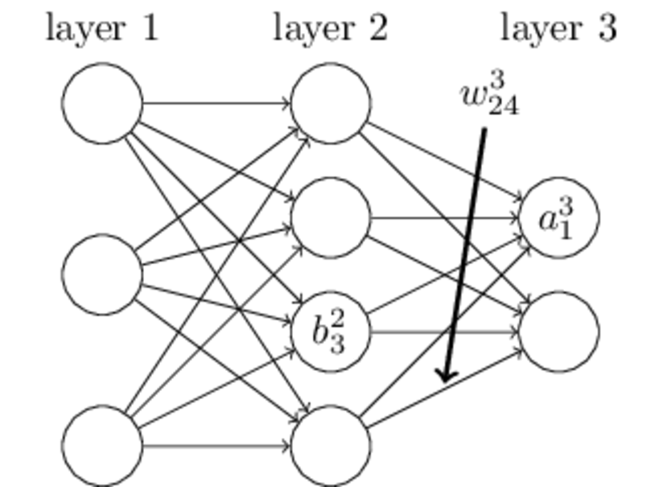

### 反向传播推导

反向传播算法是用来训练神经网络最常用且有效的算法。其主要思想是：

（1） 将训练集数据输入到网络的输入端， 经过隐藏层， 最后达到输出层并输出结果， 这是网络的前向传播过程。

（2） 由于网络的输出结果与实际标签有误差(`用损失函数来衡量`), 则计算预测值与实际值之间的误差， 并将该误差从输出层向隐藏层反向传播， 直至传播到输入层

（3） 在反向传播的过程中， 根据误差调整各个参数的值，不断迭代上述过程， 直至收敛

上述是一个`3`层的人工神经网络， `layer1`到`layer3`分别是输入层、隐藏层和输出层。如图， 先定义一些变量：

$w^l_{jk}$表示第`l-1`层的第`k`个神经元连接到第` l`层的第`j`个神经元的权重；

$b^l_j$表示第`l`层的第`j`个神经元的偏置

$a^l_j$表示第`l`层的第`j`个神经元的输出，$\sigma$表示激活函数， 即：

$$a^l_j = \sigma (\sum_k w^l_{jk} a^{l-1}_k +b^l_j)$$

$z^l_j$表示第`l`层的第`j`个神经元的输入， 即

$$ z^l_j = \sum_k w^l_{jk} a^{l-1}_k + b^l_j$$

**损失函数**

用来衡量网络输出与真实标签之间的误差， 我们用常见的均方误差来计算
$$
C = \frac{1}{2} \sum_x || y(x) - a^L(x)||^2
$$
`x`表示输入数据，` y`表示真实标签， $a^L$表示预测的输出，` L`表示网络最大的层数， 也就是第`L`层

**公式推导**

首先， 将第`l`层第`j`个神经元中产生的误差定义为：
$$
\delta^l_j = \frac{\partial C}{\partial z^l_j}
$$
**公式1 计算最后一层神经网络产生的误差：**

推导：
    