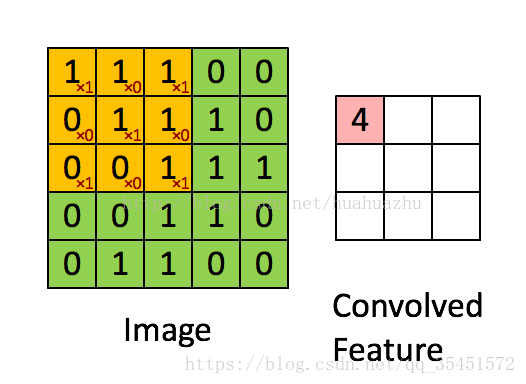
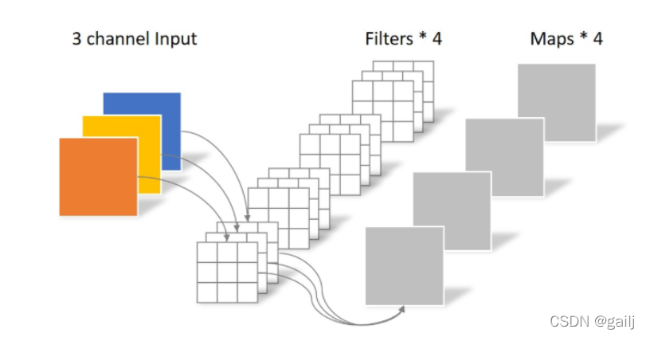
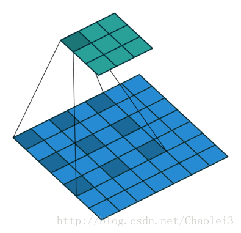
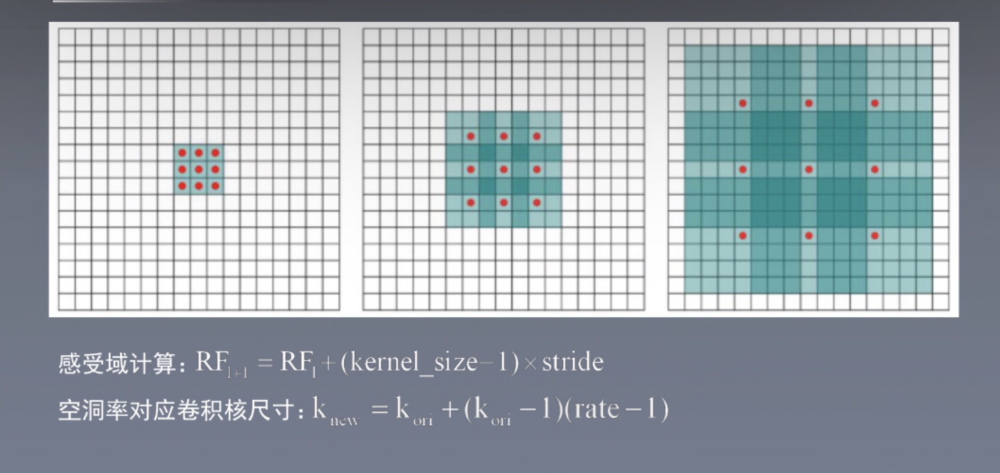
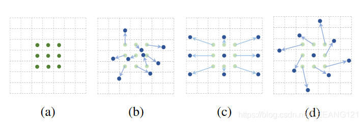
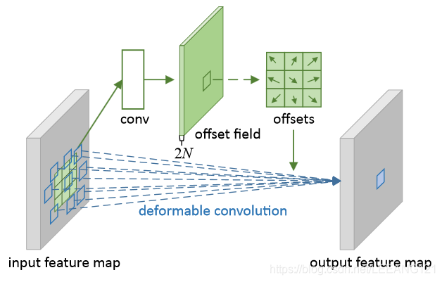

### 常见的卷积

#### 1、普通卷积





滑动窗口，相乘再相加

**输出特征图大小**：
$$
size_{out} = \frac{size_{input} + 2 \times padding - size_{kernel}}{s_{stride}} + 1
$$


**感受野的计算：**
$$
RF_n = RF_{n-1} + (kernel_n - 1) * s_{stride_n}
$$


#### 2、转置卷积

在语义分割或者GAN网络中比较常见，其主要作用是用来上采样

对于转置卷积需要注意的是：

* 转置卷积不是卷积的逆运算
* 转置卷积也是卷积

[(带你理解转置卷积（反卷积）_史丹利复合田的博客-CSDN博客_转置卷积和反卷积](https://blog.csdn.net/tsyccnh/article/details/87357447)

转置卷积不是卷积的逆运算（一般卷积操作是不可逆的），它只能恢复到原来的大小（shape)数值与原来不同。转置卷积的运算步骤可以归为以下几步：

* 在输入特征图元素间填充s-1行，列0（其中s表示转置卷积的步距）
* 在输入特征图四周填充k-p-1行，列0(其中k表示转置卷积的kernel_size大小，p为转置卷积的padding, 注意这里的padding和卷积操作有些不同）
* 将卷积核参数上下，左右翻转
* 做正常卷积运算（填充0， 步距1）

转置卷积操作后特征图的大小可以通过如下公式计算：
$$
size_{out} = (size_{in} - 1) \times stride + size_{kernel} - 2 \times padding
$$

#### 3、空洞卷积

**根据dilated rate对卷积核填充0**

优点：在不做pooling损失信息和相同的计算条件的情况下，加大了感受野，让每个卷积输出都包含较大范围的信息。空洞卷积经常用在实时图像分割中，当网络层需要较大的感受野，但计算资源有限而无法提高卷积核数量或大小时，可以考虑空洞卷积。

空洞卷积是针对图像语义分割问题中下采样会降低图像分辨率、丢失信息而提出的一种卷积思路，利用空洞卷积扩大感受野，让原本3x3的卷积核，在相同参数量和计算量下拥有5x5(dilated rate=2)或者更大的感受野，从而无需下采样。



上图是一个扩张率为2的3×3卷积核，感受野与5×5的卷积核相同，而且仅需要9个参数。你可以把它想象成一个5×5的卷积核，每隔一行或一列删除一行或一列。
在相同的计算条件下，空洞卷积提供了更大的感受野。空洞卷积经常用在实时图像分割中。当网络层需要较大的感受野，但计算资源有限而无法提高卷积核数量或大小时，可以考虑空洞卷积。




#### 4、分组卷积


第一张图代表标准卷积，若输入特征图尺寸为$H\times W \times c_1$， 卷积核尺寸为$h_1 \times w_1 \times c_1$， 输出特征图尺寸为$H \times W \times c_2$， 标准卷积层的参数量为： $(h_1 \times w_1 \times c_1) \times c_2$

第二张图代表分组卷积， 将输入特征图按照通道分成g组，则每组输入特征图的尺寸为 $H \times W \times (\frac{c_1}{g})$， 对应的卷积核尺寸为$h_1 \times w_1 \times (\frac{c_1}{g})$， 每组输出的特征图尺寸为$H \times W \times (\frac{c_2}{g})$。将g组结果拼接，得到最终尺寸为$H \times W \times c_2$的输出特征图。

分组卷积层的参数量为$h_1 \times w_1 \times (\frac{c_1}{g}) \times \frac{c_2}{g} \times g = h_1 \times w_1 \times c_1 \times c_2 \times \frac{1}{g}$


#### 5、深度可分离卷积

可以分为**逐通道卷积**和**逐点卷积**

**逐通道卷积**

一个卷积核负责一个通道，一个通道只被一个卷积核卷积


**逐通道卷积**完成后的Feature map数量与输入层的通道数相同，无法扩展Feature map。而且这种运算对输入层的每个通道独立进行卷积运算，没有有效的利用不同通道在相同空间位置上的feature信息。因此需要**逐点卷积**生成新的Feature map

**逐点卷积**（尺度为1x1的常规卷积）

**逐点卷积**核的尺寸为 1×1×M，M为上一层的通道数。所以这里的卷积运算会将上一步的map在深度方向上进行加权组合，生成新的Feature map。有几个卷积核就有几个输出Feature map


#### 6、可变形卷积

`可变形卷积是指卷积核在每一个元素上额外增加了一个参数方向参数， 这样卷积核就能在训练过程中扩展到很大的范围。`



(a) 是传统的标准卷积核，尺寸为3x3

(b) 可变形卷积，通过在图(a)的基础上给每个卷积核的参数添加一个方向向量（图b中浅绿色箭头）， 使得我们的卷积核可以变为任意形状

(c) 和（d)是可变形卷积的特殊形式。

**普通卷积的局限：**

对于未知的变化适应性差，泛化能力不强。

卷积单元对输入的特征图在固定的位置进行采样；池化层不断减小着特征图的尺寸；Rol池化层产生空间位置受限。网络内部缺乏能够解决这个问题的模块，这会产生显著的问题，例如： 同一CNN层的激活单元的感受野尺寸都相同，这对于编码位置信息的浅层神经网络并不可取，因为不同的位置可能对应有不同尺度或者不同形变的物体，这些层需要能够**自动调整尺度或者感受野**的方法。



上图是可变形卷积的学习过程，首先偏差是通过一个卷积层获得，该卷积层的卷积核与普通卷积核一样，输出的偏差尺寸和输入的特征图尺寸一致。生成通道维度是2N， 分别对应原始输出特征和偏移特征。这两个卷积核通过双线性插值后向传播算法同时学习。


### 代码实现

**普通卷积：**

```python
import torch.nn as nn
nn.Conv2d(in_channels, out_channels, kernel_size, stride, padding, dilation, gruops, bias)
in_channels: 输入通道
out_channels: 输出通道
kernel_size: 卷积核的大小
stride: 步长
padding: 填充
dilation: 空洞卷积的扩张率， 默认不扩张， 为1
groups: 控制分组卷积， 默认不分组， 为1
bias: 添加一个可学习的偏差， 默认为True
```

**空洞卷积和组卷积都可以利用这个来实现**

**转置卷积：**

```python
import torch.nn as nn
nn.ConvTranspose2d(in_channels, out_channels, kernel_size, stride, padding, bias)
```

* 在输入特征图元素间填充`stride-1`行，列0（其中s表示转置卷积的步距）
* 在输入特征图四周填充`kernel-padding-1`行，列0
* 将卷积核参数上下，左右翻转
* 做正常卷积运算（填充0， 步距1）

**深度可分离卷积：**

先逐通道分离， 再逐点分离

```python
class depthsep(nn.Module):
    def __init__(self, in_ch, out_ch):
        super(depthsep, self).__init__()
        self.depth_conv = nn.Conv2d(
        in_channels = in_ch,
        out_channels = out_ch,
        kernel_size = 3,
        stride = 1, 
        padding = 1,
        groups = in_ch)
        self.point_conv = nn.Conv2d(in_channels = in_ch,
                                   out_channels = out_ch,
                                   kernel_size = 1,
                                   stride = 1,
                                   padding = 0,
                                   groups = 1)
     def forward(self, x):
        out = self.depth_conv(x)
        out = self.point_conv(out)
        return out
```

