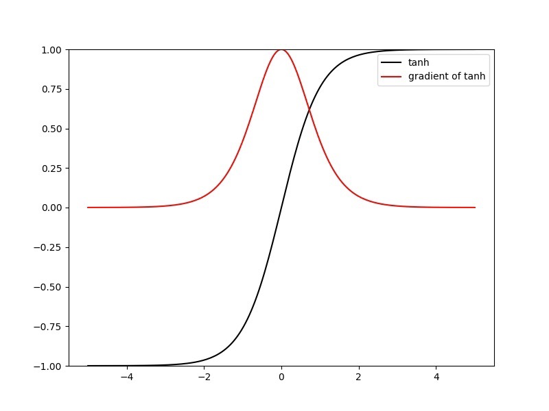
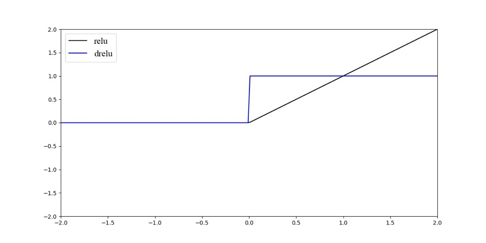
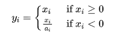
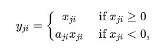
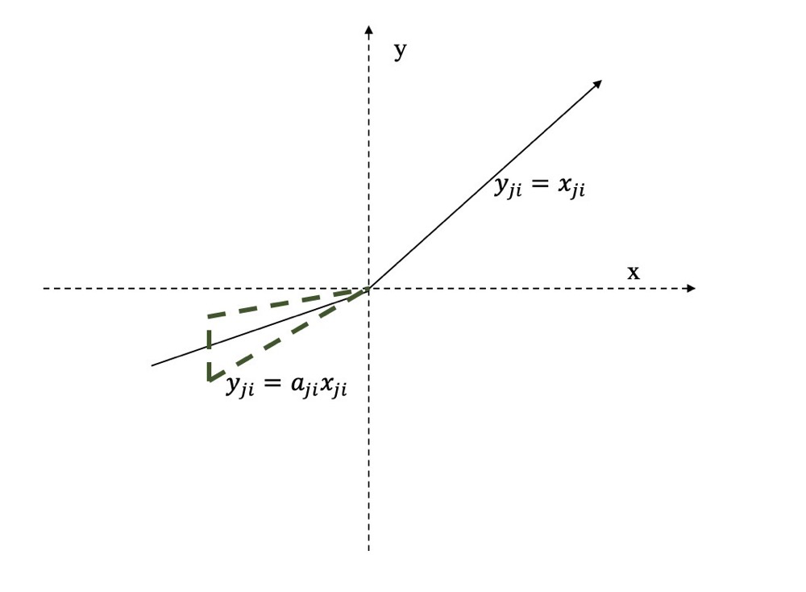
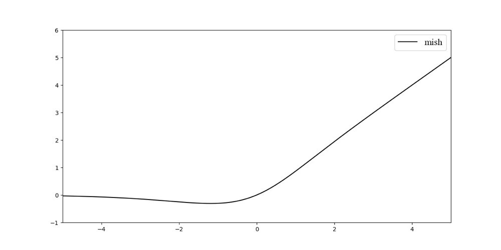
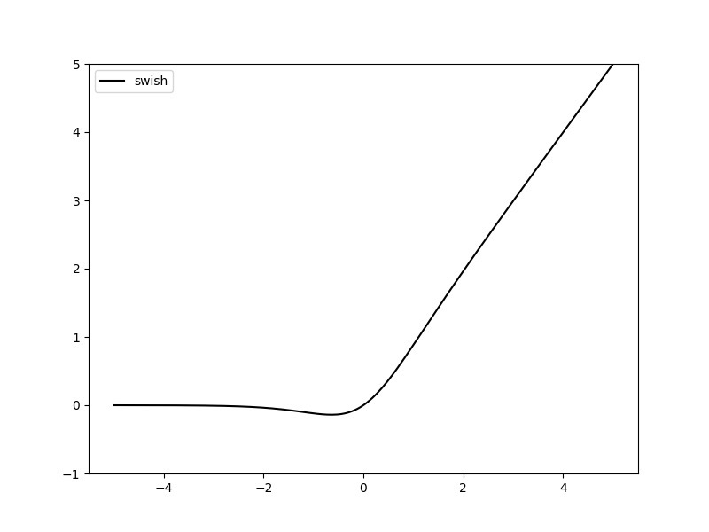
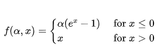
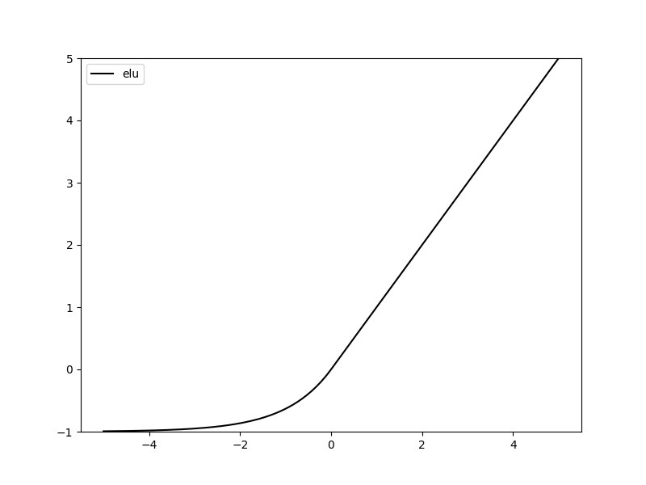
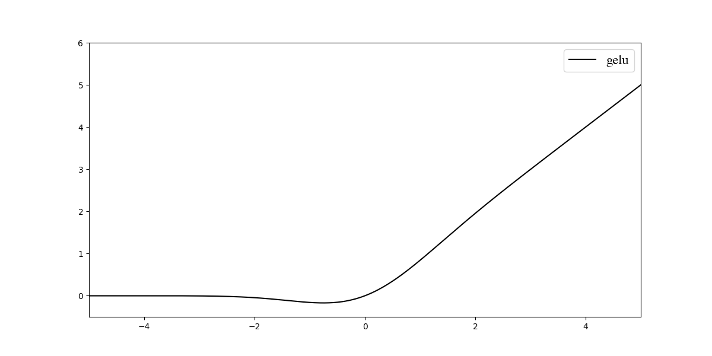

### 激活函数的选取

#### 1、Sigmoid函数

Sigmoid函数也叫`Logistic`函数，将输入值压缩到(0, 1)区间之中，其函数表达式为：
$$
Sigmoid(x) =\frac{1}{1+e^{-x}}
$$

其求导之后的表达式为：
$$
\operatorname{Sigmoid}^{\prime}(x)=\operatorname{Sigmoid}(x) \cdot(1-\operatorname{Sigmoid}(x))
$$
其梯度的导数图像如：

对于$Sigmoid$函数，其优点为：

- $Sigmoid$函数的输出在$(0,1)$之间，我们通常把它拿来作为一个二分类的方案。其输出范围有限，可以用作输出层,优化稳定。
- $Sigmoid$函数是一个连续函数，方便后续求导。

其缺点为：

- 从函数的导函数可以得到，其值范围为(0, 0.25)，存在梯度消失的问题。
- $Sigmoid$函数不是一个零均值的函数，导致后一层的神经元将得到上一层非$0$均值的信号作为输入，从而会对梯度产生影响。
- $Sigmoid$函数是一个指数函数的激活函数，我们把每次基本运算当作一次$FLOPs$(Floating Point Operations Per Second)，则$Sigmod$函数包括求负号，指数运算，加法与除法等4$FLOPs$的运算量，预算量较大。而如$Relu(x)=max(0, x)$，为$1FLOPs$。

#### 2、Softmax函数

$Softmax$函数又称归一化指数函数，函数表达式为：
$$
y_{i}=\operatorname{Softmax}(x_{i})=\frac{e^{x_{i}}}{\sum_{j=1}^{n} e^{x_{j}}}
$$
其中，$i \in [1, n]$。$\sum_{i} y_{i}=1$。如网络输出为$[-20, 10, 30]$，则经过$Softmax$层之后，输出为$[1.9287e-22, 2.0612e-09, 1.0000e+00]$。

当我们的任务是一个**互斥的多类别分类任务**（如imagenet分类），网络只能输出一个正确答案，我们可以用$Softmax$函数处理各个原始的输出值。从公式中，我们可以看到$Softmax$函数的分母是综合到了所有类别的信息。通常我们也会把$Softmax$函数的输出，这主要是由于$Softmax$函数先拉大了输入向量元素之间的差异（通过指数函数），然后才归一化为一个概率分布，在应用到分类问题时，它使得各个类别的概率差异比较显著，最大值产生的概率更接近$1$，这样输出分布的形式更接近真实分布当作网络的**置信度**。

#### 3、Sigmoid函数与Softmax函数的区别

在我们进行二分类任务时，当我们使用$Sigmoid$函数，最后一层全连接层的神经元个数是$1$，神经网络的输出经过它的转换，可以将数值压缩到$(0,1)$之间，得到的结果可以理解成**分类成目标类别的概率$P$，而不分类到该类别的概率是$(1 - P)$**，这也是典型的两点分布的形式。

而使用$Softmax$函数则需要是两个神经元，一个是表示前景类的分类概率，另一个是背景类。此时，$Softmax$函数也就退化成了二项分布。

更简单一点理解，$Softmax$函数是对两个类别进行建模，其两个类别的概率之和是$1$。而$Sigmoid$ 函数是对于一个类别的建模，另一个类别可以通过1来相减得到。

**$Sigmoid$得到的结果是“分到正确类别的概率和未分到正确类别的概率”，$Softmax$得到的是“分到正确类别的概率和分到错误类别的概率”。**

#### 4、tanH

TanH激活函数的公式如下， 也称为双切正切函数， 取值范围为[-1,1]。
$$
\begin{array}{l}
\tanh (x)=2 \operatorname{sigmoid}(2 x)-1 \\
f(z)=\tanh (z)=\frac{e^{z}-e^{-z}}{e^{z}+e^{-z}}
\end{array}
$$
而$Tanh$函数的反传公式为：
$$
\begin{aligned}
g^{\prime}(z) &=\left(\frac{e^{z}-e^{-z}}{e^{z}+e^{-z}}\right)^{\prime} \\
&=\frac{4}{\left(e^{z}+e^{-z}\right)^{2}} \\
&=1-g(z)^{2}
\end{aligned}
$$
$TanH$函数的**缺点**同$sigmoid$函数的缺点类似。当 z **很大或很小**时，𝑔′(𝑧) 接近于 0 ，会导致梯度很小，权重更新非常缓慢，即**梯度消失问题**。从下面的图像也能看出来，靠近图像两端越平缓，梯度越小。

$TanH$ 激活函数函数图像如图所示。

#### 4、ReLU

-  激活函数的特点是：输入信号小于时，输出都是0，输入信号大于0时，输出等于输入。

- $ReLU$ 的优点是使用$ReLU$ 得到的$SGD$ 的收敛速度会比使用$sigmoid/tanh$的$SGD$ 快很多。

- $ReLU$ 的缺点是神经网络训练的时候很“脆弱”，很容易就会出现神经元死亡。

  例如，一个非常大的梯度流过一个$ReLU$ 神经元，更新过参数之后，这个神经元再也不会对任何数据有激活现象了，那么这个神经元的梯度就永远都会是$0$。（Dead ReLU Problem）。

- 非零均值，所以一般$ReLU$后会加$BN$。

#### 5、Leaky ReLU / PReLU / RReLU

**Leak ReLU**

$a_{i}$是一个$(1,+\infty)$区间内的固定参数。与 $ReLU$ 相比 ，$leaky$ $ReLU$ 给所有负值赋予一个非零斜率$a_{i}$。这样保留了一些负轴的值，使得负轴的信息不会全部丢失。

**PReLU**

而 $PReLU$可以看作是$Leaky$ $ReLU$的一个变体。在$PReLU$中，负值部分的斜率$a_{i}$是根据网络学习来定的，而非预先定义的。作者称，在$ImageNet$分类（2015，Russakovsky等）上，$PReLU$是超越人类分类水平的关键所在。

如$Leaky$ $ReLU$与$PReLU$主要的特点是：（1）计算简单，有效 （2）比$Sigmoid$与$Tanh$收敛更快 (3) 解决了$Dead$ $ReLU$的问题。

**RReLU**

 $RReLU$(Randomized leaky rectified linear unit)也是$Leaky$  $ReLU$的一个变体。在$RReLU$中，$a_{ji}$是一个在一个给定的范围内随机抽取的值，这个值在测试环节就会固定下来

$RReLU$的亮点在于，在训练环节中，$a_{ji}$是从一个均匀的分布$U(I,u)$中随机抽取的数值。形式上来说，我们能得到以下结果:

where
$$
a_{j i} \sim U(l, u), l < u, u \in [0, 1)
$$
该函数的图像如下图所示：

#### 6、Mish

函数的公式如下：
$$
\text { Mish }=x * \tanh \left(\ln \left(1+e^{x}\right)\right)
$$
函数图像如图所示：

$Mish$函数,无上边界(即正值可以达到任何高度)避免了由于封顶而导致的饱和。理论上对负值的轻微允许允许更好的梯度流，而不是像$ReLU$中那样的硬零边界。

最后，可能也是最重要的，平滑的激活函数允许更好的信息深入神经网络，从而得到更好的准确性和泛化。

不过我 之前亲自训过$Mish$这个激活函数，$Pytorch$版本的$Mish$很占显存。

#### 7、Swish

激活函数的公式如下：
$$
f(x)=x \cdot \operatorname{sigmoid}(\beta x)
$$
其函数图像如下：

其中，$\beta$是常数或可训练的参数。$Swish$函数具备无上界有下界、平滑、非单调的特性。通过实验证明，对于深层模型， $Swish$的效果是优于$ReLU$的。

当$\beta=0$时，$Swish$激活函数成为线性函数$f(x)=\frac{x}{2}$。  
当$\beta \rightarrow \infty, \sigma(x)=(1+\exp (-x))^{-1}$ 为0或1. Swish变为ReLU: $f(x)=2 \max (0, x)$。
以$Swish$函数可以看做是介于线性函数与$ReLU$函数之间的平滑函数.

#### 8、ELU

同样是针对$ReLU$的负数部分进行的改进，$ELU$激活函数对$x$小于零的情况采用类似指数计算的方式进行输出：
$$
\operatorname{ELU}(x)=\max (0, x)+\min (0, \alpha *(\exp (x)-1))
$$

或者表达为：

对于$ELU$有这些特点：

- $ELU$由于其正值特性，可以像$ReLU$,$Leaky$ $ReLU$, $PReLU$一样缓解梯度消失的问题。
- 相比$ReLU$，$ELU$存在负值，可以将激活单元的输出均值往$0$推近，达到接近$BN$的效果同时减少了计算量。

#### 9、GELU

受启发于$Dropout$、$ReLU$等机制的影响，都意在将不重要的信息设置为0。对于输入的值，我们可以理解成是将输入的值乘以了一个0或者1。即对于每一个输入$x$,其服从于标准正态分布$N(0,1)$，它也会乘以一个伯努利分布$Bernoulli(\phi(x))$，其中$\phi(x)=P(x \leq x)$。

$GELU$(Gaussian error linear units)的表达式为$\operatorname{GELU}(x)=x P(X \leq x)=x \Phi(x)$。

而上式函数是无法直接计算的，因此可以使用另外的方式来进行逼近，论文得到的表达式为：$0.5 x\left(1+\tanh \left[\sqrt{2 / \pi}\left(x+0.044715 x^{3}\right)\right]\right)$。或者为$GELU(x)=\frac{x}{1+e^{-1.702 x}}$。

$bert$, $Transformer$中使用的激活函数，作者经过实验证明比$relu$等要好。原点可导，不会有$Dead$ $ReLU$问题。

其函数图像如图所示：

