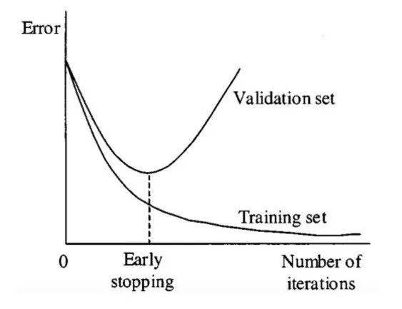
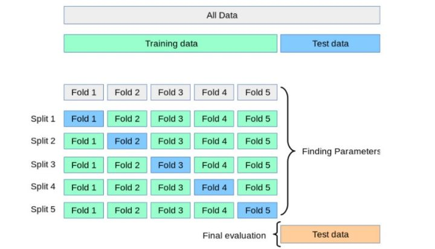

### 过拟合

#### 判定

在构建模型的过程中， 在每个epoch 中使用验证数据测试室当前已构建的模型，得到模型的损失和准确率， 以及 每个epoch的验证损失和验证准确率。**当训练集的损失一直下降， 验证集的损失一直上升时即出现了过拟合**， 当训练集的和验证集的准确率都很低， 那么说明模型欠拟合。

#### 原因

1、数据量太小

2、训练集和验证集分布不一致

3、模型复杂度太大

在选择模型算法的时候，首先就选定一个复杂度很高的模型， 然后数据的规律是很简单的， 复杂的模型反而就不适用了。

4、数据量中存在噪声

数据还有很多噪声， 模型在学习的时候， 肯定也会把噪声规律学习到， 从而减小了具有一般性的规律。这个时候模型用来预测肯定效果不好。

5、过度训练

只要训练时间足够长， 那么模型肯定就会把一些噪声隐含到规律学习到， 这个时候降低模型的性能是显而易见的。

#### 解决

##### 1、正则化

正则化可用于降低模型的复杂性， 这是通过惩罚损失函数完成的， 可通过`L1`和`L2`两种方式完成。

* `L1`惩罚的目的是优化权重绝对值的总和。它生成一个简单且可解释的模型， 且对于异常值是鲁棒性的。
* `L2`惩罚权重值的平方和。该模型能够学习复杂的数据模式， 但对于异常值不具备鲁棒性。

##### 2、Dropout

Dropout是一种正则化方法， 用于随机禁用神经网络单元， 它可以在任何隐藏层或输入层上实现， 但不能在输出层上实现。该方法可以免除对其他神经元的依赖， 进而使网络学习独立的相关性。该方法能够降低网络的密度。

##### 3、早停

对模型进行迭代训练时， 我们可以度量每次迭代的性能， 当验证损失开始增加时， 我们应该停止训练模型， 这样就能阻止过拟合。

下图展示了停止训练模型的时机：

##### 4、数据增强

##### 5、交叉验证

交叉验证是防止过拟合的好方法， 在交叉验证中，我们生成了多个训练测试划分并调整模型。K-折验证是一种标准的交叉验证方法， 即将数据分成k个子集， 用其中一个子集进行验证， 其他子集用于训练。

交叉验证允许调整超参数，性能是所有值的平均值。该方法计算成本较高，但不会浪费太多数据。交叉验证过程参见下图：

##### 6、BN

批归一化处理， 使得每一层的数据分布不变， 做归一化处理， 加快了模型的收敛速度，避免梯度消失， 提高准确率。