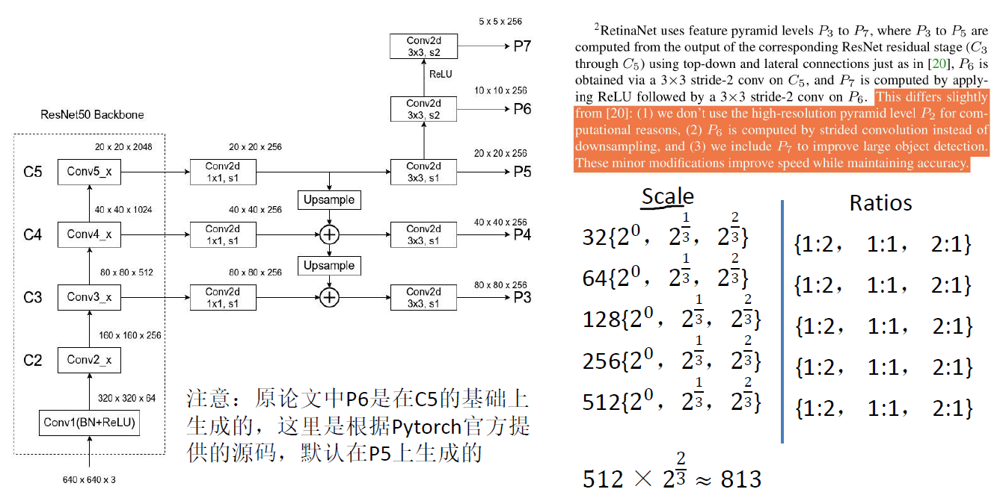
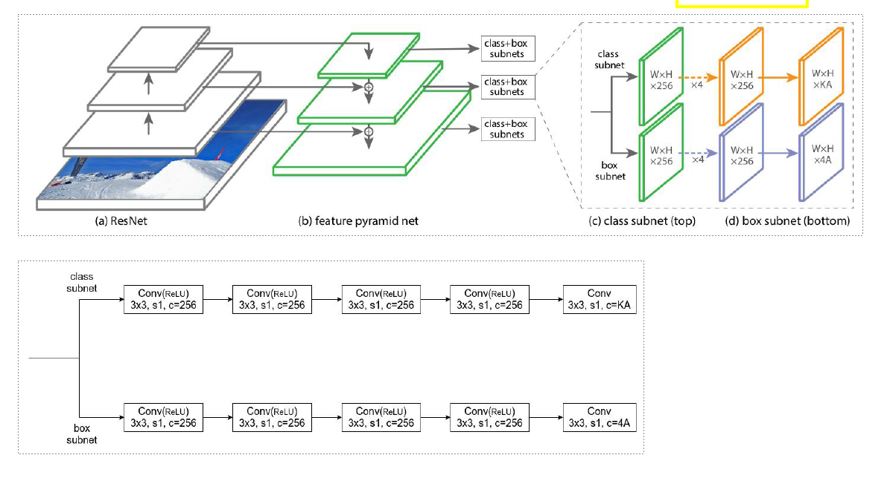

### RetinaNet  （Fcoal loss for Dense Object Detection）

**单阶段目标检测网络**

没有RPN进行候选框的筛选，通过`ResNet50`和`FPN`得到5层预测特征层，没有用`p2`作为预测特征层

特征层的每一个位置，有三种`scale`和三种`ratios`的anchor进行预测目标

同时，不同层的检测头采用权值共享的方式进行训练，

**正负样本匹配**

与fasterRCNN相似，

* IoU >= 0.5， 正样本
* IoU < 0.4， 负样本
* $IoU \in [0.4, 0.5]$， 舍弃

**损失函数**（加入Focal loss）

**one-stage网络，正负样本不均衡**

$$Loss = \frac{1}{N_{pos}}\sum_i L^i_{cls} + \frac{1}{N_{pos}}\sum_j L^j_{reg}$$

$L_{cls}$: Sigmoid Focal loss

$L_{reg}$: L1_loss

$N_{pos}$： 正样本的个数

$i$：所有的正负样本

$j$: 所有的正样本

单阶段目标检测不好的原因完全在于：

极度不平衡的正负样本比例： anchor的方式会使正负样本接近100:1， 而且绝大部分负样本都是easy example， 这就导致下面一个问题：

gradient被easy example dominant问题： 往往这些easy example虽然loss很低，但由于数量众多，对于loss依旧有很大贡献，从而导致收敛到不够好的一个结果。

所以作者的解决方案也很直接，直接按照loss削弱掉那些easy example的权重，这样使训练更加偏移到更有意义的样本中去。

