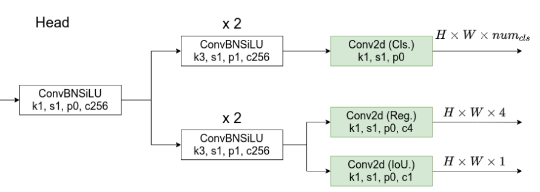
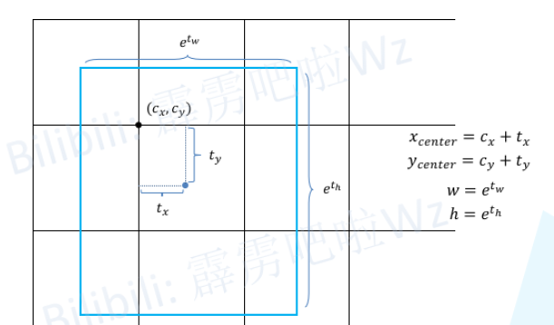
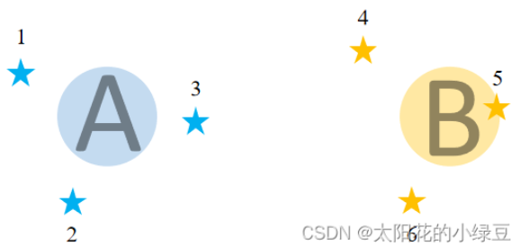
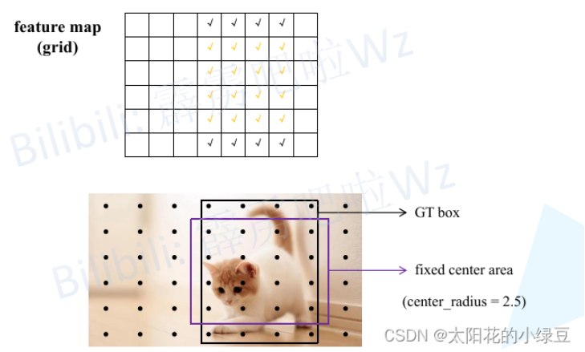
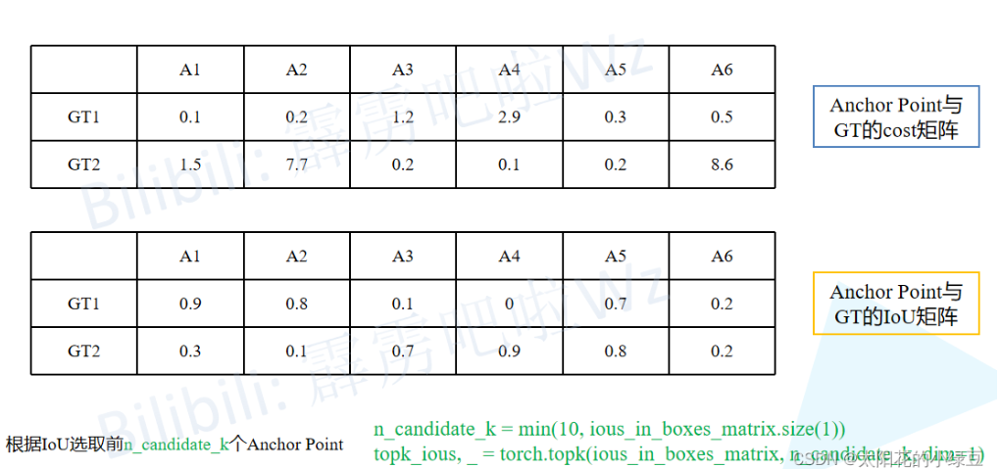
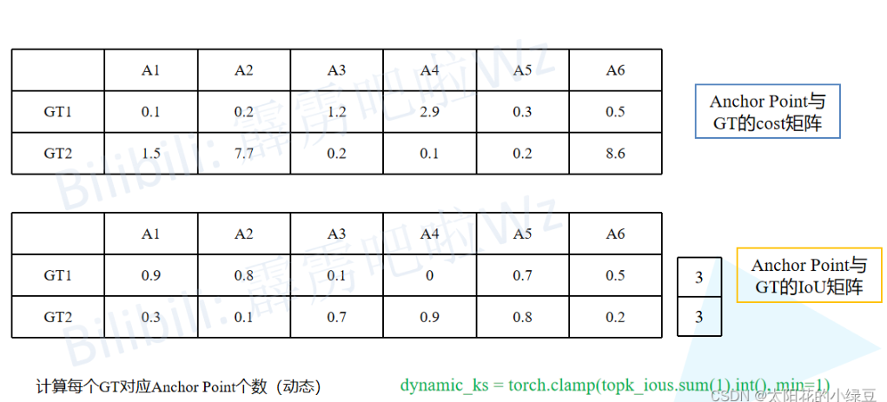
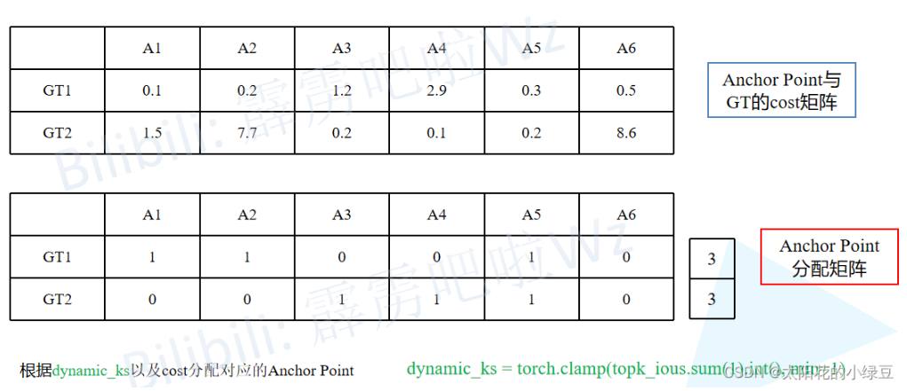
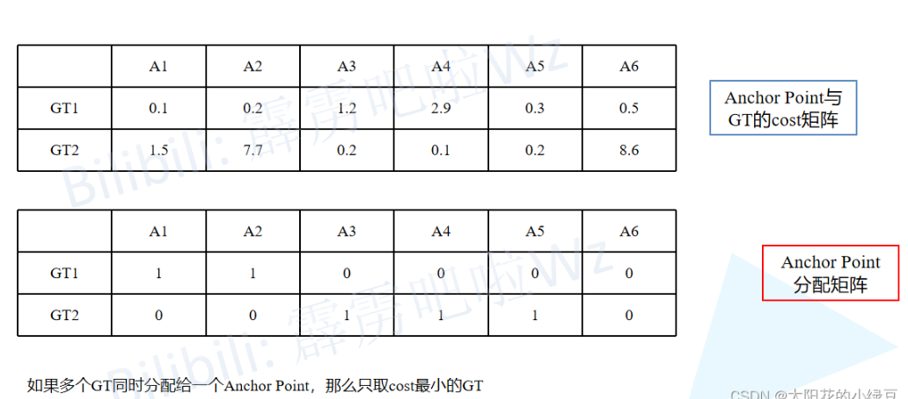

### yolox

##### decouped head

##### anchor-free

##### SimOTA


##### 1、decouped head

YOLOX和YOLOv5在网络结构上有什么差别呢，主要的差别就在检测头head部分，之前的检测头就是通过一个卷积核大小为<font color=red>`1x1`</font>的卷积层实现的，即这个卷积层要同时预测类别分数、边界框回归参数以及<font color=red>`object loss`</font>，这种方式在文章中称为<font color=red>`coupled detection head`</font>（耦合的检测头），作者说采用耦合的检测头是对网络有害的，如果将<font color=red>`coupled detection head`</font>换成<font color=red>`decoupled detection head`</font>（解耦的检测头）能够大幅提升网络的收敛速度。具体结构如下，在<font color=red>`decoupled detection head`</font>中对于预测<font color=red>`Cls`</font>. <font color=red>`Reg`</font>. <font color=red>`IoU`</font>参数分别使用三个不同的分支，这样就将三者进行了解耦，这里注意的一点，在YOLOX中对于不同的预测特征图采用不同的head，即**参数不共享**



##### 2、Anchor-free

借鉴了FCOS种的思想，YOLOX的<font color=red>`decoupled detection head`</font>,它对预测特征图（<font color=red>`feature map/Grid网格`</font>）上的每一个位置都预测了$num_{cls}+4+1$个参数， 其中$num_{cls}$代表检测的目标类别数，4代表网络预测的目标边界框参数，1代表object-ness。

由于YOLOX是Anchor-free的网络，所以head在每个位置处直接预测4个目标边界框参数$t_x, t_y, t_w, t_h$如下所示，这4个参数分别对应预测目标中心点相对<font color=red>`Grid Cell`</font>左上角$(c_x, c_y)$的偏移量，以及目标的宽度、高度因子，注意这些值都是相对预测特征图尺度上的，如果要映射回原图需要乘上当前特征图相对原图的步距<font color=red>`stride`</font>



损失函数

由于在网络的检测头中有<font color=red>`cls`</font>分支，<font color=red>`Reg`</font>分支以及<font color=red>`IoU`</font>分支（其实就是<font color=red>`Obj`</font>分支），所以损失由$L_{cls}、L_{reg}$

以及$L_{obj}$分支这三部分组成，其中$L_{cls}$和$L_{obj}$采用的都是二值交叉熵损失（BCE loss）， 而$L_{reg}$采用的是IoUloss， 还要注意的是，$L_{cls}$以及$L_{reg}$只计算正样本的损失，而$L_{obj}$既计算正样本也计算负样本的损失。
$$
Loss = \frac{L_{cls}+\lambda L_{reg+L_{obj}}}{N_{pos}}
$$
$L_{cls}$代表分类损失

$L_{reg}$代表定位损失

$L_{obj}$代表obj损失

λ代表定位损失的平衡系数，源码中设置是`5.0`

$N_{pos}$代表被分为正样本的`Anchor Point`数


##### 3、正负样本匹配策略SimOTA

<font color=red>`OTA`</font>是什么？

将匹配正负样本的过程看成一个**最优传输问题**，举例： 如下图所示，假设有1到6个城市（图中五角星），有2个牛奶生产基地A和B， 现在要求这两个牛奶生产基地为这6个城市送牛奶，究竟怎样安排才能最小化运输成本。假设运输成本（cost）仅由距离决定，那么很明显城市1、2、3由牛奶生产基地A负责，城市4、5、6由牛奶生产基地B负责，运输成本最低。



那么在<font color=red>`simOTA`</font>正负样本匹配过程中，城市对应的就是每个样本（<font color=red>`Anchor point`</font>）,其实就是<font color=red>`grid`</font>网格中的每个<font color=red>`cell`</font>，牛奶生产基地对应的是标注好的GT bbox, 那现在目标是怎么以最低的成本（cost）将GT分配给样本，cost的计算公式如下，其中$\lambda$为平衡系数，代码中的设置的是3.0
$$
c_{ij} = L^{cls}_{ij} + \lambda L^{reg}_{ij}
$$
通过公式可以得知，成本cost由分类损失和回归损失两部分组成，并且网络预测的类别越准确cost越小，网络预测的目标边界框越准确cost越小，那么最小化cost可以理解为让网络以最小的学习成本学习到有用的知识。

城市对应的是每个样本，那是不是所有的样本都参与cost计算呢，当然不是，在FCOS网络中，它是将那些落入GT中心sub-box范围内的样本视为正样本，其他都视为负样本。那么在`simOTA`中，也有类似的预筛选过程，首先会将落入目标GT box内或落入`fixed center area`内的样本给筛选出来，在源码中作者将`center_ratius`设置为2.5， 即`fixed center area`是一个`5x5`大小的box。如下图所示，feature map中所有打勾的位置都是通过预筛选得到的样本（`anchor point`）。注意，这里将落入GT Box与`fixed center area`相交区域内的样本用黄色的√表示。



接着计算网络在这些样本(`anchor point`)位置处的预测值（目标类别以及目标边界框）和每个GT的$L^{cls}_{ij}$以及$L^{reg}_{ij}$（由于回归损失是IoU loss， 所以这里也知道每个样本和每个GT的IoU）, 然后计算每个样本和每个GT之间的cost

```
cost = (
            pair_wise_cls_loss
            + 3.0 * pair_wise_ious_loss
            + 100000.0 * (~is_in_boxes_and_center)
        )
```

其中，

`pair_wise_cls_loss`就是每个样本与每个GT之间的分类损失$ L_{ij}^{cls}$

`pair_wise_ious_loss`是每个样本与每个GT之间的回归损失$L_{ij}^{reg}$

`is_in_boxes_and_center`代表那些落入GT Bbox与`fixed center area`交集内的样本，即上图中黄色

勾对应的样本，然后取反表示不在交集内的样本（非黄色样本），即上图中黑色勾对应的样本。接着又乘以100000， 也就是说对于GT box与`fixed center area`交集外的样本cost加上了一个非常大的数，这样在最小化cost过程中会优先选择GT box与`fixed center area`交集内的样本

接下来介绍如何利用cost去进行正负样本的匹配：

* 首先构建两个矩阵，一个是之前筛选出的anchor Point与每个GT之间的cost矩阵，另一个是Anchor Point与每个GT之间的IoU矩阵。接着计算<font color=red>`n_candidate_k`</font>并结合IoU对Anchor Point做进一步筛选（保留IoU大的Anchor Point）， <font color=red>`n_candidate_k`</font>是取<font color=red>`10`</font>和Anchor Point数量之间的最小值，在下面给出的这个示例中由于Anchor Point数量为6， 所以<font color=red>`n_candidate_k=6`</font>故保留所有的Anchor Point

  

* 接着对每个GT计算剩下所有的Anchor Point的IoU之和然后向下取整得到针对每个GT所采用的正样本数量，即代码中计算得到的`dynamic_ks`（这个计算过程对应论文中的`Dynamic k Estimation Strategy`。对于下面的示例，GT1的所有Anchor Point的IoU之和为`3.0`向下取整就是`3`,所以对于GT1有3个正样本，同理GT2也有3个正样本。

  

* 然后根据刚刚计算得到的<font color=red>`dynamic_ks`</font>（每个GT对应几个正样本）和cost矩阵找出所有的正样本（根据cost的数值大小）。比如对于示例中的GT1, 刚刚计算采用3个正样本，然后看下GT1和所有Anchor Point 的cost， 按照从小到大的顺序将前3个小的Anchor Point找出来，即示例中的<font color=red>`A1`</font>,<font color=red>`A2`</font>,<font color=red>`A5`</font>，同理对于GT2, cost排前3的是<font color=red>`A3`</font>, <font color=red>`A4`</font>, <font color=red>`A5`</font>。根据以上结果，我们可以再构建一个Anchor Point 分配矩阵，记录每个GT对应哪些正样本，对应正样本的位置标`1`， 其他位置为`0`

  

* 按照示例我们会发现一个问题，即GT1和GT2同时分配给了<font color=red>`A5`</font>，作者为了解决这个带有歧义的问题，又加了一个判断。如果多个GT同时分配给了一个Anchor Point， 那么只选cost最小的GT， 在示例中，由于<font color=red>`A5`</font>与GT2的cost小于与GT1的cost， 故只将GT2分配给了<font color=red>`A5`</font>

  