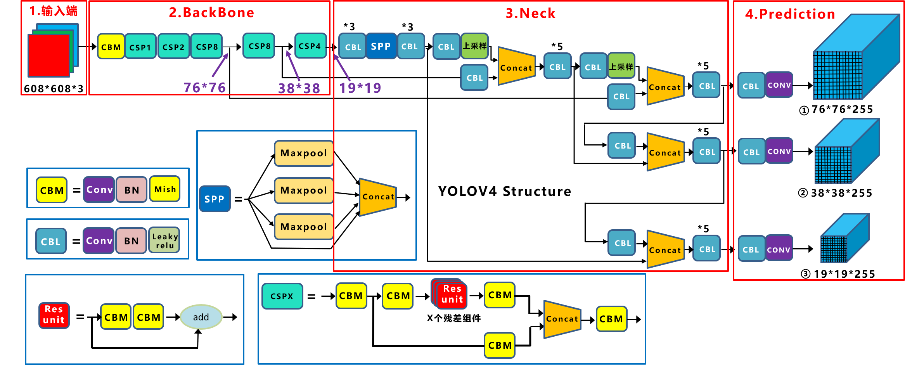
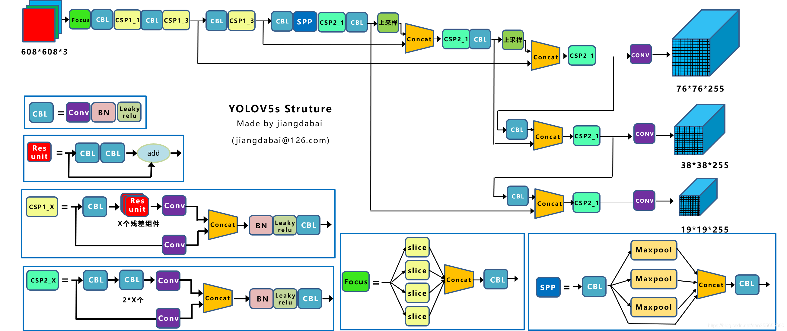

#### 目标检测常见问题

[TOC]


##### 1、手写IoU

```python
### IoU
def compute_iou(box1, box2):
    """
    box1 : (x0, y0, x1, y1)
    box2 : (x0, y0, x1, y1)
    """
    x1, y1, x2, y2 = box1
    x3, y3, x4, y4 = box2
    s_box1 = (y2 - y1) * (x2 - x1)
    s_box2 = (y4 - y3) * (x4 - x3)
    left = max(y1, y3)
    top = max(x1, x3)
    right = min(y2, y4)
    bottom = min(x2, x4)
    if left >= right or top >= bottom:
        return 0
    else:
        intersect = (right - left) * (bottom - top)
        area_union = s_box1 + s_box2 - intersect
        return intersect / area_union
## 缺点： 如果两个框没有相交，不能反映两者的距离大小，同时因为loss=0， 没有梯度回传，无法进行学习训练；无法精确的反映两者的重合度大小
    
### GIou
def compute_iou(box1, box2):
    x1, y1, x2, y2 = box1
    x3, y3, x4, y4 = box2
    s_box1 = (y2 - y1)*(x2 - x1)
    s_box2 = (y4 - y2)*(x4 - x2)
    left = max(y1, y3)
    top = max(x1, x3)
    right = min(y2, y4)
    bottom = min(x2, x4)
    if left >= right or top >= bottom:
        return 0
    else:
        intersect = (right - left)*(bottom - top)
        area_union = s_box1 + s_box2 - intersect
        area_c = (max(x2, x4) - min(x1, x3)) *(max(y2, y4) - min(y1, y3))    
        Giou = intersect / area_union + (area_c - area_union) / area_c
        return Giou
####当预测框在目标框内部时，且预测框大小一致时，这时候预测框和目标框的差集相等，这时Giou会退化成iou，无法区分各个预测框的位置关系
### DIoU
def compute_iou(box1, box2):
    x1, y1, x2, y2 = box1
    x3, y3, x4, y4 = box2
    s_box1 = (y2 - y1)*(x2 - x1)
    s_box2 = (y4 - y3)*(x4 - x3)
    left = max(x1, x3)
    top = max(y1, y3)
    right = min(x2, x4)
    bottom = min(y2, y4)
    center_x1 = x1 + (x2 - x1) / 2
    center_y1 = y1 + (y2 - y1) / 2
    center_x2 = x3 + (x4 - x3) / 2
    center_y2 = y3 + (y4 - y3) / 2
    d_c = ((center_x1 - center_x2)**2 + (center_y1 - center_y2)** 2)
    width = max(x2, x4) - min(x1, x3)
    height = max(y2, y4) - min(y1, y3)
    diag_c = (width**2 + height**2)
    if left >= right or top >= bottom:
        return 0
    else:
        insersect = (bottom - top) * (right - left)
        area_union = s_box1 + s_box2 - insersect
        iou = insersect / area_union
        diou = iou - d_c / diag_c
### CIoU
def compute_iou(box1, box2):
    x1, y1, x2, y2 = box1
    x3, y3, x4, y4 = box2
    left = max(x1, x3)
    top = max(y1, y3)
    right = min(x2, x4)
    bottom = min(y2, y4)
    center_x1, center_y1 = x2 - x1, y2 - y1 
    center_x2, center_y2 = x4 - x3, y4 - y3
    center_dis = (center_x1 - center_x2)**2 +(center_y1 - center_y2)**2
    c_dis = (max(x2, x4) - min(x1, x3))**2 + (max(y2, y4) - min(y1, y3))**2
    arc = (acrtan((x2 - x1) / (y2 - y1))-arctan((x4 - x3) / (y4 - y3)))**2
    v = 4 / pi * arc
    intersect = (right - left)*(bottom - top)
    area_1 = (x2 - x1)*(y2 - y1)
    area_2 = (x4 - x3)*(y4 - y3)
    iou = area_1 + area_2 -intersect
    alpha = v / (1 - iou + v)
    return iou - center_dis / c_dis + alpha * v
```


##### 2、手写NMS

算法实现思路：

先对每个框的score进行排序，首先选择score最高的框

然后与其他框进行比较，当iou大于一定的阈值， 说明两者的重合度高，应该去掉，这样筛选出的框就是和第一框重合度低的框，第一次迭代结束；第二次还是选择score最高的，重复上述过程直到没有框

```python
def nms(dets, thresh):
    #dets: x1, y1, x2, y2, score
    x1 = dets[:, 0]
    y1 = dets[:, 1]
    x2 = dets[:, 2]
    y2 = dets[:, 3]
    score = dets[:, 4]
    areas = (x2 - x1 + 1) * (y2 - y1 + 1)
    order = score.argsort()[::-1]
    keep = []
    while order.size > 0:
        i = order[0]
        keep.append(i)
        xx1 = np.maximum(x1[i], x1[order[1:]])
        yy1 = np.maximum(y1[i], y1[order[1:]])
        xx2 = np.minimum(x2[i], x2[order[1:]])
        yy2 = np.minimum(y2[i], y2;[order[1:]])
        w = np.maximum(0, xx2 - xx1)
        h = np.maximum(0, yy2 - yy1)
        inter = w * h
        iou = inter / (areas[i] + areas[1:] - inter)
        inds = np.where(iou < thresh)[0]
        order = order[inds + 1]
    return keep  
```


##### 3、对比YOLOv1和YOLOv3

**backbone:**

YOLOv1使用的是GoogleNet, 最后生成7x7x1024的张量，而YOLOv3使用的DarkNet53，加入了残差结构，同时有3个检测头

**损失函数**

YOLOv1直接预测的值，而YOLOv3使用的是预测位置坐标的偏移量，因为Yolov3加入了基于anchor，基于anchor的宽和高 和grid的先验位置的偏移量，得到最终的目标的位置。

**检测头**

yolov1使用的是7x7x1024的检测头，而YOLov3的检测头分叉了，分为了3部分

* 13x13x3x(4 + 1+ 80)
* 26x26x3x(4 + 1 + 80)
* 52x52x3x(4 + 1 + 80)

预测的框更多更全面了，并且分级了，我们发现3个分支分别为32倍下采样，16倍下采样，8倍下采样，分别预测大、中、小目标


##### 4、L1、L2范数

正则化是机器学习中对原始损失函数引入惩罚项， 以防止过拟合或提高模型泛化性能的一类方法的总称，常见的正则化有两种，L1范数和L2范数

* L1范数是各个参数的绝对值之和
* L2范数是模型各个参数的平方和开根号

L1范数会使得较多的模型参数为0， 从而产生稀疏解，我们可以将0对应的特征遗弃，进而用来进行特征选择，一定程度上可以防止模型的过拟合，当L1的正则化系数很小时， 得到的最优解会很小，可以达到和L2正则化类似的效果。

L2范数通过权重衰减，可以使得权重趋向于0， 但不为0， 导致模型权重参数较小且较为平滑，防止模型过拟合。

L2范数的效果是对原最优解的每个元素进行不同比例的放缩；L1范数则会使得原最优解的元素产生不同量的偏移，并使某些元素为0， 从而产生稀疏性。


##### 5、SmoothL1 loss相比L1 loss和L2 loss的优势在哪里？这些loss的公式

为了从两方面限制梯度：

1、当预测框与gt差别过大时，梯度值不至于过大；

2、当预测框与gt差别很小时，梯度值足够小；

考察如下几种损失函数，其中x为预测框与gt之间elementwise的差异：
$$
L_2(x) = x^2
$$

$$
L_1(x) = |x|
$$

$$
smooth_{L1}(x) = 
\left\{
\begin{matrix}
0.5x^2,   if |x| < 1 \\
|x| - 0.5 , otherwise\\
\end{matrix}
\right.
$$

损失函数对x的导数分别为：
$$
\frac{dL_2(x)}{dx} = 2x
$$

$$
\frac{dL_1(x)}{dx} = 
\left\{
\begin{matrix}
1, if x >= 0\\
-1, othersize\\
\end{matrix}
\right.
$$

$$
\frac{d smooth_{L1}}{dx}=
\left\{
\begin{matrix}
x, if |x| < 1\\
1 or -1, otherwise\\
\end{matrix}
\right.
$$

(4)： 当x增大时，L2损失对x的导数很大，这就导致**训练初期**， 预测值与gt差异过大，梯度十分大，训练不稳定

(5)： L1对x的导数为常数， 这就导致**训练后期**，预测值与gt过小时，梯度的决定于值仍为1， 损失函数将在稳定值附近，难以继续收敛以达到更高的精度。


##### 6、有没有看过anchor free的检测框架

##### 7、小目标如何改进

##### 8、对YOLOv4中的CSP结构有无了解

跨阶段局部网络，cross stage partial network， 设计CSPNet的主要目的是使该体系结构能够实现更丰富的梯度组合信息，同时减少计算量，通过将基础层的特征图划分两个部分，然后通过提出的跨阶段层结构将它们合并，可是实现此目标。我们的主要概念是通过分割梯度流，使梯度流通过不同的网络路径传播，这样，我们已经确认，通过切换串联和过渡步骤，传播到的梯度信息可以具有较大的相关性差异。


##### 9、mixup的优势及权值的影响？

针对小样本在样本量不足的情况下，通常会采用mixup进行数据增强


##### 10、1*1卷积优势

1、降维和升维

在网络中添加1*1的卷积使得网络更深，但并没有增加权重参数的负担，反而大大减少。

2、跨通道信息交互

通道间信息的线性组合变化

3、增加非线性特性

可以在保持feature map 大小不变的前提下大幅增加非线性特性。（利用后面的非线性激活函数）


##### 11、ROI pooling的过程

作用： 从不同的proposal中得到固定大小的相应的特征图，同时ROI pooling也极大的提高了处理速度。

过程：

（1）根据输入，将ROI 映射到feature map对应的位置

（2）将映射后的区域划分为相同大小的sections

（3） 对每个section进行max pooling操作

缺点：

（1）proposal缩放后有可能为小数，直接取整会造成偏移

（2）将整数后的边界区域平均分割成k*k个单元，对每个单元进行整数化处理也会造成量化误差


##### 12、ROI align的改进（Mask RCNN中的改进）

将最近邻插值改为双线性插值，使得即使缩放后坐标不能刚好为整数，也能通过插值得到浮点数处的值处理得到pooling 后的值。

**将`FasterRCNN`中的`RoIPool`替换成`RoIAlign`**

为什么替换？

在`RoIPool`中存在两次量化误差

下面的示意图就是`RoIPool`的执行过程，其中会经历两次量化，假设通过`RPN`得到一个`Proposal`, 它在原图上的左上角坐标是`(10, 10)`， 右下角的坐标是`(124, 124),` 对应要映射的特征层相对原图的步距为`32`， 通过`RoIPool`期望的输出为`2x2`大小：

* 将Proposal映射到特征层上，对于左上角坐标$\frac{10}{32}$四舍五入后等于0，对于右下角坐标$\frac{124}{32}$四舍五入后等于4， 即映射在特征层上的左上角坐标为(0, 0)， 右下角坐标为(4, 4)。对应下图特征层上从第0行到第4行，从第0列到第4列的区域（黑色矩形框）。这是第一次量化。
* 由于期望的输出为`2x2`大小，所以需要将映射在特征层上的`Proposal`划分为`2x2`大小区域，但现在映射在特征层上的`Proposal`是`5x5`大小的， 无法均分，所以强行划分后有的区域大有的区域小，如下图所示，这是第二次量化误差。
* 对于划分的每个子区域进行`maxpool`即可得到`RoIPool`的输出


为了解决这个问题， 提出了`RoIAlign`替换`RoIPool`， 以获取更加精确的空间定位信息。

下面的示意图是`RoIAlign`的执行过程。同样假设通过`RPN`得到一个Proposal，它在原图上的左上角坐标是(10, 10), 右下角坐标是(124, 124)， 对应要映射的特征层相当于原图的步距为32， 通过RoIAlign期望的输出为2x2大小：

* 将Proposal映射到特征层上，左上角坐标为(0.3125, 0.3125)（不进行四舍五入）， 右下角坐标为(3.875, 3.875)（不进行四舍五入）。为了方便了解，将特征层上的每个元素用一个点表示，就能得到图中下方的grid网格，图中蓝色的矩形框就是Proposal（没有量化误差）
* 由于期望输出为2x2大小，故将Proposal划分为2x2四个子区域（没有量化误差）， 接着根据sampling ratio在每个子区域中设置采样点，原论文中默认设置的sampling_ratio为4， 这里为了设置为了1
* 然后计算每个子区域中每个采样点的值（采用双线性插值计算）， 最后对每个区域的所有采样点取均值即为该子区域的输出。


值得注意的是，论文中提到，关于最终的采样结果对采样点位置，以及采样点的个数并不敏感。

**Mask Branch(FCN)**

##### 13、一阶段和两阶段的区别

One-stage网络以yolo系列网络为代表的，two-stage网络以faster-rcnn为代表

主要区别

1、一阶段网络速度要快很多

一阶段网络生成的anchor框只是一个逻辑结构，只需要对这个数据块进行分类和回归就可以，不像两阶段网络那样，生成的anchor框会映射到feature map的区域，然后将该区域重新输入到全连接层进行分类和回归，每个anchor映射的区域都要进行这样的分类和回归，所以它非常耗时。

2、一阶段的准确性要比二阶段网络低

rcnn系列首先在原图上


##### 14、了解的数据增强策略

**copy-paste**

随机选择两张图片，每张图片随机尺度抖动和随机水平翻转。然后从一个图像中随机选择一对象子集粘贴到另一图像上。

**Cutout**

对一张图像随机选取一个小正方形区域，**在这个区域的像素值设置为0或者其它统一的值**

**Random Erasing**

这个方法有点类似于Cutout， 与Cutout不同的是，**Random Erasing掩码区域的长宽，以及区域中像素值的替代值都是随机的**， Cutout是固定使用正方形

**Mixup**

主要思想是将在数据集中随机选择两张图片按照一定比例融合，包括标签值

##### 15、yolov4和yolov5的具体改进的点

YOLOv4

**检测头的改进**

* 之前的YOLOv3是1个anchor负责一个GT， YOLOv4中用多个anchor去负责一个GT, 对于GT来说，只要$IoU(anchor_i, GT_j) > threshold$， 就让anchor负责预测GT相当于改进了正样本筛选策略，总的anchor框的数量没有改变，但是选择的正样本的比例增加了，就缓解了正负样本不平衡问题

* Eliminate_grid_sensitivity， 将$b_x, b_y$的计算公式改为：

  $b_x = 1.1\sigma(t_x)+c_x$

  $b_y = 1.1 \sigma(t_y) + c_y$

这样改进后效果会再次提升

**neck的改进**

采用FPN+PAN的结构， 这样结合的操作，FPN层自顶向下传达强语义特征，而特征金字塔则自底向上传达强定位特征，两两联手， 从不同的主干层对不同的检测层进行参数聚合。

**损失函数的改进**

v1, v2, v3的位置回归损失都用的MSEloss，从V4开始用IoU loss

**MSE loss  ->  IoU loss -> GIoU loss  ->  DIoU loss ->CIoU loss**

IOU Loss主要考虑检测框和目标框的重叠面积，公式如下：

$$
IOU Loss = 1 - IOU = 1 - \frac{A \cap B}{A \cup B}
$$
IOU Loss存在两个问题：

* 问题一：当预测框和目标框不相交时，也就是当IOU=0时，无法反映两个框距离的远近，此时损失函数不可导。所以IOU Loss无法优化两个框不相交的情况
* 问题二：当两个预测框和同一个目标框相重叠，且两者IOU相同，这时IOU　Loss对两个预测框的惩罚相同，无法区分两个预测框与GT目标框的相交情况

**GIoU loss**


定义$A$为预测框，$B$为目标框，$C$为目标框和预测框的最小外接矩形，公式如下：
$$
差集 = C - A \cup B
$$

$$
GIOU Loss = 1-GIOU = 1-(IOU - \frac{|差集|}{|C|})
$$

可以看到，相比于IOU Loss，GIOU Loss衡量了目标框和预测框的相交程度，缓解了IOU Loss的问题。

但是当预测框在目标框内部，且预测框大小一致时，这时候预测框和目标框的差集相等，这是GIOU Loss会退化成IOU Loss，无法区分各个预测框的位置关系。

**DIoU loss**

好的目标框回归函数应该考虑三个重要几何因素：**重叠面积**、**中心点距离**、**长宽比**

针对Iou loss 和 GIoU loss存在的问题，DIoU loss 考虑重叠面积，中心点距离，公式如下：

设：$C$为预测框和目标框的最小外接矩形，$Distance \_ C$表示最小外接矩形的对角线距离，$Distance \_ 2$表示预测框的中心点到目标框中心点的欧式距离
$$
DIOU \ Loss =  1 - DIOU = 1-(IOU - \frac{Distance \_ 2}{Distance \_ C})
$$
由上述公式可以看出，当遇到GIOU Loss 无法解决的问题时，DIOU即考虑了重叠面积，也考虑了目标框和预测框的中心点的距离，就可以衡量两者之间的位置关系。所以当目标框包裹预测框的时候，DIOU可以衡量两者之间的距离。

但是DIOU Loss没有考虑长宽比，当预测框在目标框内部时，且多个预测框的中心点的位置都一样时，这时候DIOU Loss无法区分这几个预测框的位置。


**CIoU loss**

所以提出了CIOU Loss，其在DIOU Loss的基础上增加了一个影响因子，将预测框和目标框的长宽比都考虑进去，公式如下：
$$
CIOU \ Loss = 1 - CIOU = 1 - (IOU - \frac{Distance \_ 2^2}{Distance \_C ^2} - \frac{v^2}{(1-IOU)+v})
$$
其中，$v$是一个衡量长宽比一致性的参数，我们可以定义为：
$$
v = \frac{4}{Π^2}(arctan \frac{w^{gt}}{h^{gt}} - arctan \frac{w^p}{h^p})^2
$$
$gt$代表目标框，$p$代表预测框。

至此，CIOU Loss包含了一个好的预测框回归函数的三个重要的几何因素：重叠面积、中心点距离、长宽比。

**损失函数**




YOLOv4整个网络架构组成

* Backbone: CSPDarknet53
* Neck: SPP, PAN
* Head: YOLOv3

CSPDarknet53是在Yolov3主干网络Darknet53的基础上，借鉴2019年CSPNet的经验，产生的Backbone结构，其中包含了5个CSP模块。作者在实验中得到结论，CSPResNeX50分类精度比CSPDarknet，但是检测性能却不如后者。

每个CSP模块第一个卷积核的大小都是 $3 \times 3$，stride=2，因此可以起到下采样的作用。因为Backbone有5个CSP模块，输入图像是$608 \times 608$，所以特征图变化的规律是：$608->304->152->76->38->19$。

YOLOv4 和 YOLOv5 都使用 CSPDarknet作为BackBone，从输入图像中提取丰富的特征信息。CSPNet叫做Cross Stage Partial Network，跨阶段局部网络。其解决了其他大型卷积网络结构中的重复梯度问题，减少模型参数和FLOPS。这对 YOLO 有重要的意义，即保证了推理速度和准确率，又减小了模型尺寸。

CSPNet的作者认为推理计算过高的问题是由于网络优化中的梯度信息重复导致的。CSPNet基于Densnet的思想，复制基础层的特征映射图，通过dense block 传递到下一个阶段进行合并，从而将基础层的特征映射图分离出来。这样可以实现更丰富的梯度组合，同时减少计算量。

#### YOLOv5

**检测头的改进**

head部分没有任何改动， 和YOLOv3和YOLOv4完全相同，也是三个输出头， stride分别是8， 16， 32， 大输出特征图检测小物体，小输出特征检测大物体。

加上了自适应anchor的功能



YOLOv5各部分改进

* 输入端：Mosaic数据增强、自适应锚框计算

* Backbone：Focus结构，CSP结构

* Neck：FPN+PAN结构


##### 16、anchor-based和anchor-free的区别

##### 17、旋转框检测框和水平框的区别

##### 18、常见的分类损失和回归损失

##### 19、focal loss中的参数，哪个关注难样本，哪个解决长尾问题

单阶段目标检测不好的原因完全在于：

极度不平衡的正负样本比例： anchor的方式会使正负样本接近100:1，而且绝大部分负样本都是easy example，这就导致下面一个问题：

gradient被easy example dominant的问题：往往这些easy example虽然loss很低，但由于数量众多，对于loss依旧有很大贡献，从而导致收敛到不够好的一个结果。

所以作者的解决方案也很直接，直接按照loss 削弱掉那些easy example的权重，这样使训练更加偏移到更有意义的样本中去，


实验中作者比较了已有的各种样本选择方式

1、按照class比例加权重：最常用处理类别不平衡问题的方式

2、OHEM： 只保留loss最高的那些样本，完全忽略掉简单样本

3、OHEM+按class比例sample， 在前者基础上，再保证正负样本的比例（1:3）


##### 20、如果label中有错误标签，我们却不知道，怎么解决

##### 21、anchor怎么设置，不同网络anchor设置的差别（SSD, fasterRCNN, yolov3）

##### 22、BN设置时是每个batch进行计算，但之前的计算资源比较匮乏，batch很小，所以BN计算的时候特别敏感，会震荡不能很好收敛解决方法？

每隔几个batch做BN

##### 23、使用k-means聚类anchors

[太阳花的小绿豆CSDN博客_聚类anchor](https://blog.csdn.net/qq_37541097/article/details/119647026?spm=1001.2014.3001.5502)

k-means是非常经典且有效的聚类方法，通过计算样本之间的距离（相似程度），将较近的样本聚为同一类别。使用k-means时主要关注两个问题：

1、如何表示样本与样本之间的距离，不同方法聚类效果也不同，最常见的就是欧氏距离

2、分为几类，这个也是需要根据应用场景选取。

k-means算法主要流程如下：

* 1、手动设定簇的个数k, 假设k=2
* 2、在所有样本中随机选取k个样本作为簇的初始中心
* 3、计算每个样本离每个簇中心的距离， 然后将样本划分到离它最近的簇中
* 4、更新簇的中心，计算每个簇中所有样本的均值， 作为新的簇中心
* 5、重复第3步到第4步直到簇中心不再变化或者簇中心变化很小满足给定终止条件

k-means在anchor中的应用

为什么要聚类？如果我们一开始就选择了合适的anchors， 那么网络就更容易去学习得到好的检测器。那什么才算好的anchor呢，作者通过计算所有目标bboxes与anchors最大的IOU的均值作为指标，`Avg IOU`越大代表得到的anchors越好

**yolov2中使用k-means聚类anchor步骤：**

* 1、在所有的bboxes中随机挑选k个作为簇的中心。
* 2、计算每个bboxes离每个簇的距离`1-IOU(bboxes, anchors)`
* 3、计算每个bboxes距离最近的簇中心，并分配到离它最近的簇中
* 4、根据每个簇中的bboxes重新计算簇中心，这里默认使用的是计算中值
* 5、重复3到4直到每个簇中元素不再发生变化

