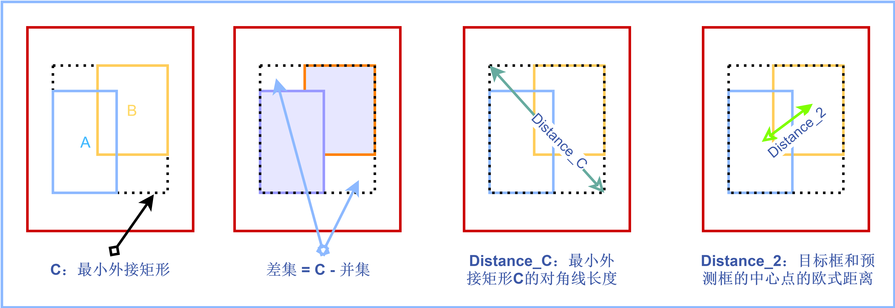

### 目标检测损失函数

常见目标检测损失函数： 
$$
L(\{p_i\},\{t_i\}) = \frac{1}{N_{cls}}\sum_i L_{cls}(p_i, p^*_i) + \lambda \frac{1}{N_{reg}} \sum_i p^*_iL_{reg}(t_i, t^*_i)
$$


$p_i$表示第`i`个`anchor`预测为目标的概率， $p^*$当为正样本时为`1`， 当为负样本时为`0`

$L_{cls}$为`二值交叉熵损失`， 值得注意的是， 交叉熵损失：

1、针对多分类问题， （`softmax`输出， 所有输出概率和为1）
$$
H = - \sum_i o^*_i log(o_i)
$$
2、针对二分类问题，（sigmoid输出， 每个输出节点之间互不相干）
$$
H = -\frac{1}{N}[o^*_i~log ~o_i + (1 - o^*_i~log(1 - o_i))]
$$
#### **用tensor实现二分类交叉熵损失**

```python
N = 3 * pow(10, 3)
torch.random.manual_seed(420)
x = torch.rand((N, 4), dtype=torch.float32)
w = torch.rand((4, 1), dtype=torch.float32)
y = torch.randint((0, 2), size=(N,1), dtype=torch.float32)
zhat = torch.mm(x, w)
sigma = torch.sigmoid(zhat)
loss = (-1/N) * torch.sum(y * torch.log(sigma) + (1 - y) * torch.log(1- sigma))
```


#### **用pytorch中类实现二分类交叉熵损失**

`BCEWithLogitsLoss `以及 `BCELoss`

其中`BCEWithLogitsLoss`自带`sigmoid`函数， 只需要输入预测值`zhat`即可

对于`BCELoss`来说， 需要输入激活函数激活后的`sigmma`

```python
N =  3 * pow(10, 6)
torch.random.manual_seed(420)
x = torch.rand((N, 4), dtype=torch.float32)
w = torch.rand((4, 1), dtype=torch.float32)
y = torch.randint((0, 2), size=(N,1), dtype=torch.float32)
zhat = torch.mm(x, w)
criterion = nn.BCEWithLogitsLoss()
loss = criterion(zhat, y)
```

```python
N = 3 * pow(10, 6)
torch,random.manual_seed(420)
x = torch.rand((N, 4), dtype=torch.float32)
w = torch.rand((4, 1), dtype=torch.float32)
y = torch.randint((0, 2, size = (N, 1), dtype= torch.float32)
zhat = torch.mm(x, w)
sigma = torch.sigmoid(zhat)
cirterion = nn.BCELoss()
loss = cirterion(sigma, y)
```

#### **用pytorch 类实现多分类交叉熵损失函数**


需要用到`one-hot编码`

[one-hot 编码](./one-hot编码.md)

两种方法：

`LogSoftmax和NLLLoss`

`CrossEntropyLoss`

```python
N = 3 * pow(10, 2)
torch.rand.manual_seed(420)
x = torch.rand((N, 4), dtype= torch.float32)
w = torch.rand((4, 3), dtype= torch.float32)
zhat = torch.mm(x, w)
y = torch.randint((0, 4), size= (N, ), dtype=torch.float32)
logsm = nn.Logsoftmax(dim = 1)
logsigma = logsm(zhat)
criterion = nn.NLLLoss()
# 由于交叉熵损失需要将标签转换为one-hot形式， 因此不接受浮点数作为标签的输入
cirterion(logsigma, y.long())
```

直接调用`CrossEntropyLoss`

```python
N = 3 * pow(10, 2)
torch.rand.manual_seed(420)
x = torch.rand((N, 4), dtype= torch.float32)
w = torch.rand((4, 3), dtype= torch.float32)
zhat = torch.mm(x, w)
y = torch.randint((0, 4), size= (N, ), dtype=torch.float32)
cirterion = nn.CrossEntropyLoss()
loss = cirterion(zhat, y.long())
```


$L_{reg}$为边界框回归损失， 采用的是`smoothl1`损失
$$
L_{cls} = - [p^*_i log(p_i) + (1- p^*_i)log(1-p_i)]​
$$

$$
L_{reg}(t_i, t^*_i) = \sum_i smooth_{L1}(t_i - t^*_i)
$$

$$
smooth_{L1}(x) = 
\left\{
\begin{matrix}
0.5x^2,   if |x| < 1 \\
|x| - 0.5 , otherwise\\
\end{matrix}
\right.
$$
#### **SmoothL1损失**

```python
def smoothl1_loss(input, target, sigma):
    beta = 1. 
    diff = torch.abs(input-target)
    cond = diff < beta
    loss = torch.where(cond, 0.5 * diff ** 2 , diff - 0.5)
    return torch.sum(loss, dim=1)
```

#### MSE损失

均方根误差， 也称L2损失， 其基本形式为：

$J_{MSE} = \frac{1}{N}\sum^N_{i=1}(y_i-\hat{y_i})^2$

在pytorch中， 

```python
import torch
from torch.autograd import Variable
import torch.nn as nn
import torch.nn.functional as F
loss_func = torch.nn.MSELoss()
input = torch.autograd.Variable(torch.randn(3, 4))
targets = torch.autograd.Variable(torch.randn(3, 4))
loss = loss_func(input, target)
print(loss)
```


#### IoU损失

`v1`, `v2`, `v3`的位置回归损失都用的`MSEloss`，从`V4`开始用`IoU loss`

**`MSE loss  ->  IoU loss -> GIoU loss  ->  DIoU loss ->CIoU loss`**

`IoU Loss`主要考虑检测框和目标框的重叠面积，公式如下：
$$
IOU Loss = 1 - IOU = 1 - \frac{A \cap B}{A \cup B}
$$


```python
def iou_loss(box1, box2):
    """
    box1 : (x0, y0, x1, y1)
    box2 : (x0, y0, x1, y1)
    """
    x1, y1, x2, y2 = box1
    x3, y3, x4, y4 = box2
    s_box1 = (y2 - y1) * (x2 - x1)
    s_box2 = (y4 - y3) * (x4 - x3)
    left = max(y1, y3)
    top = max(x1, x3)
    right = min(y2, y4)
    bottom = min(x2, x4)
    if left >= right or top >= bottom:
        return 1 - 0
    else:
        intersect = (right - left) * (bottom - top)
        area_union = s_box1 + s_box2 - intersect
        return 1 - intersect / area_union
```


`IoU Loss`存在两个问题：

* 问题一：当预测框和目标框不相交时，也就是当`IoU=0`时，无法反映两个框距离的远近，此时损失函数不可导。所以`IoU Loss`无法优化两个框不相交的情况
* 问题二：当两个预测框和同一个目标框相重叠，且两者`IoU`相同，这时`IoULoss`对两个预测框的惩罚相同，无法区分两个预测框与`GT`目标框的相交情况

#### GIoU 损失



定义$A$为预测框，$B$为目标框，$C$为目标框和预测框的最小外接矩形，公式如下：
$$
差集 = C - A \cup B
$$

$$
GIOU Loss = 1-GIOU = 1-(IOU - \frac{|差集|}{|C|})
$$

可以看到，相比于`IOU Loss`，`GIOU Loss`衡量了目标框和预测框的相交程度，缓解了`IOU Loss`的问题。

但是当预测框在目标框内部，且预测框大小一致时，这时候预测框和目标框的差集相等，这是`GIOU Loss`会退化成`IOU Loss`，无法区分各个预测框的位置关系。

```python
def Giou_loss(box1, box2):
    x1, y1, x2, y2 = box1
    x3, y3, x4, y4 = box2
    s_box1 = (y2 - y1)*(x2 - x1)
    s_box2 = (y4 - y2)*(x4 - x2)
    left = max(y1, y3)
    top = max(x1, x3)
    right = min(y2, y4)
    bottom = min(x2, x4)
    if left >= right or top >= bottom:
        return 1 - 0
    else:
        intersect = (right - left)*(bottom - top)
        area_union = s_box1 + s_box2 - intersect
        area_c = (max(x2, x4) - min(x1, x3)) *(max(y2, y4) - min(y1, y3))    
        Giou = intersect / area_union + (area_c - area_union) / area_c
        return 1 - Giou
```


#### DIoU 损失

好的目标框回归函数应该考虑三个重要几何因素：**重叠面积**、**中心点距离**、**长宽比**

针对`Iou loss` 和 `GIoU loss`存在的问题，`DIoU loss` 考虑重叠面积，中心点距离，公式如下：

设：$C$为预测框和目标框的最小外接矩形，$Distance \_ C$表示最小外接矩形的对角线距离，$Distance \_ 2$表示预测框的中心点到目标框中心点的欧式距离
$$
DIOU \ Loss =  1 - DIOU = 1-(IOU - \frac{Distance \_ 2}{Distance \_ C})
$$
由上述公式可以看出，当遇到`GIOU Loss` 无法解决的问题时，`DIOU`即考虑了重叠面积，也考虑了目标框和预测框的中心点的距离，就可以衡量两者之间的位置关系。所以当目标框包裹预测框的时候，`DIOU`可以衡量两者之间的距离。

但是`DIOU Loss`没有考虑长宽比，当预测框在目标框内部时，且多个预测框的中心点的位置都一样时，这时候`DIOU Loss`无法区分这几个预测框的位置。


```python
def Diou_loss(box1, box2):
    x1, y1, x2, y2 = box1
    x3, y3, x4, y4 = box2
    s_box1 = (y2 - y1)*(x2 - x1)
    s_box2 = (y4 - y3)*(x4 - x3)
    left = max(x1, x3)
    top = max(y1, y3)
    right = min(x2, x4)
    bottom = min(y2, y4)
    center_x1 = x1 + (x2 - x1) / 2
    center_y1 = y1 + (y2 - y1) / 2
    center_x2 = x3 + (x4 - x3) / 2
    center_y2 = y3 + (y4 - y3) / 2
    d_c = ((center_x1 - center_x2)**2 + (center_y1 - center_y2)** 2)
    width = max(x2, x4) - min(x1, x3)
    height = max(y2, y4) - min(y1, y3)
    diag_c = (width**2 + height**2)
    if left >= right or top >= bottom:
        return 1 - 0
    else:
        insersect = (bottom - top) * (right - left)
        area_union = s_box1 + s_box2 - insersect
        iou = insersect / area_union
        diou = iou - d_c / diag_c
        return 1 - diou
```


#### CIoU 损失

所以提出了`CIOU Loss`，其在`DIOU Loss`的基础上增加了一个影响因子，将预测框和目标框的长宽比都考虑进去，公式如下：
$$
CIOU \ Loss = 1 - CIOU = 1 - (IOU - \frac{Distance \_ 2^2}{Distance \_C ^2} - \frac{v^2}{(1-IOU)+v})
$$
其中，$v$是一个衡量长宽比一致性的参数，我们可以定义为：
$$
v = \frac{4}{Π^2}(arctan \frac{w^{gt}}{h^{gt}} - arctan \frac{w^p}{h^p})^2
$$
$gt$代表目标框，$p$代表预测框。

至此，`CIOU Loss`包含了一个好的预测框回归函数的三个重要的几何因素：重叠面积、中心点距离、长宽比。

```python
def Ciou_loss(box1, box2):
    x1, y1, x2, y2 = box1
    x3, y3, x4, y4 = box2
    left = max(x1, x3)
    top = max(y1, y3)
    right = min(x2, x4)
    bottom = min(y2, y4)
    center_x1, center_y1 = x2 - x1, y2 - y1 
    center_x2, center_y2 = x4 - x3, y4 - y3
    center_dis = (center_x1 - center_x2)**2 +(center_y1 - center_y2)**2
    c_dis = (max(x2, x4) - min(x1, x3))**2 + (max(y2, y4) - min(y1, y3))**2
    arc = (acrtan((x2 - x1) / (y2 - y1))-arctan((x4 - x3) / (y4 - y3)))**2
    v = 4 / pi * arc
    intersect = (right - left)*(bottom - top)
    area_1 = (x2 - x1)*(y2 - y1)
    area_2 = (x4 - x3)*(y4 - y3)
    iou = area_1 + area_2 -intersect
    alpha = v / (1 - iou + v)
    ciou =  iou - center_dis / c_dis + alpha * v
    return ciou
```


