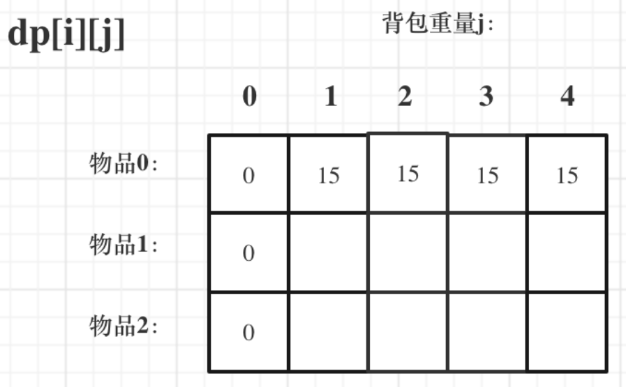

## 0-1背包


**确定dp数组和下标含义**


<font color=red>**$dp[i][j]$表示从下标为[0-i]的物品里任意取，放进容量为j的背包，价值总和最大是多少**</font>

**确定递推公式**

如果该物品的重量大于背包的重量，则背包能背的物品最大价值为之前的最大价值，即$dp[i][j] = dp[i-1][j]$

但是如果该物品的重量小于等于背包的重量，就要选择**放不放**，即$dp[i][j] = max(dp[i-1][j], dp[i-1][j-weight[i]]+value[i])$

$dp[i-1][j-weight[i]]$为背包容量为$j-weight[i]$时，背包能背的物品的最大价值，再加上如果放的价值

**初始化**



当j = 0时， 背包的容量为0，此时背包什么也放不了，则背包的最大价值也为0

同时初始化i=0时的dp， 由于i=0时，只能选物品0， 则只有背包容量可以容纳物品0的重量时，背包中的最大价值就为value[0]

初始化程序如下：

```c++
vector<vector<int>> dp(weight.size(), vector<int>(bagweight+1, 0));
for(int j = weight[0]; j <= bagweight; j++){
    dp[0][j] = value[0];
}
```

先遍历物品，然后再遍历背包重量：

```c++
for(int i = 1; i < weight.size(); i++){
    for(int j = 1; j <= bagweight; j++){
        if(weight[i] <= j){
            dp[i][j] = max(dp[i-1][j], dp[i-1][j-weight[i]]+value[i]);
        }
        else{
            dp[i][j] = dp[i-1][j];
        }
    }
}
```


用一维数组表示dp， dp[i]为每个物品重量为i时，背包中的最大价值

分别对每个物品进行遍历，覆盖之前最大的价值

```c++
vector<int> dp(bagweight+1, 0);
for(int i = 0; i < weight.size(); i++){
    for(int j = bagweight; j >= weight[i]; j--){
        dp[j] = max(dp[j], dp[j - weight[i]] + value[i]);
    }
}
```

