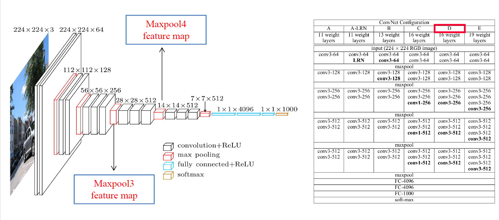
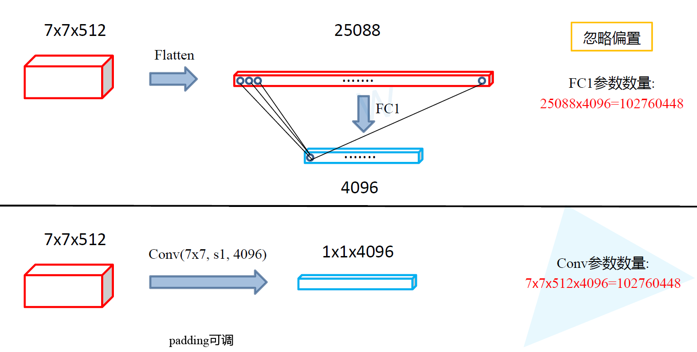
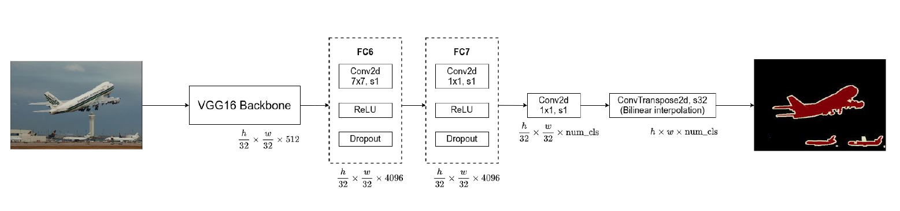

### FCN(全卷积网络)

语义分割任务， 主要采用的是`VGG16`

**cnn与fcn的比较**

在传统的CNN网络中，在最后的卷积层之后会连接上若干个全连接层，将卷积层产生的特征图映射称为一个固定长度的特征向量。一般的CNN结构适用于图像级别的分类和回归任务，因为它们最后都期望得到输入图像的分类的概率。

FCN是对图像进行像素级的分类（也就是每个像素点都进行分类）， 从而解决了语义级别的图像分割问题。与上面介绍的经典CNN在卷积层使用全连接层得到固定长度的特征向量进行分类不同，FCN可以接受任意尺寸的输入图像，采用反卷积层对最后一个卷积成的特征图进行上采样，使得它恢复到输入图像相同的尺寸，从而可以对每一个像素都产生一个预测， 同时保留了原始输入图像中的空间信息，最后在上采样的特征图上进行像素的分类。

**为什么要进行上采样**

FCN网络一般是用来对图像进行语义分割的，于是就需要对图像上的各个像素进行分类，这就需要一个上采样将最后得到的输出上采样到原图的大小。上采样对于低分辨率的特征图，常常采用上采样的方式将它还原高分辨率， 具体有： `双线性插值上采样`,`反卷积上采样`， `反池化上采样`

[上采样的具体方式](./上采样的方式.md)

下图是`VGG16`的网络结构

FCN与VGG16的核心区别是FCN将**CNN末尾的三个全连接层转化成了卷积层**： 

全卷积层部分进行特征提取， 提取卷积层（3个蓝色层）的输出来作为预测21个类别（**包含背景**）的特征

最后通过反卷积层可以上采样到原图大小。

**总结：**

* 想要精确预测每个像素的分割结果

* 必须经历从大到小，再从小到大的两个过程

* 在上采样的过程中，分阶段增大比一步到位效果更好

* 在上采样的过程中，使用下采样对应成的特行进行辅助

* 得到的结果还不够精细，进行8倍上采样虽然比32倍效果好了很多，但是上采样的结果还是比较模糊和平滑，对图像中的细节不敏感。

* 对各个像素进行分类，没有充分考虑像素与像素之间的关系，忽略了在通常的基于像素分类的分割方法中使用的空间规整步骤，缺乏空间一致性。

  