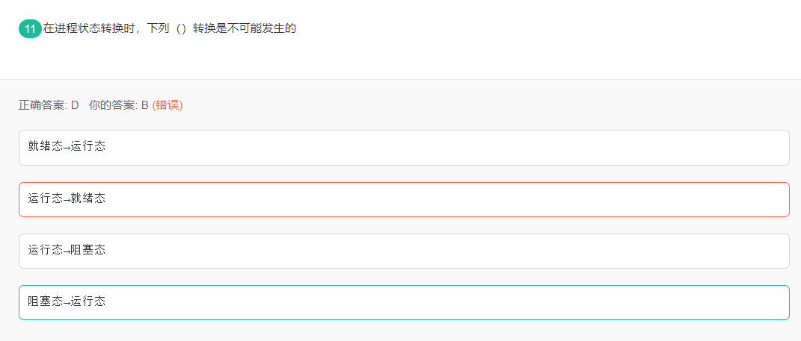

小米笔试：

#### 1、

解析：

运行态失去CPU资源变成就绪态， 就绪态得到CPU资源变形运行态， 运行态等待或者I/O请求变成阻塞态。阻塞等待的事情发生就进入就绪态， 阻塞态不能直接转换到运行态， 必须先经过就绪态才行。

#### 2、

疫苗是有效减少新冠感染的防御手段， 但疫苗的防护率并非百分之百。调查中发现国外某高风险地区， 在普通非感染人群中疫苗接种比例为80%， 而感染人群中疫苗接种率仅为20%， 假设该地区已有5%的人被感染， 则该地区某市民接种疫苗后，仍然被感染的概率约为多少：
$$
P(感染|接种) = \frac{P(接种|感染)P(感染)}{P(接种)} = \frac{P(接种|感染)P(感染)}{P(接种|感染)P(感染) + P(接种|未感染)P(未感染)}\\
= \frac{0.2\times 0.05}{0.2\times 0.05 + 0.8\times 0.95} = 0.13
$$

#### 3、

**L0范数**

L0范数并不是真正的范数， 它主要被用来度量向量中非零元素的个数。

#### 4、

下列算法中使用到分治策略的有：

**二分查找**     **归并排序**    **快速排序**     贪心算法      动态规划

