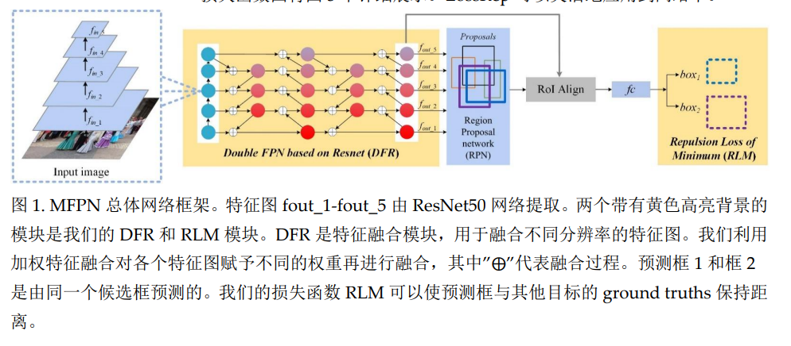
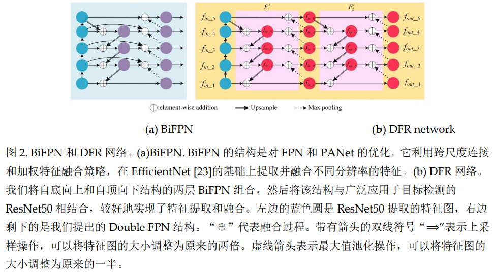
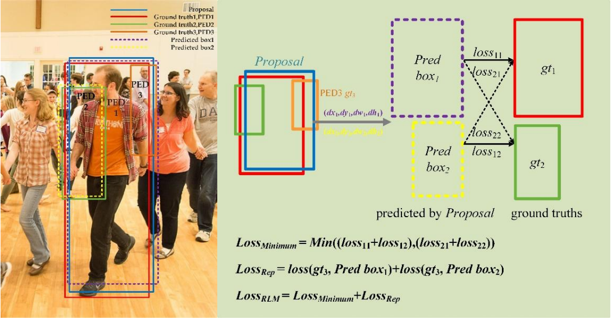
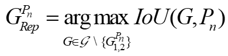
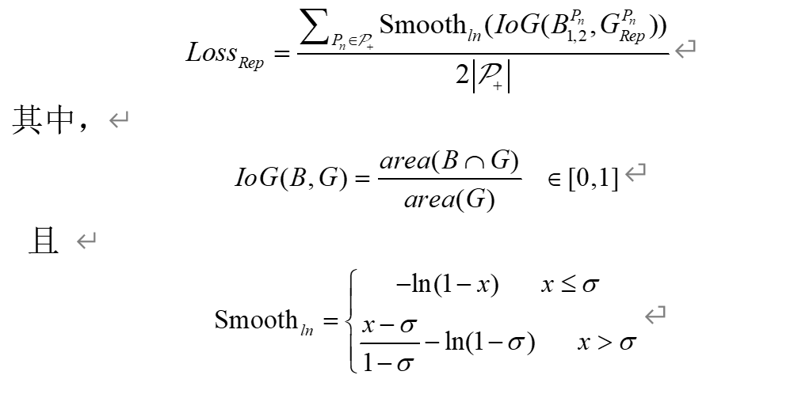

### 遮挡目标检测

##### 摘要

为了解决拥挤场景下行人检测的严重遮挡问题，提出一种基于ResNet的多尺度特征金字塔网络，来增强被遮挡目标的特征以此来提高检测精度。

改进：

**1）DFR（double FPN)**

提出了一种新的特征提取网络DFR (Double FPN integrated ResNet), 增强了被遮挡行人的语义信息和轮廓，并且简化了网络结构和减少了参数。

**2）RLM (Repulsion Loss of Minimum)**

在原有的损失函数上，引入斥力损失，既可以减少预测框与gt之间的损失，又可以增加预测框与其周围目标的gt之间的损失。

**解决行人检测中存在的严重遮挡问题，使得目标检测器可以实现更高的检测精度。**

##### 网络结构

网络主要由`DFR`, `RPN`, `RoIAlign`和`Repulsion Loss of Minimum`四部分组成。

在本文中，我们采用两阶段检测算法，选择ResNet50作为骨干网络，其次是我们的DFR网络，与传统的FPN相比，DFR是一种改进的金字塔结构。

两阶段检测算法的RPN网络负责在多尺度特征图上生成不同的anchors， 由anchors回归的一些候选框在图1中的RPN模块显示出来。RoI Align模块结合特征图fout_1-fout_5和比例信息，将不同大小的特征图转换为相同大小的特征图。全连接层就可以针对一个候选框预测生成多个目标的偏移量。最后一部分是Repulsion Loss of Minimum

##### DFR

有效地提取和融合特征对于行人检测具有重要意义，因此，特征提取网络提取的特征图影响检测结果的准确性。为了能够将高层特征与更抽象的语义信息结合，将底层特征与更多轮廓信息结合。

* PANet: 在FPN上增加了一个额外的自底而上路径。

* Tan等人提出了一种加权双向特征金字塔网络结构BiFPN，可以通过对网络缩放融合特征。

为了整合上述网络结构，在BiFPN中提出了跨尺度连接，如图所示，虽然这些方法优化了网络提取和融合特征的过程并获得了更好的精度，但仍存在需要克服的缺点：

（1）对于提取严重遮挡目标的特征这些网络仍有一定的局限性

（2）过多的参数和计算量降低了网络的效率

（3）网络不能灵活运用

提出了一种有效的多尺度特征提取与融合网络DFR， 整个DFR网络由ResNet50和Double FPN网络两部分组成

`选择ResNet50`

* ResNet50 的错误率比 ResNet18 和 ResNet34 低，参数是 ResNet101 和 ResNet152 的一半。但是 ResNet50、ResNet101 和 ResNet152 可以达到几乎相同的精度。

我们提出的DFR在两层BiFPN的基础上做了如下改进：

**首先，去除同一层的初始输入和输出之间的连接，因此相应的特征融合时的权重也应该去除，能够减少初始化参数；其次，将BiFPN中的可分离卷积替换为普通卷积，尽管可分离卷积的网络结构参数量较少，但是我们的实验证明，可分离卷积的网络在所有指标上都不能超过使用标准卷积的网络。同时，在我们的实验中，使用标准卷积网络提取的特征图比使用可分离卷积提取的特征图更清晰，这表明我们的网络使用标准卷积可以更好地提取和融合特征。**

##### Repulsion Loss of Minimum

对于一个候选框，我们选择可以**预测两个或多个边界框**，这样可以避免预测框由于严重重叠，在NMS的后处理后 只有一个框留下的情况。行人检测中的损失函数一般由回归损失和分类损失两部分组成，在本节中，我们将详细介绍损失函数RLM，以解决行人检测中的遮挡问题。RLM由两部分组成，定义为：

$Loss_{RLM} = Loss_{Minmum} + Loss_{Rep}$

PED1和PED2是我们要检测的目标，红色框和绿色框是他们的gt， 蓝色框负责预测PED1和PED2的候选框。

`紫色的pre box1和黄色的pre box2分别对应于行人的哪个gt？`

* 解决方案是粉笔额计算对应两个目标的损失，并选择最小损失

  $Loss_{Minimum} = Min((loss_{11}+loss_{12}), (loss_{21}+loss_{22}))$

接下来是$Loss_{Rep}$:

目的：为了使两个预测框（Pred box1和Pred box2）与周围其他的ground truth保持距离。

例如上图所示，$Loss_{Rep} = loss(gt_{3}, Pred box_{1}) + loss(gt_{3}, Predbox_{2})$

具体地loss为斥力损失

一般来说，对于第n个候选框$P_n$，需要与它相斥的ground truth定义为除了它需要预测的两个目标的ground truth外，剩下的ground truth中与该候选框的IoU区域最大的那个候选框，即：

$G^{p_n}_{Rep}$ ： 剩下的ground truth中与该候选框的IoU区域最大的那个候选框

$Loss_{Rep}$: 就是计算的$G^{p_n}_{Rep}$与两个预测框$B^{P_n}_{1, 2}$之间的损失（$B^{P_n}_{1, 2}$由候选框$P_n$回归得到）

候选框与其他目标的gt的IoU越大，$Loss_{Rep}$对bounding box回归器实施的惩罚就越大

##### 实验设置

使用常用的两阶段算法Faster RCNN, backbone为ResNet+FPN作为基线网络。所有实验均采用在ImageNet上预先训练好的ResNet50。本网络中，使用的是RoI Align而不是RoI Pooling。每次实验，我们总共训练35个epoch,对于学习率，我们采用了warm up的方法： 每次训练时，从第一个epoch的iteration 1 到iteration 800, 学习率从0.0001到0.001线性增加，然后保持不变。到第24个epoch，学习率变为原来的十分之一，到第28个epoch时，学习率变为原来的百分之一。

##### 评价指标

使用三个评价指标来评估方法，$AP, MR^{-2}, JI$, 

$MR^{-2}$： 一般用于行人检测，是在[10-2, 100]范围内的log-average Miss Rate on False Positive Per Image(FPPI)的简称。对假阳敏感，越小性能越好。

JI: 评估预测框与ground truth重叠情况，JI越大，性能越好。

