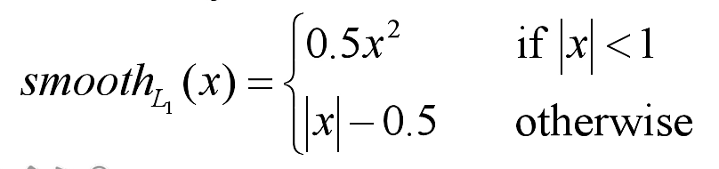

### 遮挡程序

位置： `/data2/20120017/CrowdDet-master`

##### 1、数据加载

```python
crowdhuman = CrowdHuman(config, if_train=True)
data_iter = torch.utils.data.DataLoader(dataset=crowdhuman,
                                        batch_size=train_config.mini_batch_size,
                                        num_workers=2,
                                        collate_fn=crowdhuman.merge_batch,
                                        shuffle=True)
```

##### 2、网络结构

```python
fpn_fms = self.FPN(image)
rpn_rois, loss_dict_rpn = self.RPN(fpn_fms, im_info, gt_boxes)
rcnn_rois, rcnn_labels, rcnn_bbox_targets = fpn_roi_target(rpn_rois, im_info, gt_boxes, topk=2)
loss_dict_rcnn = self.RCNN(fpn_fms, rcnn_rois, rcnn_labels, rcnn_bbox_targets)
```

self.bottom_up：`ResNet50`


self.FPN:

(2, 3, 832, 1408)  >>>>>> 

下采样32倍  :  (2, 2048, 26, 44)    >>> **(2, 256, 26, 44)**  >>> 上采样 + {(2, 1024, 52, 88) >>> (2, 256, 52, 88)}   = **(2, 256, 52, 88)**

下采样16倍 : (2, 1024, 52, 88)       >>> (2, 256, 52, 88) >>> 上采样 + {(2, 512, 104, 176) >>>(2, 256, 104, 176) = (2 256,  104, 176)} = **(2, 256, 104, 176)**

下采样8倍 : (2, 512, 104, 176)     = **(2, 256, 208, 352)   **

下采样4倍 : (2, 256, 208, 352)      

再插入一个**(2, 256, 13, 22)**

**一共组成5层预测特征层** fpn_fms


self.RPN:

```python
rpn_rois, loss_dict_rpn = self.RPN(fpn_fms, im_info, gt_boxes)
```

传入RPN网络的样本数据被整理成为anchor box（坐标）和每个anchor box是否有物体（二分类标签）， 一共有3个anchor box， 因此， 整理的特征为：

​                                            pred_cls_score    pred_bbox_offsets     

(2, 256, 13, 22)        >>>   (2, 3x4, 13, 22),    (2, 3x2, 13, 22)

(2, 256, 26, 44)        >>>   (2, 3x4, 26, 44),     (2, 3x2, 26, 44)

(2, 256, 52, 88)        >>>   (2, 3x4, 52, 88),      (2, 3x2, 52, 88)

(2, 256, 104, 176)   >>>    (2, 3x4, 104, 176),  (2, 3x2, 104, 176)

(2, 256, 208, 352)   >>>     (2, 3x4, 208, 352), (2, 3x4, 208, 352)


获取anchor：

base_stride = 4 尺度最大的特征层降维是4倍， 故从0到4层特征层的下采样倍数为（4， 8， 16， 32， 64）

针对每一个预测特征层：以（2, 256, 13, 22)为例

先获取shift，为对应预测特征层的坐标，间隔为下采样倍数， 然后拼接， 最终得到的就是特征图HxW个坐标

（286， 4）[flatten_shift_x, flatten_shift_y, flatten_shift_x, flatten_y]

同时，对于每个特征层的尺度，生成3种大小的anchor [1:1, 1:2, 2:1], **获取每个以零点为中心的anchor坐标**

然后将zero_central的anchor和获取的shift得到正常对应到原图上的anchors （286， 3x4）3是3种anchor

all_anchors: 5个预测特征层上的

第0层： （13x22x3, 4）

第1层：  （26x44x3, 4)

第2层：     (52x88x3, 4)

第3层：     (104x176x3, 4)

第4层：     (208x352x3, 4)


获取proposals:

得到：

batch_proposals,(292578, 4)      13x22x3+ 26x44x3 + 52x88x3 + 104x176x3 + 208x352x3 = 292578

 batch_probs,       (292578,)

* 筛选：去掉宽高不满足下限的proposals  292578

* 对probs进行排序，保留前12000个
* 根据nms， iou阈值设置为0.7，同时保留前2000个

返回（2000 x batch, 5）

正负样本策略：fpn_anchor_target（256个样本）**用256个进行训练**

在每一层下：

* 计算anchor与gt的iou, 并求每个anchor 对应的g(iou最大的)
* 找到每个gt最接近的anchor， 与上一步相反
* 将第一步中iou小于0.3的置为负样本
* 将第一步中iou大于0.7的置为正样本
* **如果最大的iou也很小，就把最大的设为正样本**（第二步）

concated_batch_labels:所有anchor的标签（前景或背景）

concated_batch_bbox_targets: 所有anchor的损失

随机筛选256个标签，前景背景各128个， 前景不够的话背景用256减

每张图像，正样本最多128个，负样本256-正样本， 剩下的填充-1， 丢弃

最终得到final_labels, final_bbox_targets

reshape得分和偏置损失

类别损失： 计算正负样本与标签的损失


fpn_roi_target    (为了跟自己的创新点相靠近)

将gt_rois拼接到rpn_rois后面，得到all_rois

计算all_rois与每个gt_boxes_perimg的iou重合度

对其进行排序，正样本以及负样本[2000+gt, gt]

每个预测框与gt最重合的那个，**（一个预测框预测一个gt）**

每个预测框与gt_ignore最重合的那个overlaps_ignore

将阈值小于0.5或者负样本重合度大于正样本的生成ignore_assign_mask

通过ignore_assign_mask筛选一下

获取labels： 2000+gt个对应前景和背景

fg_mask: iou阈值大于0.5且labels不为-1

bg_mask: iou阈值小于0.5

筛选出512个？labels为512的前景背景； gt_assignment为512对应的gt索引； target_boxes为512对应的真实位置标签； rois:为预测的bbox

得到bbox_targets: [dx, dy, dw, dh]


self.RCNN

```python
 loss_dict_rcnn = self.RCNN(fpn_fms, rcnn_rois,
                rcnn_labels, rcnn_bbox_targets)
```

用7x7进行roialign

对输出的4个特征图（最小的pool层不用）， 根据proposal Box的面积算出在哪一个特征图层进行ROI Align处理

然后对每一层进行处理

output（512xbatch, 256, 7, 7）

self.fc1(in=256x7x7, out=1024) 

self.fc2(in = 1024, out=1024)

pred_cls: Linear(in = 1024, out = 2)   前景背景

pred_delta: Linear(in = 1024, out = 2)  前景背景（类别+1）

##### 损失函数

**RPN分类损失**：

RPN在生成的anchor只分为**前景和背景**。前景的标签为1， 背景的标签为0.在训练RPN的过程中，会选择256个anchor， 采用二分类交叉熵损失

$L{cls}(p_i, p^*_i) = -log[p^*_ip_i + (1-p^*_i)(1-p_i)]$, 然后除以总的anchor数量的Ncls

**FasterRCNN分类损失：**

采用的是多分类交叉熵损失（类别肯定不止2个，这里的类别得加上背景），

$L_{cls} = -\sum_i o^*log(o_i)$

**回归损失**

都一样的，RPN和FasterRCNN, 公式为, 只计算前景的损失

$L_{reg} = 1/N_{reg} * \sum_ismooth_{L_1}(t_i, t^*_i)$



使用smoothl1损失的原因

对于边框的预测是一个回归问题。通常可以选择平方损失（L2损失）但这个损失对于比较大的误差的惩罚很高

我们可以采用稍微缓和一点绝对损失函数（L1损失）f(x) = |x|， 它随着误差线性增加，而不是平方增加，但这个函数在0点出不可导，因此可能会影响收敛

一个通常的办法就是，分段函数，在0点附近使用平方函数使得它更加平滑，他被称为平滑L1损失函数。


FPN的改进

检测头的改进

损失函数的改进