#### 雷达和光学空天遮挡目标识别

天基光学和地基雷达的空天飞行目标，在有云雾或者多个目标的情况下，存在遮挡问题，如何有效去除遮挡，有效监测和识别目标，是本项目需要解决的问题。

目标检测过程中出现的遮挡情况主要分为两类，一种是类间遮挡，是指不同类的物体之间的遮挡；另一类是类内遮挡，是指同类物体之间相互遮挡。对于空天目标来说，遮挡情况下一般分为两种，一种是空天目标由于自然环境的变化被云雾遮挡；另一种情况是空天目标之间相互遮挡。

**什么是天基光学与陆基雷达的空天目标检测算法？**

空天目标： 位于20Km-100km之间的空天目标，空天飞机、临近空间飞行器、超高声速飞行器、隐身飞机、巡航导弹等

陆基雷达：通过在地面的陆基雷达系统，一般通过ISAR成像系统进行成像

天基光学： 光学成像卫星， 利用CCD相机进行拍摄成像

##### 数据集

为了完成基于天基光学与陆基雷达的空天目标联合识别，针对各类目标在遮挡情景下，我们采用Unity3D仿真位于空间20km到100km之间的各类飞行器。

`Unity3D`是一款用于制作游戏的专业软件，可以用来制作虚拟现实场景。通过Unity3D强大的图形渲染功能，可以模拟各类飞机在不同飞行轨迹下的状态。我们设计了多种飞行器（B-2、J31、Jet、J-20等），在多种不同背景下的飞行轨迹。运用Unity3D仿真环境，开启视频录制软件，获得飞行在不同环境下对地及对空的仿真飞行视频。之后，通过每隔25帧对视频进行拆分取值，获得分辨率为512x512大小的图像。本项目数据集主要考虑了飞机不同尺度、飞机多旋转角度的遮挡情景。

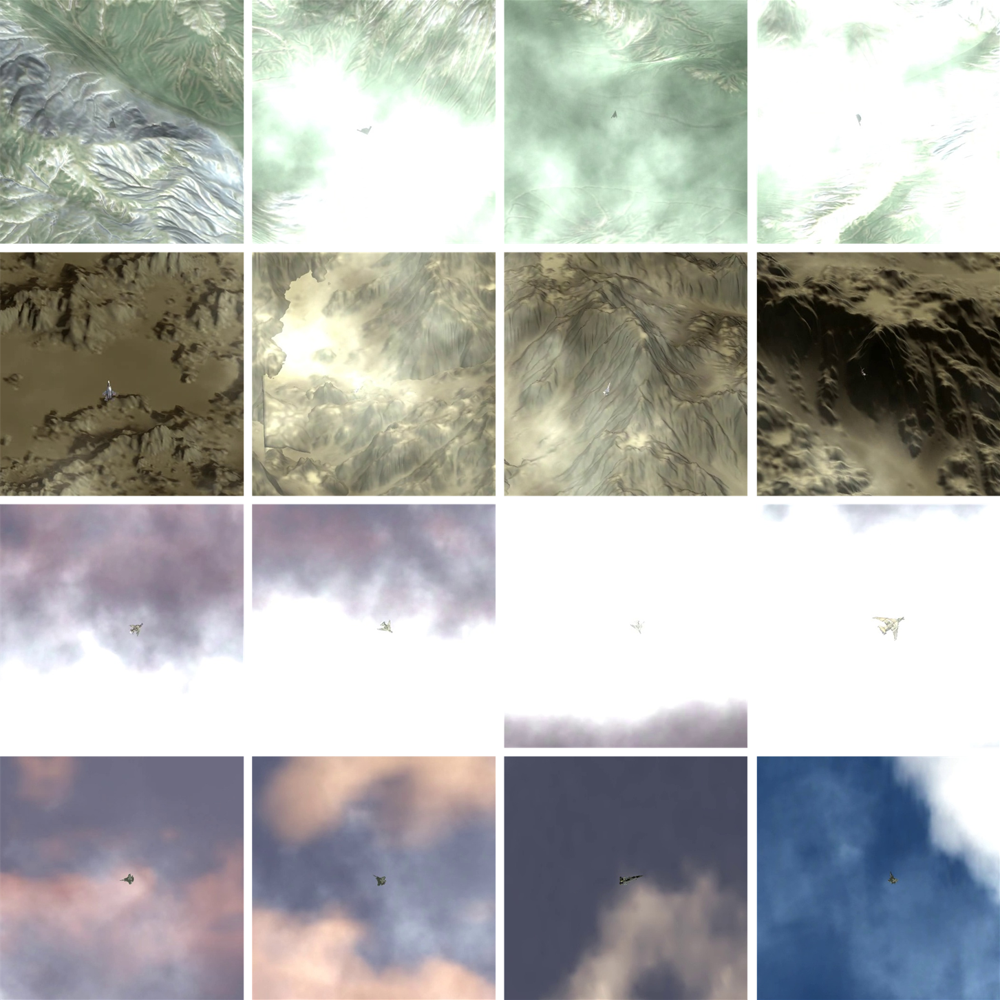

在数据集制作过程中，我们采用标准的pascal voc数据集标注格式，不同空天目标的图像保存为jpg格式，标注保存为xml格式的标注信息文件。数据集的制作和处理主要使用python脚本和LabelImg标注软件实现。

##### 方法

按照不同的遮挡程度可以分为以下几种情况： Heavy（被遮挡部分大于等于35%）、Reasonable（被遮挡部分小于等于35%）、Partical（10%-35%）、Bare（被遮挡部分小于等于 10%）。遮挡问题空天目标检测任务中仍然是一个巨大的挑战。特别地，在多个目标距离有限的情况下，难以正确识别目标的数量和将来的飞行轨迹，从而导致对目标识别的错误；在遮挡情况下，空天目标的缺损特征容易导致最终的漏检率较高，使得目标检测系统很难准确地检测出被遮挡的空天目标。

本文在Faster R-CNN两阶段检测网络的基础上进行改进，选择ResNet50作为骨干网络，改进后的多尺度特征金字塔网络框架如图3-2-4所示，主要由Double FPN integrated with ResNet（DFR）、RPN、RoI Align和Repulsion Loss of Minimum（RLM）四部分组成。与传统的FPN相比，Double FPN是一种在BiFPN的基础上改进的网络，与ResNet一起共同组成新的网络，可以更好地提取和融合多尺度特征。其次是RPN网络，两阶段检测算法的RPN网络负责在多尺度特征图上生成不同尺度和不同大小的锚框。如图所示，第一个蓝色部分为骨干网络ResNet50自下而上提取特征图*fin_*1~*fin_*5的过程，为DFR模块中蓝色部分的放大版本。RPN模块中展示了由anchors进行第一次回归得到的proposals。RoI Align模块结合特征图*fout_*1~*fout_*5和图像缩放等信息，将不同尺寸的特征图转换为相同尺寸的特征图。全连接层就可以针对一个候选框预测生成两个目标的偏移量，从而一个候选框可以预测两个目标。最后一部分是改进后的损失函数Repulsion Loss of Minimum，该损失函数由两部分*LossMinimum*和*LossRep*组成，*LossRep*可以根据需要选择是否将其应用到网络模型中。

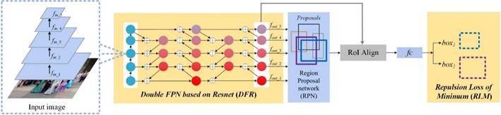

**(1) 改进的BiFPN结构——Double FPN **：

有效地提取和融合特征对于目标检测具有重要意义。因此，特征提取网络提取的特征图影响检测结果的准确性。多尺度特征提取和融合网络——特征金字塔网络FPN及其变体PANe和BiFPN已经得到了广泛应用。虽然这些方法优化了网络提取和融合特征的过程并获得了更好的精度，但仍存在需要克服的缺点:（1）对于提取遮挡目标的特征这些网络仍有一定的局限性；（2）过多的参数和计算量降低了网络的效率；（3）网络不能灵活运用。

我们在BiFPN的基础上提出了一种有效的多尺度特征提取与融合网络DFR，如图3-2-5所示。整个DFR网络由ResNet50和Double FPN网络两部分组成。之所以选择ResNet50作为自下而上的特征提取路径，是因为有文献的实验表明，ResNet50的错误率比ResNet18和ResNet34低，参数基本是ResNet101和ResNet152的一半。但是ResNet50、ResNet101和ResNet152可以达到几乎相同的精度。

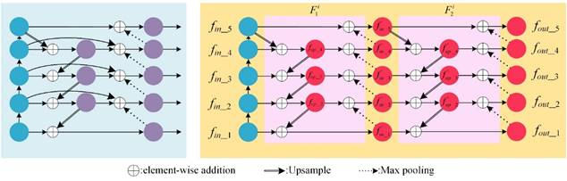

​                                                              (a)                                             (b)

图3-5 双向加权特征金字塔与DFR网络示意图：(a)双向加权特征金字塔网络；(b)DFR网络

本文的DFR网络，如图3-5(b)所示，在两层BiFPN的基础上做了如下改进：首先，去除同一层的初始输入和输出之间的连接，因此相应的特征融合时的权重也应该去除，能够减少初始化参数；其次，将BiFPN中的可分离卷积替换为标准卷积。尽管可分离卷积的网络结构参数量较少，但是我们的实验结果表明，使用可分离卷积的网络得到的最终检测结果在所有指标上都没有超过使用标准卷积的网络。因此，标准卷积对于我们的网络来说是更优选择。修改后的网络结构如图3-5(b)所示。左边的蓝色圆是经过ResNet50自下而上路径得到的特征映射，右边剩余部分的是我们提出的Double FPN结构。

**(2) 检测头部：**

传统的两阶段检测算法Faster R-CNN的检测头部通常是找到与真实框的IoU最大的候选框，进而在这个候选框的基础上进行回归，减少候选框与真实框之间的损失，即一个候选框负责预测一个目标。但是，当空天目标距离较小，互相遮挡时，它们之间的特征非常接近，会对检测器造成影响；除此之外，传统的NMS算法容易导致误检或者漏检的问题。既然互相遮挡的目标特征十分相似，检测器不能非常容易地分辨候选框应该具体地预测哪个目标，那么就让一个候选框来预测两目标，即两个目标的预测框是由一个候选框经过回归得到的，这样一来就解决了互相遮挡情况下的目标检测与识别的问题。

如图3-2-6所示，airplane1和airplane2都是待检测目标，airplane1把airplane2的大部分遮挡。对于一个候选框负责预测一个目标的情况，如图3-2-6(a)所示，假设黄色候选框负责预测airplane1，红色的候选框负责预测airplane2，那么黑色候选框没有需要负责预测的目标，这对普通的两阶段目标检测器来说是非常困难的，因为被遮挡目标airplane2的特征与airplane1的特征非常接近，并且经过传统的NMS之后，很容易只留下一个预测框，从而导致漏检问题。

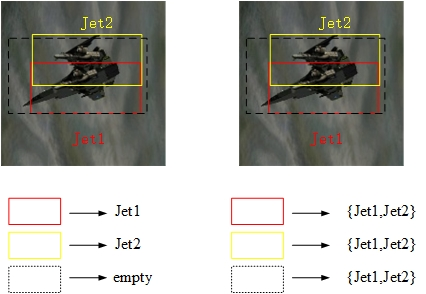

 

​                                                               (a)一对一                                    (b)一对二

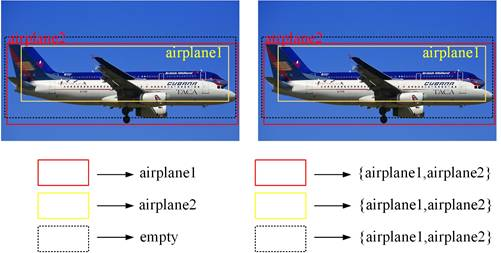

​                                                                  (c)一对一                                       (d)一对二

 

​                                                                     图3-2-6 遮挡场景空天目标检测

因此就有了一个候选框预测两个目标的算法，如图3-2-6(b) 所示，让图中的三个候选框都分别负责预测两个目标，此时，必然会造成重复多余的预测框。针对该问题，解决办法如下：假设三个候选框，proposal A，proposal B和proposal C，先计算每个proposal与目标真实框的IoU，将其进行从高到底排序，找出其中前两个IoU的最大值对应的目标，也就是这个proposal需要负责预测的目标。当用NMS进行后处理时，若两个目标的预测框来自同一个候选框，则两个预测框都会得到保留；若同一目标的预测框来自不同的候选框，则将其中与真实框IoU较大的预测框进行保留。检测头部框图如图3-2-7所示，*box*1和*box*2是由一个候选框回归得到的两个预测框。

 

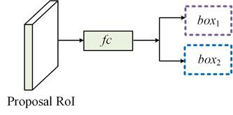

​                                                                                        图3-2-7 检测头部框图

**(3) 损失函数****

目标检测中的损失函数一般由回归损失*lossreg*和分类损失*losscls*两部分组成。基于一个候选框预测两个目标，我们将回归损失*lossreg*命名为Minimum Loss(ML)。本文中的分类损失*losscls*与目标检测中常见的分类损失定义相同，不再赘述。本小节将详细介绍损失函数ML。

如图3-2-7所示，假设红色框与绿色框是待检测目标的真实框ground truth，蓝色边界框是负责预测这两个目标的候选框proposal。用本文的检测框架，经过全连接层后可以得到两组针对蓝色候选框的偏移量，从而进一步计算*Pred box*1和*Pred box*2的位置，定义为：

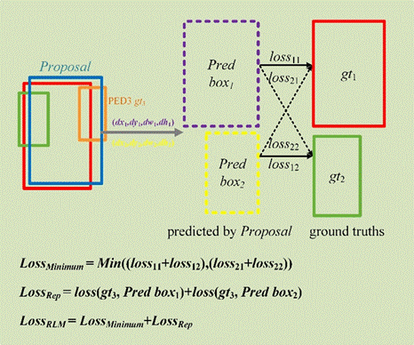

​                                                                         图3-2-7 损失函数

但是，紫色的*Pred box*1和黄色的*Pred box*2分别对应于哪个目标的ground truth?下面是解决方案：对于一个候选框预测的两个边界框，分别计算出这两个边界框分别对应的两个目标的损失和，并选择两种情况中最小损失的匹配情况，此时对应的两个预测框的目标即待检测目标。

第一种是紫色*Pred box*1需要预测红色ground truth (gt1)所代表的目标，两个框之间的损失记为*loss*11；黄色*Pred box*2需要预测绿色ground truth (gt2)所代表的目标，两个框之间的损失记为*loss*12. 所以第一种情况的损失是：

第二种情况是紫色*Pred box*1需要预测绿色ground truth (gt2)所代表的目标，两个框之间的损失记为*loss*21；黄色的*Pred box*2需要预测红色ground truth (gt1)所代表的目标，两个框之间的损失记为*loss*22。第二种情况的损失是：

若*loss*1>*loss*2，则选择第二种情况作为最终的预测结果，即：

 

反之亦然。损失越小，目标检测器的性能越好。这就是“最小损失”的由来。

斥力损失*LossRep*：

如图3-2-7所示，斥力损失定义为：

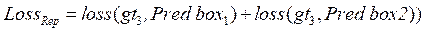

一般来说，对于第*n*个候选框*Pn*，与它相斥的ground truth定义为除了它需要预测的两个目标的ground truths外，其余所有的ground truths中与该候选框*Pn*的IoU值最大的那个候选框，即：

​                                   (3-11)

其中，G = {*G*}表示一张图片中所有的ground truths, 是候选框*Pn*需要预测的两个目标的ground truths. *LossRep*即与两个预测框之间的损失（由候选框*Pn*回归得到）：

​               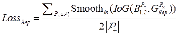         (3-12)

其中，

​                  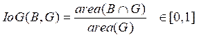            (3-13)

且，

​               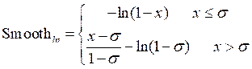           (3-14)

Smoothln是一个平滑的在（0,1）内连续可微的ln函数。*s*参数是调整斥力损失对异常值的灵敏度的平滑参数。由式(3-12)和式(3-14)可见，候选框*Pn*与非目标的ground truth的IoU越大，*LossRep*对*bounding box*回归部分实施的惩罚就越大。这样，*LossRep*可以有效地防止预测框与其周围目标的ground truths重叠在一起，而这些目标并不是这些预测框的ground truths。因此，*LossRep*的数值越大越好，表明预测框与其他目标的ground truths可以分离开来，从而能够帮助网络模型学习，准确地检测严重遮挡的目标。

表1 IoU=0.5实验结果

| 类别   | B-2   | J-31  | Jet   | J-20  |
| ------ | ----- | ----- | ----- | ----- |
| AP/%   | 91.23 | 90.56 | 92.12 | 91.54 |
| MR-2/% | 1.23  | 0.98  | 1.12  | 1.36  |

表2其它方法IoU=0.5 AP实验结果

| 类别                 | B-2   | J-31  | Jet   | J-20  |
| -------------------- | ----- | ----- | ----- | ----- |
| FPN baseline[57]     | 86.07 | 83.85 | 83.75 | 84.76 |
| ResNet50+FPN[57]     | 90.57 | 89.9  | 91.39 | 90.81 |
| Adaptive NMS [44]    | 85.26 | 84.76 | 86.09 | 85.65 |
| Cascade R-CNN[33]    | 85.82 | 85.19 | 86.67 | 86.03 |
| 改进方法（单一特征） | 86.11 | 85.56 | 86.98 | 85.94 |
| 改进方法（融合特征） | 91.23 | 90.56 | 92.12 | 91.54 |